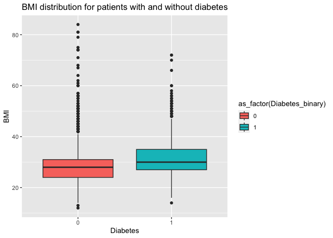
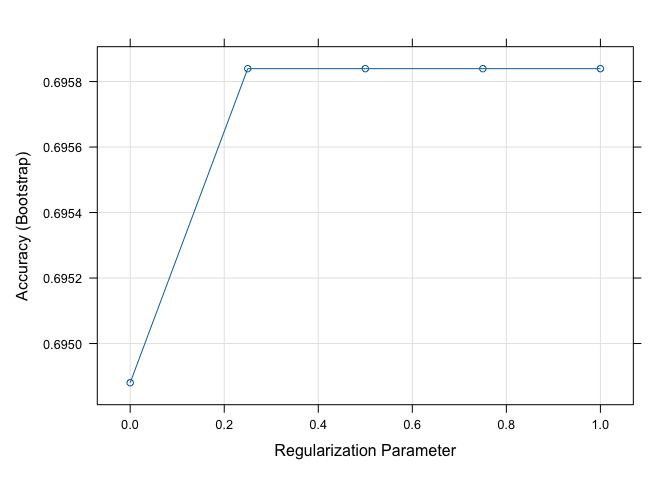
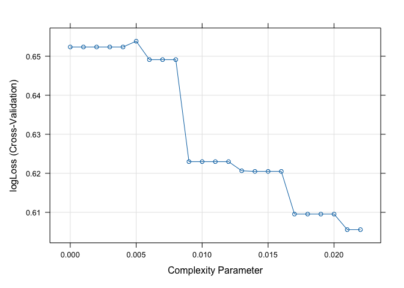
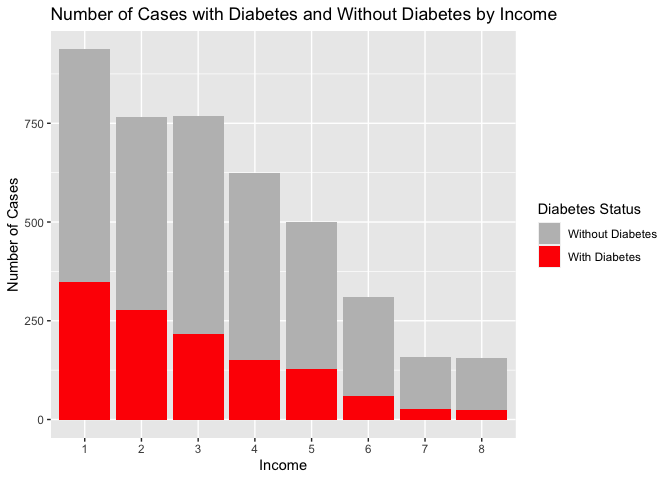
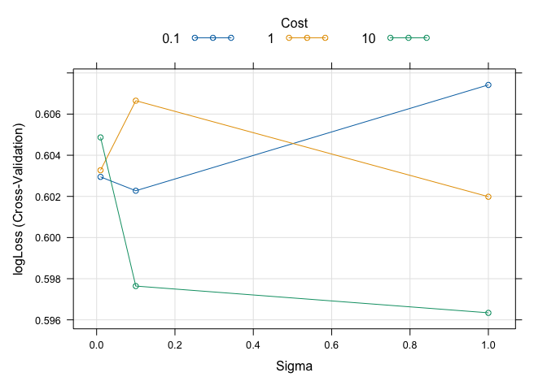

ST558, Project3
================
Jacob Press, Nataliya Peshekhodko
2023-11-06

- <a href="#1-introduction" id="toc-1-introduction">1 Introduction</a>
- <a href="#2-packages" id="toc-2-packages">2 Packages</a>
- <a href="#3-data" id="toc-3-data">3 Data</a>
- <a href="#4-explanatory-data-analysiseda"
  id="toc-4-explanatory-data-analysiseda">4 Explanatory Data
  Analysis(EDA)</a>
- <a href="#5-modeling" id="toc-5-modeling">5 Modeling</a>
  - <a href="#51-log-loss" id="toc-51-log-loss">5.1 Log loss</a>
  - <a href="#52-logistic-regression" id="toc-52-logistic-regression">5.2
    Logistic regression</a>
    - <a href="#521-fit-logistic-regression-model-1"
      id="toc-521-fit-logistic-regression-model-1">5.2.1 Fit Logistic
      regression model 1</a>
    - <a href="#522-fit-logistic-regression-model-2"
      id="toc-522-fit-logistic-regression-model-2">5.2.2 Fit Logistic
      regression model 2</a>
    - <a href="#523-fit-logistic-regression-model-3"
      id="toc-523-fit-logistic-regression-model-3">5.2.3 Fit Logistic
      regression model 3</a>
  - <a href="#53-lasso-logistic-regression"
    id="toc-53-lasso-logistic-regression">5.3 LASSO logistic regression</a>
    - <a href="#531-fit-and-validate-lasso-logistic-regression"
      id="toc-531-fit-and-validate-lasso-logistic-regression">5.3.1 Fit and
      validate LASSO logistic regression</a>
  - <a href="#54-classification-tree-model"
    id="toc-54-classification-tree-model">5.4 Classification tree model</a>
  - <a href="#55-random-forest-model" id="toc-55-random-forest-model">5.5
    Random forest model</a>
  - <a href="#56-new-model---support-vector-machine"
    id="toc-56-new-model---support-vector-machine">5.6 New model - Support
    Vector Machine</a>
  - <a href="#57-new-model---naive-bayes"
    id="toc-57-new-model---naive-bayes">5.7 New model - Naive Bayes</a>

# 1 Introduction

In this project we will read and analyze dataset [Diabetes health
indicator
dataset](https://www.kaggle.com/datasets/alexteboul/diabetes-health-indicators-dataset/)
for each education level. We will create different classification models
for predicting the `Diabetes_binary` variable. The best model will be
choosen based on `log loss` function.

This report is built for education level 12.

# 2 Packages

In order to achive our goals, we will be using the following `R`
packages.

``` r
library(tidyverse)
library(caret)
library(ggplot2)
library(corrplot)
library(klaR)
```

- `tidyverse` - is a collection of R packages, required for data
  transformation and manipulation
- `caret` - required for training and evaluating machine learning models
- `ggplot2` - required for for creating data visualizations and graphics
- `corrplot` - required for correlation matrix visualizing

# 3 Data

Reading data from `diabetes_binary_health_indicators_BRFSS2015.csv`
file.

``` r
data = read_csv('./data/diabetes_binary_health_indicators_BRFSS2015.csv')
```

Checking for NA values

``` r
sum(is.na(data))
```

    ## [1] 0

There are no missing values in the data set.

Let’s look at the head of data.

``` r
head(data)
```

    ## # A tibble: 6 × 22
    ##   Diabetes_binary HighBP HighChol CholCheck   BMI Smoker Stroke HeartDiseaseorAttack PhysActivity Fruits Veggies
    ##             <dbl>  <dbl>    <dbl>     <dbl> <dbl>  <dbl>  <dbl>                <dbl>        <dbl>  <dbl>   <dbl>
    ## 1               0      1        1         1    40      1      0                    0            0      0       1
    ## 2               0      0        0         0    25      1      0                    0            1      0       0
    ## 3               0      1        1         1    28      0      0                    0            0      1       0
    ## 4               0      1        0         1    27      0      0                    0            1      1       1
    ## 5               0      1        1         1    24      0      0                    0            1      1       1
    ## 6               0      1        1         1    25      1      0                    0            1      1       1
    ## # ℹ 11 more variables: HvyAlcoholConsump <dbl>, AnyHealthcare <dbl>, NoDocbcCost <dbl>, GenHlth <dbl>, MentHlth <dbl>,
    ## #   PhysHlth <dbl>, DiffWalk <dbl>, Sex <dbl>, Age <dbl>, Education <dbl>, Income <dbl>

Combine Education levels `1` and `2` into one level `12`

``` r
transformed <- data %>%
  mutate (Education = if_else(Education == 1 | Education == 2, 12, Education))
```

Sub-setting data for the selected education level:

``` r
education_level = params$education_level
#TODO: remove hard coded value
#education_level = 12

subset <- transformed %>%
  filter(Education == education_level)
```

Checking data structure:

``` r
str(subset)
```

    ## tibble [4,217 × 22] (S3: tbl_df/tbl/data.frame)
    ##  $ Diabetes_binary     : num [1:4217] 0 1 1 1 0 0 1 0 1 0 ...
    ##  $ HighBP              : num [1:4217] 1 1 0 1 1 1 1 1 1 0 ...
    ##  $ HighChol            : num [1:4217] 1 1 1 1 0 1 1 1 0 1 ...
    ##  $ CholCheck           : num [1:4217] 1 1 1 1 1 1 1 1 1 1 ...
    ##  $ BMI                 : num [1:4217] 38 28 32 25 35 45 25 37 30 36 ...
    ##  $ Smoker              : num [1:4217] 1 1 0 1 1 1 1 1 0 0 ...
    ##  $ Stroke              : num [1:4217] 0 0 0 0 0 0 0 0 0 0 ...
    ##  $ HeartDiseaseorAttack: num [1:4217] 0 1 1 1 0 1 0 0 0 0 ...
    ##  $ PhysActivity        : num [1:4217] 0 0 1 0 1 1 0 1 1 0 ...
    ##  $ Fruits              : num [1:4217] 1 0 0 1 1 1 0 1 0 0 ...
    ##  $ Veggies             : num [1:4217] 1 1 0 1 1 1 0 1 0 1 ...
    ##  $ HvyAlcoholConsump   : num [1:4217] 0 0 0 0 0 0 0 0 0 0 ...
    ##  $ AnyHealthcare       : num [1:4217] 1 1 1 1 1 1 1 1 1 0 ...
    ##  $ NoDocbcCost         : num [1:4217] 0 0 0 0 0 1 0 0 0 1 ...
    ##  $ GenHlth             : num [1:4217] 5 4 1 5 4 5 4 3 3 4 ...
    ##  $ MentHlth            : num [1:4217] 15 0 0 15 0 5 3 0 0 0 ...
    ##  $ PhysHlth            : num [1:4217] 30 0 0 30 1 10 6 0 7 30 ...
    ##  $ DiffWalk            : num [1:4217] 1 0 1 1 1 1 1 0 1 0 ...
    ##  $ Sex                 : num [1:4217] 0 1 0 0 1 0 1 0 0 1 ...
    ##  $ Age                 : num [1:4217] 13 12 13 9 9 7 12 11 10 5 ...
    ##  $ Education           : num [1:4217] 12 12 12 12 12 12 12 12 12 12 ...
    ##  $ Income              : num [1:4217] 3 4 2 3 5 2 2 2 3 3 ...

Variables in the data set:

- **Diabetes_binary** - 0 = no diabetes, 1 = diabetes
- **HighBP** - 0 = no high blood pressure, 1 = high blood pressure
- **HighChol** - 0 = no high cholesterol, 1 = high cholesterol
- **CholCheck** - 0 = no cholesterol check in 5 years, 1 = yes
  cholesterol check in 5 years
- **BMI** - Body Mass Index
- **Smoker** - Have you smoked at least 100 cigarettes in your entire
  life? 0 = no, 1 = yes
- **Stroke** - (Ever told) you had a stroke. 0 = no, 1 = yes
- **HeartDiseaseorAttack** - Coronary heart disease (CHD) or myocardial
  infarction (MI), 0 = no, 1 = yes
- **PhysActivity** - Physical activity in past 30 days - not including
  job, 0 = no, 1 = yes
- **Fruits** - Consume Fruit 1 or more times per day, 0 = no, 1 = yes
- **Veggies** - Consume Vegetables 1 or more times per day, 0 = no 1 =
  yes
- **HvyAlcoholConsump** - Heavy drinkers (adult men having more than 14
  drinks per week and adult women having more than 7 drinks per week) 0
  = no
- **AnyHealthcare** - Have any kind of health care coverage, including
  health insurance, prepaid plans such as HMO, etc. 0 = no 1 = yes
- **NoDocbcCost** - Was there a time in the past 12 months when you
  needed to see a doctor but could not because of cost? 0 = no 1 = yes
- **GenHlth** - Would you say that in general your health is: scale 1-5
  1 = excellent 2 = very good 3 = good 4 = fair 5 = poor
- **MentHlth** - Now thinking about your mental health, which includes
  stress, depression, and problems with emotions, for how
- **PhysHlth** - Now thinking about your physical health, which includes
  physical illness and injury, for how many days during the past 30
- **DiffWalk** - Do you have serious difficulty walking or climbing
  stairs? 0 = no, 1 = yes
- **Sex** - 0 = female, 1 = male
- **Age** - 13-level age category, 1 = 18-24, 9 = 60-64, 13 = 80 or
  older
- **Education** - Education level scale 1-6, 1 = Never attended school
  or only kindergarten, 2 = Grades 1 through 8
- **Income** - Income scale scale 1-8, 1 = less than 10,000 dol, 5 =
  less than 35,000 dol, 8 = 75,000 dol or more

# 4 Explanatory Data Analysis(EDA)

First, let’s look at number of thr records with Diabetes and without
Diabetes for the selected education level:

``` r
table (factor (subset$Diabetes_binary, labels = c("No diabet", "Diabet")) )
```

    ## 
    ## No diabet    Diabet 
    ##      2987      1230

Let’s look at `Age` distribution for the selected education level:

``` r
ggplot(data = subset, aes(x = Age)) +
  geom_histogram(color = "black", fill = 'brown') +
  labs(title = "Histogram of Age groups distribution", 
       x = "Age group", 
       y = "Frequency")
```

<!-- -->

Let’s look at number of cases with Diabetes and without Diabetes for
each age group for the selected education level

``` r
# TODO: update levels for ages
table(factor(subset$Diabetes_binary, labels = c("No diabet", "Diabet")), subset$Age)
```

    ##            
    ##               1   2   3   4   5   6   7   8   9  10  11  12  13
    ##   No diabet  25  48 104 157 200 203 308 273 291 320 315 285 458
    ##   Diabet      1   4   9  14  21  64  85 128 163 203 193 161 184

Number of cases with Diabetes and without Diabetes for males and
females.

``` r
table(factor (subset$Diabetes_binary, labels = c("No diabet", "Diabet")), 
      factor(subset$Sex, labels = c("Female", "Male")))
```

    ##            
    ##             Female Male
    ##   No diabet   1576 1411
    ##   Diabet       707  523

Linear correlation between numeric variables.

``` r
corrplot(cor(as.matrix(subset %>% dplyr::select(-Education))), 
         type="upper", 
         tl.pos = "lt")
```

<!-- -->

Number of cases with Diabetes and without Diabetes for each general
health level.

``` r
#TODO: update levels
table(factor(subset$Diabetes_binary, labels = c("No diabet", "Diabet")), 
      subset$GenHlth)
```

    ##            
    ##                1    2    3    4    5
    ##   No diabet  243  399 1010  924  411
    ##   Diabet      32   62  255  510  371

Number of cases with Diabetes and without Diabetes for high blood
pressure and normal blood pressure patients.

``` r
table(factor(subset$Diabetes_binary, labels = c("No diabet", "Diabet")), 
      factor(subset$HighBP, labels = c("No high BP", "High BP")) )
```

    ##            
    ##             No high BP High BP
    ##   No diabet       1472    1515
    ##   Diabet           268     962

Number of cases with Diabetes and without Diabetes for high cholesterol
and normal cholesterol patients.

``` r
table(factor(subset$Diabetes_binary, labels = c("No diabet", "Diabet")), 
      factor (subset$HighChol, labels = c("No high chol", "High chol")))
```

    ##            
    ##             No high chol High chol
    ##   No diabet         1611      1376
    ##   Diabet             354       876

BMI distribution for patients with Diabetes and without Diabetes for the
selected education level.

``` r
ggplot(subset, aes(x = as_factor(Diabetes_binary), 
                   y = BMI, 
                   fill = as_factor(Diabetes_binary))) +
  geom_boxplot() +
  labs(title = "BMI distribution for patients with and without diabetes", 
       x = "Diabetes", 
       y = "BMI")
```

<!-- -->

# 5 Modeling

Converting some of the variables to factors.

``` r
names = c('HighBP' ,'HighChol', 
          'CholCheck', 'Smoker', 
          'Diabetes_binary', 'Stroke',
          'HeartDiseaseorAttack', 'PhysActivity',
          'Fruits', 'Veggies', 
          'HvyAlcoholConsump', 'Sex',
          'Age','Income', 'GenHlth', 
          'MentHlth', 'PhysHlth', 'DiffWalk',
          'AnyHealthcare', 'NoDocbcCost')
subset[,names] = lapply(subset[,names] , factor)
str(subset)
```

    ## tibble [4,217 × 22] (S3: tbl_df/tbl/data.frame)
    ##  $ Diabetes_binary     : Factor w/ 2 levels "0","1": 1 2 2 2 1 1 2 1 2 1 ...
    ##  $ HighBP              : Factor w/ 2 levels "0","1": 2 2 1 2 2 2 2 2 2 1 ...
    ##  $ HighChol            : Factor w/ 2 levels "0","1": 2 2 2 2 1 2 2 2 1 2 ...
    ##  $ CholCheck           : Factor w/ 2 levels "0","1": 2 2 2 2 2 2 2 2 2 2 ...
    ##  $ BMI                 : num [1:4217] 38 28 32 25 35 45 25 37 30 36 ...
    ##  $ Smoker              : Factor w/ 2 levels "0","1": 2 2 1 2 2 2 2 2 1 1 ...
    ##  $ Stroke              : Factor w/ 2 levels "0","1": 1 1 1 1 1 1 1 1 1 1 ...
    ##  $ HeartDiseaseorAttack: Factor w/ 2 levels "0","1": 1 2 2 2 1 2 1 1 1 1 ...
    ##  $ PhysActivity        : Factor w/ 2 levels "0","1": 1 1 2 1 2 2 1 2 2 1 ...
    ##  $ Fruits              : Factor w/ 2 levels "0","1": 2 1 1 2 2 2 1 2 1 1 ...
    ##  $ Veggies             : Factor w/ 2 levels "0","1": 2 2 1 2 2 2 1 2 1 2 ...
    ##  $ HvyAlcoholConsump   : Factor w/ 2 levels "0","1": 1 1 1 1 1 1 1 1 1 1 ...
    ##  $ AnyHealthcare       : Factor w/ 2 levels "0","1": 2 2 2 2 2 2 2 2 2 1 ...
    ##  $ NoDocbcCost         : Factor w/ 2 levels "0","1": 1 1 1 1 1 2 1 1 1 2 ...
    ##  $ GenHlth             : Factor w/ 5 levels "1","2","3","4",..: 5 4 1 5 4 5 4 3 3 4 ...
    ##  $ MentHlth            : Factor w/ 26 levels "0","1","2","3",..: 16 1 1 16 1 6 4 1 1 1 ...
    ##  $ PhysHlth            : Factor w/ 29 levels "0","1","2","3",..: 29 1 1 29 2 11 7 1 8 29 ...
    ##  $ DiffWalk            : Factor w/ 2 levels "0","1": 2 1 2 2 2 2 2 1 2 1 ...
    ##  $ Sex                 : Factor w/ 2 levels "0","1": 1 2 1 1 2 1 2 1 1 2 ...
    ##  $ Age                 : Factor w/ 13 levels "1","2","3","4",..: 13 12 13 9 9 7 12 11 10 5 ...
    ##  $ Education           : num [1:4217] 12 12 12 12 12 12 12 12 12 12 ...
    ##  $ Income              : Factor w/ 8 levels "1","2","3","4",..: 3 4 2 3 5 2 2 2 3 3 ...

Spiting up data training and validation data sets.

``` r
set.seed(5)
trainIndex <- createDataPartition(subset$Diabetes_binary, p = .7, 
                                  list = FALSE, 
                                  times = 1)
train_data = subset[trainIndex, ]
val_data = subset[-trainIndex, ]


#Taking sample TEMPORARY. 
#Will be removed
#Having performance issues and not able to render for original sizes. 
#TODO: remove the following lines
train_data <- train_data[sample(nrow(train_data), size = 500), ]
val_data <- val_data[sample(nrow(val_data), size = 200), ]
```

## 5.1 Log loss

**Log loss**, also known as **logarithmic loss** or **cross-entropy
loss**, is a common evaluation metric for binary classification models.
It measures the performance of a model by quantifying the difference
between predicted probabilities and actual values. Log-loss is
indicative of how close the prediction probability is to the
corresponding actual/true value, penalizing inaccurate predictions with
higher values. Lower log-loss indicates better model performance.

Mathematical interpretation: Log Loss is the negative average of the log
of corrected predicted probabilities for each instance.

$$log \ loss = -\frac{1}{N} \sum_{i=1}^N y_i log(p(y_i)) + (1-y_i)log(1-p(y_i))$$

$p(y_i)$ is the probability of $1$.

$1-p(y_i)$ is the probability of 0.

## 5.2 Logistic regression

Logistic regression is a statistical and machine learning model used for
binary classification tasks. It’s a type of regression analysis that’s
well-suited for predicting the probability of an observation belonging
to one of two classes or categories.

- Logistic regression is used when the response variable is binary,
  meaning it has two possible outcomes or classes.
- Logistic regression uses the `sigmoid` function to model the
  relationship between the features and the probability of the binary
  outcome. The logistic function has an S-shaped curve and maps any
  real-valued number to a value between 0 and 1.
  $p(x)=\frac{1}{1+e^{-(\beta_0+\beta_1x)}}$. ($p(x)$ is the probability
  of the dependent variable being 1)
- The goal of logistic regression is to find the best-fitting model by
  estimating the coefficients $\beta_0$, $\beta_1$. This is typically
  done using a process called maximum likelihood estimation. The
  coefficients are adjusted to maximize the likelihood of the observed
  data given the model.

Creating lists to store model performance on train and validations data
sets.

``` r
models_performace_train = list()
models_performace_val = list()
```

### 5.2.1 Fit Logistic regression model 1

``` r
train_data$Diabetes_binary_transformed = train_data$Diabetes_binary
val_data$Diabetes_binary_transformed = val_data$Diabetes_binary

levels(train_data$Diabetes_binary_transformed) = make.names(levels(train_data$Diabetes_binary_transformed))
levels(val_data$Diabetes_binary_transformed) = make.names(levels(val_data$Diabetes_binary_transformed))
```

``` r
train.control = trainControl(method = "cv", 
                              number = 5, 
                              summaryFunction=mnLogLoss,
                              classProbs = TRUE)

set.seed(83)
lr_model_1 = train(Diabetes_binary_transformed ~ 
                                   HighChol+
                                   BMI + 
                                   GenHlth, 
                                 data = train_data,
                                 method = "glm", 
                                 family="binomial",
                                 metric="logLoss",
                                 trControl = train.control
                                )
summary(lr_model_1)
```

    ## 
    ## Call:
    ## NULL
    ## 
    ## Coefficients:
    ##              Estimate Std. Error z value Pr(>|z|)    
    ## (Intercept) -3.381014   0.859900  -3.932 8.43e-05 ***
    ## HighChol1    0.940368   0.219076   4.292 1.77e-05 ***
    ## BMI          0.009255   0.015608   0.593  0.55321    
    ## GenHlth2     0.662849   0.841198   0.788  0.43071    
    ## GenHlth3     1.439531   0.760868   1.892  0.05850 .  
    ## GenHlth4     1.919844   0.755916   2.540  0.01109 *  
    ## GenHlth5     2.406156   0.764672   3.147  0.00165 ** 
    ## ---
    ## Signif. codes:  0 '***' 0.001 '**' 0.01 '*' 0.05 '.' 0.1 ' ' 1
    ## 
    ## (Dispersion parameter for binomial family taken to be 1)
    ## 
    ##     Null deviance: 610.86  on 499  degrees of freedom
    ## Residual deviance: 547.98  on 493  degrees of freedom
    ## AIC: 561.98
    ## 
    ## Number of Fisher Scoring iterations: 5

Create custom function for log loss calculation.

``` r
calculateLogLoss <- function(predicted_probabilities, true_labels) {
  predicted_probabilities = pmax(pmin(predicted_probabilities, 1 - 1e-15), 
                                 1e-15)

  log_loss <- -mean(true_labels * log(predicted_probabilities) + 
                      (1 - true_labels) * log(1 - predicted_probabilities))
  return(log_loss)
}
```

Calculate log loss for train data set for logistic regression model \#1.

``` r
train_predictions = predict(lr_model_1, 
                             newdata = train_data %>% dplyr::select(-Diabetes_binary), 
                             type = "prob")

predicted_prob_class1 = train_predictions[, 1]
true_labels = as.integer(as.character(train_data$Diabetes_binary))

log_loss_train_lr_model_1 = calculateLogLoss(predicted_prob_class1, true_labels)
print(paste("Log Loss:", log_loss_train_lr_model_1))
```

    ## [1] "Log Loss: 1.22494264804201"

``` r
models_performace_train[["logistic_regression_model_1"]] <- log_loss_train_lr_model_1
```

Calculate log loss for validation data set

``` r
val_predictions = predict(lr_model_1, 
                             newdata = val_data %>% dplyr::select(-Diabetes_binary), 
                             type = "prob")

predicted_prob_class1 = val_predictions[, 1]
true_labels = as.integer(as.character(val_data$Diabetes_binary))

log_loss_val_lr_model_1 = calculateLogLoss(predicted_prob_class1, true_labels)
print(paste("Log Loss:", log_loss_val_lr_model_1))
```

    ## [1] "Log Loss: 1.31491569759802"

``` r
models_performace_val[["logistic_regression_model_1"]] = log_loss_val_lr_model_1
```

### 5.2.2 Fit Logistic regression model 2

``` r
train.control = trainControl(method = "cv", 
                              number = 5, 
                              summaryFunction=mnLogLoss,
                              classProbs = TRUE)

set.seed(8)
lr_model_2 = train(Diabetes_binary_transformed ~ 
                                   poly(BMI, 2) + 
                                   HighChol + HeartDiseaseorAttack+
                                   HighChol:HeartDiseaseorAttack,
                                 data = train_data,
                                 method = "glm", 
                                 family="binomial",
                                 metric="logLoss",
                                 trControl = train.control
                                )
summary(lr_model_2)
```

    ## 
    ## Call:
    ## NULL
    ## 
    ## Coefficients:
    ##                                   Estimate Std. Error z value Pr(>|z|)    
    ## (Intercept)                        -1.6814     0.1991  -8.446  < 2e-16 ***
    ## `poly(BMI, 2)1`                     2.6585     2.2486   1.182   0.2371    
    ## `poly(BMI, 2)2`                    -0.9936     2.4229  -0.410   0.6818    
    ## HighChol1                           1.2310     0.2483   4.957 7.15e-07 ***
    ## HeartDiseaseorAttack1               0.9005     0.4027   2.236   0.0253 *  
    ## `HighChol1:HeartDiseaseorAttack1`  -0.7517     0.4905  -1.532   0.1254    
    ## ---
    ## Signif. codes:  0 '***' 0.001 '**' 0.01 '*' 0.05 '.' 0.1 ' ' 1
    ## 
    ## (Dispersion parameter for binomial family taken to be 1)
    ## 
    ##     Null deviance: 610.86  on 499  degrees of freedom
    ## Residual deviance: 573.97  on 494  degrees of freedom
    ## AIC: 585.97
    ## 
    ## Number of Fisher Scoring iterations: 4

Calculate log loss for train data set

``` r
train_predictions = predict(lr_model_2, 
                             newdata = train_data %>% dplyr::select(-Diabetes_binary), 
                             type = "prob")

predicted_prob_class1 = train_predictions[, 1]
true_labels = as.integer(as.character(train_data$Diabetes_binary))

log_loss_train_lr_model_2 = calculateLogLoss(predicted_prob_class1, true_labels)
print(paste("Log Loss:", log_loss_train_lr_model_2))
```

    ## [1] "Log Loss: 1.10091941077044"

``` r
models_performace_train[["logistic_regression_model_2"]] = log_loss_train_lr_model_2
```

Calculate log loss for validation data set

``` r
val_predictions = predict(lr_model_2, 
                             newdata = val_data %>% dplyr::select(-Diabetes_binary), 
                             type = "prob")

predicted_prob_class1 = val_predictions[, 1]
true_labels = as.integer(as.character(val_data$Diabetes_binary))

log_loss_val_lr_model_2 = calculateLogLoss(predicted_prob_class1, true_labels)
print(paste("Log Loss:", log_loss_val_lr_model_2))
```

    ## [1] "Log Loss: 1.15706856817977"

``` r
models_performace_val[["logistic_regression_model_2"]] = log_loss_val_lr_model_2
```

### 5.2.3 Fit Logistic regression model 3

``` r
train.control = trainControl(method = "cv", 
                              number = 5, 
                              summaryFunction=mnLogLoss,
                              classProbs = TRUE)

set.seed(10)
lr_model_3 = train(Diabetes_binary_transformed ~ Income+
                     Age+GenHlth+
                     HighBP+
                     HeartDiseaseorAttack+
                     poly(BMI, 2),
                   data = train_data,
                   method = "glm", 
                   family="binomial",
                   metric="logLoss",
                   trControl = train.control
                   )
summary(lr_model_3)
```

    ## 
    ## Call:
    ## NULL
    ## 
    ## Coefficients:
    ##                        Estimate Std. Error z value Pr(>|z|)    
    ## (Intercept)           -17.30424  561.90136  -0.031 0.975432    
    ## Income2                -0.29931    0.33110  -0.904 0.365996    
    ## Income3                -0.02652    0.33968  -0.078 0.937781    
    ## Income4                -0.25631    0.39210  -0.654 0.513313    
    ## Income5                -0.14040    0.38508  -0.365 0.715399    
    ## Income6                 0.83555    0.49560   1.686 0.091811 .  
    ## Income7                -0.15940    0.68650  -0.232 0.816386    
    ## Income8                -0.33728    0.72633  -0.464 0.642389    
    ## Age2                   16.49584  561.90341   0.029 0.976580    
    ## Age3                   13.16904  561.90179   0.023 0.981302    
    ## Age4                   12.84587  561.90133   0.023 0.981761    
    ## Age5                   13.12514  561.90114   0.023 0.981364    
    ## Age6                   13.18205  561.90095   0.023 0.981284    
    ## Age7                   13.35694  561.90094   0.024 0.981035    
    ## Age8                   13.88526  561.90084   0.025 0.980285    
    ## Age9                   14.09715  561.90085   0.025 0.979985    
    ## Age10                  14.70710  561.90082   0.026 0.979119    
    ## Age11                  14.98906  561.90086   0.027 0.978718    
    ## Age12                  14.37754  561.90086   0.026 0.979586    
    ## Age13                  14.72585  561.90082   0.026 0.979092    
    ## GenHlth2                0.68801    0.88826   0.775 0.438602    
    ## GenHlth3                1.46656    0.80013   1.833 0.066818 .  
    ## GenHlth4                1.99182    0.79525   2.505 0.012257 *  
    ## GenHlth5                2.45968    0.80977   3.037 0.002386 ** 
    ## HighBP1                 0.89230    0.25424   3.510 0.000449 ***
    ## HeartDiseaseorAttack1  -0.11769    0.26064  -0.452 0.651605    
    ## `poly(BMI, 2)1`         4.07765    2.49155   1.637 0.101717    
    ## `poly(BMI, 2)2`        -1.07045    2.53267  -0.423 0.672546    
    ## ---
    ## Signif. codes:  0 '***' 0.001 '**' 0.01 '*' 0.05 '.' 0.1 ' ' 1
    ## 
    ## (Dispersion parameter for binomial family taken to be 1)
    ## 
    ##     Null deviance: 610.86  on 499  degrees of freedom
    ## Residual deviance: 504.45  on 472  degrees of freedom
    ## AIC: 560.45
    ## 
    ## Number of Fisher Scoring iterations: 14

Calculate log loss for train data set

``` r
train_predictions = predict(lr_model_3, 
                             newdata = train_data %>% dplyr::select(-Diabetes_binary), 
                             type = "prob")

predicted_prob_class1 = train_predictions[, 1]
true_labels = as.integer(as.character(train_data$Diabetes_binary))

log_loss_train_lr_model_3 = calculateLogLoss(predicted_prob_class1, true_labels)
print(paste("Log Loss:", log_loss_train_lr_model_3))
```

    ## [1] "Log Loss: 1.58016344400703"

``` r
models_performace_train[["logistic_regression_model_3"]] = log_loss_train_lr_model_3
```

Calculate log loss for validation data set

``` r
val_predictions = predict(lr_model_3, 
                             newdata = val_data %>% dplyr::select(-Diabetes_binary), 
                             type = "prob")

predicted_prob_class1 = val_predictions[, 1]
true_labels = as.integer(as.character(val_data$Diabetes_binary))

log_loss_val_lr_model_3 = calculateLogLoss(predicted_prob_class1, true_labels)
print(paste("Log Loss:", log_loss_val_lr_model_3))
```

    ## [1] "Log Loss: 1.38780724821458"

``` r
models_performace_val[["logistic_regression_model_3"]] = log_loss_val_lr_model_3
```

## 5.3 LASSO logistic regression

`LASSO (Least Absolute Shrinkage and Selection Operator) logistic regression`
is a statistical method that combines logistic regression with LASSO
regularization. It is used for binary classification problems where you
want to predict the probability of an event occurring, such as whether a
customer will buy a product (yes/no) based on various predictor
variables.

How it works:

- `LASSO logistic regression` models the probability of an event using
  the logistic function. It models the log-odds of the event as a linear
  combination of predictor variables. The logistic function is used to
  transform the linear combination into probabilities.
- `LASSO` adds a regularization term to the logistic regression model.
  The regularization term is a penalty based on the absolute values of
  the model coefficients (L1 regularization). This penalty encourages
  some of the coefficient values to become exactly zero, effectively
  performing feature selection.
- `LASSO` regularization promotes sparsity in the model. It can
  automatically select a subset of the most relevant predictor variables
  by setting the coefficients of irrelevant variables to zero. This
  helps to reduce overfitting and build more interpretable models.
- The degree of regularization is controlled by a hyper parameter
  denoted as $\lambda$.

### 5.3.1 Fit and validate LASSO logistic regression

``` r
train.control <- trainControl(method = "cv",
                              number = 5, 
                              summaryFunction=mnLogLoss,
                              classProbs = TRUE)


set.seed(2)

# Limiting number of features due to performance issues
lasso_log_reg<-train(#Diabetes_binary ~., 
                   Diabetes_binary ~ HighBP + HighChol + BMI + Smoker + AnyHealthcare + GenHlth + Age + Sex,
                   data = dplyr::select(train_data, -Diabetes_binary_transformed),
                   method = 'glmnet',
                   metric="logLoss",
                   tuneGrid = expand.grid(alpha = 1, 
                                          lambda=seq(0, 1, by = 0.25))
)
```

    ## Warning in train.default(x, y, weights = w, ...): The metric "logLoss" was not in the result set. Accuracy will be used
    ## instead.

``` r
lasso_log_reg$results
```

    ##   alpha lambda  Accuracy     Kappa AccuracySD    KappaSD
    ## 1     1   0.00 0.6948803 0.2115833 0.03105896 0.06915671
    ## 2     1   0.25 0.6958394 0.0000000 0.02440006 0.00000000
    ## 3     1   0.50 0.6958394 0.0000000 0.02440006 0.00000000
    ## 4     1   0.75 0.6958394 0.0000000 0.02440006 0.00000000
    ## 5     1   1.00 0.6958394 0.0000000 0.02440006 0.00000000

Obtained the best tuning parameter $\lambda$ value is

``` r
lasso_log_reg$bestTune$lambda
```

    ## [1] 1

Plot obtained accuracy for different $\lambda$ values.

``` r
plot(lasso_log_reg)
```

<!-- -->

Calculate log loss for train data set

``` r
train_predictions = predict(lasso_log_reg, 
                             newdata = train_data %>% dplyr::select(-Diabetes_binary), 
                             type = "prob")

predicted_prob_class1 = train_predictions[, 1]
true_labels = as.integer(as.character(train_data$Diabetes_binary))

log_loss_train_lasso = calculateLogLoss(predicted_prob_class1, true_labels)
print(paste("Log Loss:", log_loss_train_lasso))
```

    ## [1] "Log Loss: 0.949783446209775"

``` r
models_performace_train[["lasso"]] = log_loss_train_lasso
```

Calculate log loss for validation data set

``` r
val_predictions = predict(lasso_log_reg, 
                             newdata = val_data %>% dplyr::select(-Diabetes_binary), 
                             type = "prob")

predicted_prob_class1 = val_predictions[, 1]
true_labels = as.integer(as.character(val_data$Diabetes_binary))

log_loss_val_lasso = calculateLogLoss(predicted_prob_class1, true_labels)
print(paste("Log Loss:", log_loss_val_lasso))
```

    ## [1] "Log Loss: 0.954019935511711"

``` r
models_performace_val[["lasso"]] = log_loss_val_lasso
```

## 5.4 Classification tree model

A Classification tree model is a supervised machine learning model used
to predict group membership. It has a hierarchical tree structure
consisting a root node, branches, internal nodes, and leaf nodes.
Classification trees are used when the target variable is categorical.
One benefit to classification trees is they are intuitive and usually
easy to explain.

Here is a break down of the tree structure:

- **Root Node** - The beginning node on the graph.
- **Branches** - The arrows connecting the nodes.
- **Internal Nodes** - A non-leaf node denoting a test on an attribute.
- **Leaf Nodes** - The terminal node displaying the classification.

``` r
train_control <- trainControl(method = "cv",
                              summaryFunction=mnLogLoss,
                              classProbs = TRUE,
                              number = 5)
set.seed(1122)
tree_model <- train(Diabetes_binary_transformed ~ ., 
                data = dplyr::select(train_data, -Diabetes_binary), 
                method = "rpart",
                trControl = train_control,
                metric="logLoss",
                tuneGrid = data.frame(cp=seq(0,.022, by = .001))
                )

tree_model$results
```

    ##       cp   logLoss  logLossSD
    ## 1  0.000 0.6523538 0.07121100
    ## 2  0.001 0.6523538 0.07121100
    ## 3  0.002 0.6523538 0.07121100
    ## 4  0.003 0.6523538 0.07121100
    ## 5  0.004 0.6523538 0.07121100
    ## 6  0.005 0.6538374 0.07029281
    ## 7  0.006 0.6491138 0.06313824
    ## 8  0.007 0.6491138 0.06313824
    ## 9  0.008 0.6491138 0.06313824
    ## 10 0.009 0.6229820 0.05891724
    ## 11 0.010 0.6229820 0.05891724
    ## 12 0.011 0.6229820 0.05891724
    ## 13 0.012 0.6229820 0.05891724
    ## 14 0.013 0.6206373 0.05714729
    ## 15 0.014 0.6204822 0.05740999
    ## 16 0.015 0.6204822 0.05740999
    ## 17 0.016 0.6204822 0.05740999
    ## 18 0.017 0.6095459 0.03016872
    ## 19 0.018 0.6095459 0.03016872
    ## 20 0.019 0.6095459 0.03016872
    ## 21 0.020 0.6095459 0.03016872
    ## 22 0.021 0.6055631 0.02912929
    ## 23 0.022 0.6055631 0.02912929

``` r
plot(tree_model)
```

<!-- -->
Calculate log loss for train data set

``` r
train_predictions = predict(tree_model, 
                             newdata = train_data %>% dplyr::select(-Diabetes_binary), 
                             type = "prob")

predicted_prob_class1 = train_predictions[, 1]
true_labels = as.integer(as.character(train_data$Diabetes_binary))

log_loss_train_tree = calculateLogLoss(predicted_prob_class1, true_labels)
print(paste("Log Loss:", log_loss_train_tree))
```

    ## [1] "Log Loss: 1.22402259128851"

``` r
models_performace_train[["classification_tree"]] = log_loss_train_tree
```

Calculate log loss for validation data set

``` r
val_predictions = predict(tree_model, 
                             newdata = val_data %>% dplyr::select(-Diabetes_binary), 
                             type = "prob")

predicted_prob_class1 = val_predictions[, 1]
true_labels = as.integer(as.character(val_data$Diabetes_binary))

log_loss_val_tree = calculateLogLoss(predicted_prob_class1, true_labels)
print(paste("Log Loss:", log_loss_val_tree))
```

    ## [1] "Log Loss: 1.16442593739986"

``` r
models_performace_val[["classification_tree"]] = log_loss_val_tree
```

## 5.5 Random forest model

A Random Forest classification model is a supervised machine learning
model used for classification tasks. It is an ensemble of multiple
decision trees, where each tree predicts the class label of an input
based on a set of features. The final prediction in a Random Forest is
determined through a combination of predictions from individual decision
trees, often using majority voting for classification tasks.

Random Forest might be chosen over a basic Classification Tree for
several reasons:

- **Generalization** - Random Forest typically offers better
  generalization to new, unseen data. It reduces the risk of
  overfitting, which is a common issue with basic Classification Trees.
- **Higher Accuracy** - Random Forest often provides higher accuracy
  because it combines multiple decision trees. The majority voting from
  these trees leads to a more reliable and accurate classification.
- **Robustness to Noise** - Basic Classification Trees are sensitive to
  noise in the data, which can lead to overfitting. Random Forest,
  through ensemble learning, is more robust to noise and outliers.
- **Reduced Variance** - A basic Classification Tree can vary
  significantly with small changes in the training data. Random Forest
  reduces this variance because the ensemble of trees accounts for
  different sources of variance.
- **Feature Selection** - Random Forest provides a measure of feature
  importance. It can help identify which features are most relevant for
  making predictions. This feature selection is especially valuable when
  dealing with high-dimensional data.

``` r
train_control <- trainControl(
  method = "cv",   
  number = 5,
  summaryFunction=mnLogLoss,
  classProbs = TRUE
)

# limiting number of the features due 
# to performance issues with random forest algorithm
set.seed(11)
rf_model = train(
  #Diabetes_binary_transformed ~ ., 
  Diabetes_binary_transformed ~ HighChol+
                                BMI + 
                                GenHlth+
                                HeartDiseaseorAttack,
  data = dplyr::select(train_data, -Diabetes_binary),
  method = "rf",
  metric="logLoss",
  tuneGrid = data.frame(mtry = c(1:3)), 
  trControl = train_control
)

rf_model$results
```

    ##   mtry   logLoss logLossSD
    ## 1    1 1.1705828 0.2237017
    ## 2    2 0.9178552 0.3544241
    ## 3    3 0.8790794 0.1981326

``` r
plot(rf_model)
```

<!-- -->

Calculate log loss for train data set

``` r
train_predictions = predict(rf_model, 
                             newdata = train_data %>% dplyr::select(-Diabetes_binary), 
                             type = "prob")

predicted_prob_class1 = train_predictions[, 1]
true_labels = as.integer(as.character(train_data$Diabetes_binary))

log_loss_train_rf = calculateLogLoss(predicted_prob_class1, true_labels)
print(paste("Log Loss:", log_loss_train_rf))
```

    ## [1] "Log Loss: 5.64438497825976"

``` r
models_performace_train[["random_forest"]] = log_loss_train_rf
```

Calculate log loss for validation data set

``` r
val_predictions = predict(rf_model, 
                             newdata = val_data %>% dplyr::select(-Diabetes_binary), 
                             type = "prob")

predicted_prob_class1 = val_predictions[, 1]
true_labels = as.integer(as.character(val_data$Diabetes_binary))

log_loss_val_rf = calculateLogLoss(predicted_prob_class1, true_labels)
print(paste("Log Loss:", log_loss_val_rf))
```

    ## [1] "Log Loss: 5.23312114093528"

``` r
models_performace_val[["random_forest"]] = log_loss_val_rf
```

## 5.6 New model - Support Vector Machine

Support Vector Machine(SVM) is a supervised machine learning algorithm
that is used for both classification and regression tasks. It is a
powerful and versatile algorithm known for its ability to handle complex
decision boundaries and high-dimensional data. SVM works by finding the
*optimal hyperplane* that best separates data points into different
classes or predicts a continuous target variable.

Main components of SVM:

- **Hyperplane** - SVM’s core concept is to find the optimal hyperplane
  that maximizes the margin between two classes in a data set. The
  hyperplane is the decision boundary that separates data points into
  different classes. In two dimensions, it’s a line; in higher
  dimensions, it’s a hyperplane.
- **Support Vectors** - Support Vectors are the data points that are
  closest to the decision boundary, or hyperplane. These support vectors
  play a crucial role in determining the position and orientation of the
  hyperplane.
- **Margin** - The margin is the distance between the decision boundary
  (hyperplane) and the closest support vectors. SVM aims to maximize
  this margin, as it represents the separation between classes. The
  larger the margin, the better the model’s generalization.
- **Kernel Trick** - SVM can handle both linearly separable and
  non-linearly separable data. The kernel trick allows SVM to transform
  data into higher-dimensional space, making it possible to find linear
  separation in this transformed space. Common kernel functions include
  linear, polynomial, radial basis function (RBF), and sigmoid.
- **C Parameter** - SVM has a hyper parameter called C, which controls
  the trade-off between maximizing the margin and minimizing the
  classification error. Smaller C values lead to a larger margin but may
  allow some mis-classification, while larger C values lead to a smaller
  margin with fewer mis-classifications.

``` r
train_control = trainControl(
  method = "cv",
  number = 5,
  classProbs =  TRUE,
  summaryFunction=mnLogLoss
)

svm_grid = expand.grid(
  sigma = c(0.01, 0.1, 1),   # Range of sigma values for the RBF kernel
  C = c(0.1, 1, 10)          # Range of C values for regularization
)

# limiting number of features due to performance 
# issues of the algorithm 
svm_model = train(
  #Diabetes_binary_transformed ~ ., 
  Diabetes_binary_transformed ~ HighChol+
                                BMI + 
                                GenHlth,
  data = dplyr::select(train_data, -Diabetes_binary),
  method = "svmRadial",
  trControl = train_control,
  metric="logLoss",
  tuneGrid = svm_grid
)
svm_model
```

    ## Support Vector Machines with Radial Basis Function Kernel 
    ## 
    ## 500 samples
    ##   3 predictor
    ##   2 classes: 'X0', 'X1' 
    ## 
    ## No pre-processing
    ## Resampling: Cross-Validated (5 fold) 
    ## Summary of sample sizes: 400, 400, 400, 400, 400 
    ## Resampling results across tuning parameters:
    ## 
    ##   sigma  C     logLoss  
    ##   0.01    0.1  0.6029483
    ##   0.01    1.0  0.6032710
    ##   0.01   10.0  0.6048665
    ##   0.10    0.1  0.6022749
    ##   0.10    1.0  0.6066511
    ##   0.10   10.0  0.5976416
    ##   1.00    0.1  0.6074178
    ##   1.00    1.0  0.6019819
    ##   1.00   10.0  0.5963390
    ## 
    ## logLoss was used to select the optimal model using the smallest value.
    ## The final values used for the model were sigma = 1 and C = 10.

``` r
plot(svm_model)
```

<!-- -->

``` r
svm_model$bestTune
```

    ##   sigma  C
    ## 9     1 10

Calculate log loss for train data set

``` r
train_predictions = predict(svm_model, 
                             newdata = train_data %>% dplyr::select(-Diabetes_binary_transformed), 
                             type = "prob")

predicted_prob_class1 = train_predictions[, 1]
true_labels = as.integer(as.character(train_data$Diabetes_binary))

log_loss_train_svm = calculateLogLoss(predicted_prob_class1, true_labels)
print(paste("Log Loss:", log_loss_train_svm))
```

    ## [1] "Log Loss: 1.02723299330081"

``` r
models_performace_train[["svm"]] = log_loss_train_svm
```

Calculate log loss for validation data set

``` r
val_predictions = predict(svm_model, 
                             newdata = val_data %>% dplyr::select(-Diabetes_binary_transformed), 
                             type = "prob")

predicted_prob_class1 = val_predictions[, 1]
true_labels = as.integer(as.character(val_data$Diabetes_binary))

log_loss_val_svm = calculateLogLoss(predicted_prob_class1, true_labels)
print(paste("Log Loss:", log_loss_val_svm))
```

    ## [1] "Log Loss: 1.01417603527647"

``` r
models_performace_val[["svm"]] = log_loss_val_svm
```

## 5.7 New model - Naive Bayes

``` r
train_control = trainControl(
  method = "cv",
  number = 5,
  summaryFunction=mnLogLoss,
  classProbs =  TRUE
)

nb_grid <- expand.grid(
  usekernel = TRUE,
  fL = seq(0,1, by = 0.5),
  adjust = seq(0.5, 1.5, by = 0.5)
)

nb_model = train(
  Diabetes_binary_transformed ~ ., 
  data = dplyr::select(train_data, -MentHlth, -PhysHlth, -Diabetes_binary),
  method = "nb",
  trControl = train_control,
  tuneGrid = nb_grid,
  metric="logLoss"
)

nb_model$results
```

    ##   usekernel  fL adjust  logLoss logLossSD
    ## 1      TRUE 0.0    0.5 1.522950 0.3682954
    ## 2      TRUE 0.0    1.0 1.509222 0.3749519
    ## 3      TRUE 0.0    1.5 1.500320 0.3759339
    ## 4      TRUE 0.5    0.5 1.522950 0.3682954
    ## 5      TRUE 0.5    1.0 1.509222 0.3749519
    ## 6      TRUE 0.5    1.5 1.500320 0.3759339
    ## 7      TRUE 1.0    0.5 1.522950 0.3682954
    ## 8      TRUE 1.0    1.0 1.509222 0.3749519
    ## 9      TRUE 1.0    1.5 1.500320 0.3759339

``` r
nb_model
```

    ## Naive Bayes 
    ## 
    ## 500 samples
    ##  19 predictor
    ##   2 classes: 'X0', 'X1' 
    ## 
    ## No pre-processing
    ## Resampling: Cross-Validated (5 fold) 
    ## Summary of sample sizes: 400, 400, 400, 400, 400 
    ## Resampling results across tuning parameters:
    ## 
    ##   fL   adjust  logLoss 
    ##   0.0  0.5     1.522950
    ##   0.0  1.0     1.509222
    ##   0.0  1.5     1.500320
    ##   0.5  0.5     1.522950
    ##   0.5  1.0     1.509222
    ##   0.5  1.5     1.500320
    ##   1.0  0.5     1.522950
    ##   1.0  1.0     1.509222
    ##   1.0  1.5     1.500320
    ## 
    ## Tuning parameter 'usekernel' was held constant at a value of TRUE
    ## logLoss was used to select the optimal model using the smallest value.
    ## The final values used for the model were fL = 0, usekernel = TRUE and adjust = 1.5.

Calculate log loss for train data set

``` r
train_predictions = predict(nb_model, 
                             newdata = train_data %>% dplyr::select(-Diabetes_binary_transformed), 
                             type = "prob")

predicted_prob_class1 = train_predictions[, 1]
true_labels = as.integer(as.character(train_data$Diabetes_binary))

log_loss_train_nb = calculateLogLoss(predicted_prob_class1, true_labels)
print(paste("Log Loss:", log_loss_train_nb))
```

    ## [1] "Log Loss: 4.80455910040269"

``` r
models_performace_train[["Naive Bayes"]] = log_loss_train_nb
```

Calculate log loss for validation data set

``` r
val_predictions = predict(nb_model, 
                             newdata = val_data %>% dplyr::select(-Diabetes_binary_transformed), 
                             type = "prob")

predicted_prob_class1 = val_predictions[, 1]
true_labels = as.integer(as.character(val_data$Diabetes_binary))

log_loss_val_nb = calculateLogLoss(predicted_prob_class1, true_labels)
print(paste("Log Loss:", log_loss_val_nb))
```

    ## [1] "Log Loss: 4.84207709775285"

``` r
models_performace_val[["Naive Bayes"]] = log_loss_val_nb
```

``` r
models_performace_train
```

    ## $logistic_regression_model_1
    ## [1] 1.224943
    ## 
    ## $logistic_regression_model_2
    ## [1] 1.100919
    ## 
    ## $logistic_regression_model_3
    ## [1] 1.580163
    ## 
    ## $lasso
    ## [1] 0.9497834
    ## 
    ## $classification_tree
    ## [1] 1.224023
    ## 
    ## $random_forest
    ## [1] 5.644385
    ## 
    ## $svm
    ## [1] 1.027233
    ## 
    ## $`Naive Bayes`
    ## [1] 4.804559

``` r
models_performace_val
```

    ## $logistic_regression_model_1
    ## [1] 1.314916
    ## 
    ## $logistic_regression_model_2
    ## [1] 1.157069
    ## 
    ## $logistic_regression_model_3
    ## [1] 1.387807
    ## 
    ## $lasso
    ## [1] 0.9540199
    ## 
    ## $classification_tree
    ## [1] 1.164426
    ## 
    ## $random_forest
    ## [1] 5.233121
    ## 
    ## $svm
    ## [1] 1.014176
    ## 
    ## $`Naive Bayes`
    ## [1] 4.842077

The best performed model based on train data set is

``` r
print (names(models_performace_train)[which.min(unlist(models_performace_train))])
```

    ## [1] "lasso"

The best performed model based on validation data set is

``` r
print (names(models_performace_val)[which.min(unlist(models_performace_val))])
```

    ## [1] "lasso"
