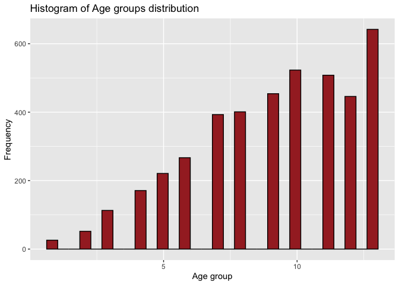

ST558, Project3
================
Jacob Press, Nataliya Peshekhodko
2023-11-05

- <a href="#1-introduction" id="toc-1-introduction">1 Introduction</a>
- <a href="#2-packages" id="toc-2-packages">2 Packages</a>
- <a href="#3-data" id="toc-3-data">3 Data</a>
- <a href="#4-explanatory-data-analysiseda"
  id="toc-4-explanatory-data-analysiseda">4 Explanatory Data
  Analysis(EDA)</a>
- <a href="#5-modeling" id="toc-5-modeling">5 Modeling</a>
  - <a href="#51-log-loss" id="toc-51-log-loss">5.1 Log loss</a>
  - <a href="#52-logistic-regression" id="toc-52-logistic-regression">5.2
    Logistic regression</a>
    - <a href="#521-fit-logistic-regression-model-1"
      id="toc-521-fit-logistic-regression-model-1">5.2.1 Fit Logistic
      regression model 1</a>
    - <a href="#522-fit-logistic-regression-model-2"
      id="toc-522-fit-logistic-regression-model-2">5.2.2 Fit Logistic
      regression model 2</a>
    - <a href="#523-fit-logistic-regression-model-3"
      id="toc-523-fit-logistic-regression-model-3">5.2.3 Fit Logistic
      regression model 3</a>
  - <a href="#53-lasso-logistic-regression"
    id="toc-53-lasso-logistic-regression">5.3 LASSO logistic regression</a>
    - <a href="#531-fit-and-validate-lasso-logistic-regression"
      id="toc-531-fit-and-validate-lasso-logistic-regression">5.3.1 Fit and
      validate LASSO logistic regression</a>
  - <a href="#54-classification-tree-model"
    id="toc-54-classification-tree-model">5.4 Classification tree model</a>
  - <a href="#55-random-forest-model" id="toc-55-random-forest-model">5.5
    Random forest model</a>
  - <a href="#56-new-model---support-vector-machine"
    id="toc-56-new-model---support-vector-machine">5.6 New model - Support
    Vector Machine</a>

``` r
#source("render.R")
```

# 1 Introduction

# 2 Packages

``` r
library(tidyverse)
library(caret)
library(ggplot2)
library(corrplot)
library(caret)
library(Metrics)
```

# 3 Data

``` r
data = read_csv('./data/diabetes_binary_health_indicators_BRFSS2015.csv')
```

Checking for NA values

``` r
sum(is.na(data))
```

    ## [1] 0

``` r
head(data)
```

    ## # A tibble: 6 × 22
    ##   Diabetes_binary HighBP HighChol CholCheck   BMI Smoker Stroke HeartDiseaseorAttack PhysActivity Fruits
    ##             <dbl>  <dbl>    <dbl>     <dbl> <dbl>  <dbl>  <dbl>                <dbl>        <dbl>  <dbl>
    ## 1               0      1        1         1    40      1      0                    0            0      0
    ## 2               0      0        0         0    25      1      0                    0            1      0
    ## 3               0      1        1         1    28      0      0                    0            0      1
    ## 4               0      1        0         1    27      0      0                    0            1      1
    ## 5               0      1        1         1    24      0      0                    0            1      1
    ## 6               0      1        1         1    25      1      0                    0            1      1
    ## # ℹ 12 more variables: Veggies <dbl>, HvyAlcoholConsump <dbl>, AnyHealthcare <dbl>, NoDocbcCost <dbl>,
    ## #   GenHlth <dbl>, MentHlth <dbl>, PhysHlth <dbl>, DiffWalk <dbl>, Sex <dbl>, Age <dbl>,
    ## #   Education <dbl>, Income <dbl>

Combine Education levels `1` and `2` into one level `12`

``` r
transformed <- data %>%
  mutate (Education = if_else(Education == 1 | Education == 2, 12, Education))
```

Sub-setting data for the selected education level:

``` r
print(params$education_level)
```

    ## [1] "12"

``` r
education_level = params$education_level

subset <- transformed %>%
  filter(Education == education_level)
```

Checking data structure:

``` r
str(subset)
```

    ## tibble [4,217 × 22] (S3: tbl_df/tbl/data.frame)
    ##  $ Diabetes_binary     : num [1:4217] 0 1 1 1 0 0 1 0 1 0 ...
    ##  $ HighBP              : num [1:4217] 1 1 0 1 1 1 1 1 1 0 ...
    ##  $ HighChol            : num [1:4217] 1 1 1 1 0 1 1 1 0 1 ...
    ##  $ CholCheck           : num [1:4217] 1 1 1 1 1 1 1 1 1 1 ...
    ##  $ BMI                 : num [1:4217] 38 28 32 25 35 45 25 37 30 36 ...
    ##  $ Smoker              : num [1:4217] 1 1 0 1 1 1 1 1 0 0 ...
    ##  $ Stroke              : num [1:4217] 0 0 0 0 0 0 0 0 0 0 ...
    ##  $ HeartDiseaseorAttack: num [1:4217] 0 1 1 1 0 1 0 0 0 0 ...
    ##  $ PhysActivity        : num [1:4217] 0 0 1 0 1 1 0 1 1 0 ...
    ##  $ Fruits              : num [1:4217] 1 0 0 1 1 1 0 1 0 0 ...
    ##  $ Veggies             : num [1:4217] 1 1 0 1 1 1 0 1 0 1 ...
    ##  $ HvyAlcoholConsump   : num [1:4217] 0 0 0 0 0 0 0 0 0 0 ...
    ##  $ AnyHealthcare       : num [1:4217] 1 1 1 1 1 1 1 1 1 0 ...
    ##  $ NoDocbcCost         : num [1:4217] 0 0 0 0 0 1 0 0 0 1 ...
    ##  $ GenHlth             : num [1:4217] 5 4 1 5 4 5 4 3 3 4 ...
    ##  $ MentHlth            : num [1:4217] 15 0 0 15 0 5 3 0 0 0 ...
    ##  $ PhysHlth            : num [1:4217] 30 0 0 30 1 10 6 0 7 30 ...
    ##  $ DiffWalk            : num [1:4217] 1 0 1 1 1 1 1 0 1 0 ...
    ##  $ Sex                 : num [1:4217] 0 1 0 0 1 0 1 0 0 1 ...
    ##  $ Age                 : num [1:4217] 13 12 13 9 9 7 12 11 10 5 ...
    ##  $ Education           : num [1:4217] 12 12 12 12 12 12 12 12 12 12 ...
    ##  $ Income              : num [1:4217] 3 4 2 3 5 2 2 2 3 3 ...

Variables in data set:

- **Diabetes_binary** - 0 = no diabetes, 1 = diabetes
- **HighBP** - 0 = no high blood pressure, 1 = high blood pressure
- **HighChol** - 0 = no high cholesterol, 1 = high cholesterol
- **CholCheck** - 0 = no cholesterol check in 5 years, 1 = yes
  cholesterol check in 5 years
- **BMI** - Body Mass Index
- **Smoker** - Have you smoked at least 100 cigarettes in your entire
  life? 0 = no, 1 = yes
- **Stroke** - (Ever told) you had a stroke. 0 = no, 1 = yes
- **HeartDiseaseorAttack** - Coronary heart disease (CHD) or myocardial
  infarction (MI), 0 = no, 1 = yes
- **PhysActivity** - Physical activity in past 30 days - not including
  job, 0 = no, 1 = yes
- **Fruits** - Consume Fruit 1 or more times per day, 0 = no, 1 = yes
- **Veggies** - Consume Vegetables 1 or more times per day, 0 = no 1 =
  yes
- **HvyAlcoholConsump** - Heavy drinkers (adult men having more than 14
  drinks per week and adult women having more than 7 drinks per week) 0
  = no
- **AnyHealthcare** - Have any kind of health care coverage, including
  health insurance, prepaid plans such as HMO, etc. 0 = no 1 = yes
- **NoDocbcCost** - Was there a time in the past 12 months when you
  needed to see a doctor but could not because of cost? 0 = no 1 = yes
- **GenHlth** - Would you say that in general your health is: scale 1-5
  1 = excellent 2 = very good 3 = good 4 = fair 5 = poor
- **MentHlth** - Now thinking about your mental health, which includes
  stress, depression, and problems with emotions, for how
- **PhysHlth** - Now thinking about your physical health, which includes
  physical illness and injury, for how many days during the past 30
- **DiffWalk** - Do you have serious difficulty walking or climbing
  stairs? 0 = no, 1 = yes
- **Sex** - 0 = female, 1 = male
- **Age** - 13-level age category, 1 = 18-24, 9 = 60-64, 13 = 80 or
  older
- **Education** - Education level scale 1-6, 1 = Never attended school
  or only kindergarten, 2 = Grades 1 through 8
- **Income** - Income scale scale 1-8, 1 = less than 10,000 dol, 5 =
  less than 35,000 dol, 8 = 75,000 dol or more

# 4 Explanatory Data Analysis(EDA)

``` r
table(subset$Diabetes_binary)
```

    ## 
    ##    0    1 
    ## 2987 1230

``` r
ggplot(data = subset, aes(x = Age)) +
  geom_histogram(color = "black", fill = 'brown') +
  labs(title = "Histogram of Age groups distribution", x = "Age group", y = "Frequency")
```

<!-- -->

``` r
table(subset$Diabetes_binary, subset$Age)
```

    ##    
    ##       1   2   3   4   5   6   7   8   9  10  11  12  13
    ##   0  25  48 104 157 200 203 308 273 291 320 315 285 458
    ##   1   1   4   9  14  21  64  85 128 163 203 193 161 184

``` r
table(factor (subset$Diabetes_binary, labels = c("No diabet", "Diabet")), 
      factor(subset$Sex, labels = c("Female", "Male")))
```

    ##            
    ##             Female Male
    ##   No diabet   1576 1411
    ##   Diabet       707  523

``` r
corrplot(cor(as.matrix(subset %>% select(-Education))), 
         type="upper", 
         tl.pos = "lt")
```

<!-- -->

``` r
table(subset$Diabetes_binary, subset$GenHlth)
```

    ##    
    ##        1    2    3    4    5
    ##   0  243  399 1010  924  411
    ##   1   32   62  255  510  371

``` r
table(subset$Diabetes_binary, factor(subset$HighBP, labels = c("No high BP", "High BP")) )
```

    ##    
    ##     No high BP High BP
    ##   0       1472    1515
    ##   1        268     962

``` r
table(subset$Diabetes_binary, factor (subset$HighChol, labels = c("No high chol", "High chol")))
```

    ##    
    ##     No high chol High chol
    ##   0         1611      1376
    ##   1          354       876

``` r
ggplot(subset, aes(x = as_factor(Diabetes_binary), 
                   y = BMI, 
                   fill = as_factor(Diabetes_binary))) +
  geom_boxplot() +
  labs(title = "BMI distribution for patients with and without diabetes", 
       x = "Diabetes", 
       y = "BMI")
```

<!-- -->

# 5 Modeling

Converting some of the variables to factors.

``` r
names = c('HighBP' ,'HighChol', 
          'CholCheck', 'Smoker', 
          'Diabetes_binary', 'Stroke',
          'HeartDiseaseorAttack', 'PhysActivity',
          'Fruits', 'Veggies', 
          'HvyAlcoholConsump', 'Sex',
          'Age','Income')
subset[,names] = lapply(subset[,names] , factor)
str(subset)
```

    ## tibble [4,217 × 22] (S3: tbl_df/tbl/data.frame)
    ##  $ Diabetes_binary     : Factor w/ 2 levels "0","1": 1 2 2 2 1 1 2 1 2 1 ...
    ##  $ HighBP              : Factor w/ 2 levels "0","1": 2 2 1 2 2 2 2 2 2 1 ...
    ##  $ HighChol            : Factor w/ 2 levels "0","1": 2 2 2 2 1 2 2 2 1 2 ...
    ##  $ CholCheck           : Factor w/ 2 levels "0","1": 2 2 2 2 2 2 2 2 2 2 ...
    ##  $ BMI                 : num [1:4217] 38 28 32 25 35 45 25 37 30 36 ...
    ##  $ Smoker              : Factor w/ 2 levels "0","1": 2 2 1 2 2 2 2 2 1 1 ...
    ##  $ Stroke              : Factor w/ 2 levels "0","1": 1 1 1 1 1 1 1 1 1 1 ...
    ##  $ HeartDiseaseorAttack: Factor w/ 2 levels "0","1": 1 2 2 2 1 2 1 1 1 1 ...
    ##  $ PhysActivity        : Factor w/ 2 levels "0","1": 1 1 2 1 2 2 1 2 2 1 ...
    ##  $ Fruits              : Factor w/ 2 levels "0","1": 2 1 1 2 2 2 1 2 1 1 ...
    ##  $ Veggies             : Factor w/ 2 levels "0","1": 2 2 1 2 2 2 1 2 1 2 ...
    ##  $ HvyAlcoholConsump   : Factor w/ 2 levels "0","1": 1 1 1 1 1 1 1 1 1 1 ...
    ##  $ AnyHealthcare       : num [1:4217] 1 1 1 1 1 1 1 1 1 0 ...
    ##  $ NoDocbcCost         : num [1:4217] 0 0 0 0 0 1 0 0 0 1 ...
    ##  $ GenHlth             : num [1:4217] 5 4 1 5 4 5 4 3 3 4 ...
    ##  $ MentHlth            : num [1:4217] 15 0 0 15 0 5 3 0 0 0 ...
    ##  $ PhysHlth            : num [1:4217] 30 0 0 30 1 10 6 0 7 30 ...
    ##  $ DiffWalk            : num [1:4217] 1 0 1 1 1 1 1 0 1 0 ...
    ##  $ Sex                 : Factor w/ 2 levels "0","1": 1 2 1 1 2 1 2 1 1 2 ...
    ##  $ Age                 : Factor w/ 13 levels "1","2","3","4",..: 13 12 13 9 9 7 12 11 10 5 ...
    ##  $ Education           : num [1:4217] 12 12 12 12 12 12 12 12 12 12 ...
    ##  $ Income              : Factor w/ 8 levels "1","2","3","4",..: 3 4 2 3 5 2 2 2 3 3 ...

Spiting up data training and validation data sets.

``` r
set.seed(5)
trainIndex <- createDataPartition(subset$Diabetes_binary, p = .7, 
                                  list = FALSE, 
                                  times = 1)
train_data = subset[trainIndex, ]
val_data = subset[-trainIndex, ]
```

## 5.1 Log loss

**Log loss**, also known as **logarithmic loss** or **cross-entropy
loss**, is a common evaluation metric for binary classification models.
It measures the performance of a model by quantifying the difference
between predicted probabilities and actual values. Log-loss is
indicative of how close the prediction probability is to the
corresponding actual/true value, penalizing inaccurate predictions with
higher values. Lower log-loss indicates better model performance.

Mathematical interpretation: Log Loss is the negative average of the log
of corrected predicted probabilities for each instance.

$$log \ loss = -\frac{1}{N} \sum_{i=1}^N y_i log(p(y_i)) + (1-y_i)log(1-p(y_i))$$

$p(y_i)$ is the probability of $1$.

$1-p(y_i)$ is the probability of 0.

## 5.2 Logistic regression

Logistic regression is a statistical and machine learning model used for
binary classification tasks. It’s a type of regression analysis that’s
well-suited for predicting the probability of an observation belonging
to one of two classes or categories.

- Logistic regression is used when the response variable is binary,
  meaning it has two possible outcomes or classes.
- Logistic regression uses the `sigmoid` function to model the
  relationship between the features and the probability of the binary
  outcome. The logistic function has an S-shaped curve and maps any
  real-valued number to a value between 0 and 1.
  $p(x)=\frac{1}{1+e^{-(\beta_0+\beta_1x)}}$. ($p(x)$ is the probability
  of the dependent variable being 1)
- The goal of logistic regression is to find the best-fitting model by
  estimating the coefficients $\beta_0$, $\beta_1$. This is typically
  done using a process called maximum likelihood estimation. The
  coefficients are adjusted to maximize the likelihood of the observed
  data given the model.

Creating lists to store model perfromance on train and validations data
sets.

``` r
models_performace_train = list()
models_performace_val = list()
```

### 5.2.1 Fit Logistic regression model 1

``` r
train_data$Diabetes_binary_transformed = train_data$Diabetes_binary
val_data$Diabetes_binary_transformed = val_data$Diabetes_binary

levels(train_data$Diabetes_binary_transformed) = make.names(levels(train_data$Diabetes_binary_transformed))
levels(val_data$Diabetes_binary_transformed) = make.names(levels(val_data$Diabetes_binary_transformed))
```

``` r
train_data
```

    ## # A tibble: 2,952 × 23
    ##    Diabetes_binary HighBP HighChol CholCheck   BMI Smoker Stroke HeartDiseaseorAttack PhysActivity
    ##    <fct>           <fct>  <fct>    <fct>     <dbl> <fct>  <fct>  <fct>                <fct>       
    ##  1 0               1      1        1            38 1      0      0                    0           
    ##  2 1               1      1        1            28 1      0      1                    0           
    ##  3 1               1      1        1            25 1      0      1                    0           
    ##  4 0               1      1        1            45 1      0      1                    1           
    ##  5 1               1      0        1            30 0      0      0                    1           
    ##  6 0               0      1        1            36 0      0      0                    0           
    ##  7 0               0      0        1            20 0      0      0                    1           
    ##  8 0               1      1        1            37 0      0      0                    0           
    ##  9 1               1      1        1            30 1      0      0                    0           
    ## 10 1               1      1        1            32 1      0      0                    0           
    ## # ℹ 2,942 more rows
    ## # ℹ 14 more variables: Fruits <fct>, Veggies <fct>, HvyAlcoholConsump <fct>, AnyHealthcare <dbl>,
    ## #   NoDocbcCost <dbl>, GenHlth <dbl>, MentHlth <dbl>, PhysHlth <dbl>, DiffWalk <dbl>, Sex <fct>,
    ## #   Age <fct>, Education <dbl>, Income <fct>, Diabetes_binary_transformed <fct>

``` r
train.control = trainControl(method = "cv", 
                              number = 5, 
                              summaryFunction=mnLogLoss,
                              classProbs = TRUE)

set.seed(83)
lr_model_1 = train(Diabetes_binary_transformed ~ 
                                   HighChol+
                                   BMI + 
                                   GenHlth, 
                                 data = train_data,
                                 method = "glm", 
                                 family="binomial",
                                 metric="logLoss",
                                 trControl = train.control
                                )
summary(lr_model_1)
```

    ## 
    ## Call:
    ## NULL
    ## 
    ## Coefficients:
    ##              Estimate Std. Error z value Pr(>|z|)    
    ## (Intercept) -4.592156   0.247084 -18.585  < 2e-16 ***
    ## HighChol1    0.781034   0.091961   8.493  < 2e-16 ***
    ## BMI          0.042900   0.005958   7.200 6.03e-13 ***
    ## GenHlth      0.536778   0.044825  11.975  < 2e-16 ***
    ## ---
    ## Signif. codes:  0 '***' 0.001 '**' 0.01 '*' 0.05 '.' 0.1 ' ' 1
    ## 
    ## (Dispersion parameter for binomial family taken to be 1)
    ## 
    ##     Null deviance: 3563.9  on 2951  degrees of freedom
    ## Residual deviance: 3179.4  on 2948  degrees of freedom
    ## AIC: 3187.4
    ## 
    ## Number of Fisher Scoring iterations: 4

Create custom function for log loss calculation.

``` r
calculateLogLoss <- function(predicted_probabilities, true_labels) {
  # Avoid log(0) or log(1) which can lead to NaN or Inf values
  predicted_probabilities = pmax(pmin(predicted_probabilities, 1 - 1e-15), 
                                 1e-15)

  log_loss <- -mean(true_labels * log(predicted_probabilities) + 
                      (1 - true_labels) * log(1 - predicted_probabilities))
  return(log_loss)
}
```

Calculate log loss for train data set for logistic regression model \#1.

``` r
train_predictions = predict(lr_model_1, 
                             newdata = train_data %>% select(-Diabetes_binary), 
                             type = "prob")

train_predictions
```

    ##            X0         X1
    ## 1   0.3768390 0.62316095
    ## 2   0.6136773 0.38632271
    ## 3   0.5136764 0.48632361
    ## 4   0.3093222 0.69067777
    ## 5   0.8448554 0.15514463
    ## 6   0.5298625 0.47013745
    ## 7   0.9607351 0.03926486
    ## 8   0.5191636 0.48083637
    ## 9   0.7137717 0.28622828
    ## 10  0.4389107 0.56108927
    ## 11  0.6136773 0.38632271
    ## 12  0.4389107 0.56108927
    ## 13  0.8409153 0.15908471
    ## 14  0.9517941 0.04820593
    ## 15  0.4762904 0.52370964
    ## 16  0.6697494 0.33025057
    ## 17  0.8825791 0.11742088
    ## 18  0.6487320 0.35126796
    ## 19  0.3768390 0.62316095
    ## 20  0.4815129 0.51848711
    ## 21  0.8332734 0.16672655
    ## 22  0.4179037 0.58209630
    ## 23  0.7686902 0.23130984
    ## 24  0.5827554 0.41724463
    ## 25  0.6884436 0.31155643
    ## 26  0.6487320 0.35126796
    ## 27  0.8660423 0.13395772
    ## 28  0.5457270 0.45427299
    ## 29  0.7240128 0.27598718
    ## 30  0.6307534 0.36924662
    ## 31  0.6437087 0.35629133
    ## 32  0.8229339 0.17706610
    ## 33  0.7309749 0.26902510
    ## 34  0.9409422 0.05905784
    ## 35  0.7762300 0.22376997
    ## 36  0.5952764 0.40472365
    ## 37  0.6931369 0.30686310
    ## 38  0.7943918 0.20560825
    ## 39  0.5878350 0.41216505
    ## 40  0.9233663 0.07663373
    ## 41  0.6136773 0.38632271
    ## 42  0.6034583 0.39654171
    ## 43  0.7999014 0.20009856
    ## 44  0.8272278 0.17277217
    ## 45  0.8965005 0.10349951
    ## 46  0.3471279 0.65287212
    ## 47  0.5563400 0.44366003
    ## 48  0.5136764 0.48632361
    ## 49  0.7686902 0.23130984
    ## 50  0.5243855 0.47561445
    ## 51  0.4179037 0.58209630
    ## 52  0.3869654 0.61303463
    ## 53  0.4708126 0.52918743
    ## 54  0.4977228 0.50227719
    ## 55  0.6791683 0.32083166
    ## 56  0.5298625 0.47013745
    ## 57  0.7907796 0.20922038
    ## 58  0.5243855 0.47561445
    ## 59  0.7137717 0.28622828
    ## 60  0.6959261 0.30407392
    ## 61  0.6839372 0.31606276
    ## 62  0.7065432 0.29345682
    ## 63  0.9385126 0.06148741
    ## 64  0.6487320 0.35126796
    ## 65  0.7475099 0.25249013
    ## 66  0.8033952 0.19660476
    ## 67  0.7555206 0.24447944
    ## 68  0.9409422 0.05905784
    ## 69  0.1808462 0.81915375
    ## 70  0.6697494 0.33025057
    ## 71  0.7977889 0.20221113
    ## 72  0.6680262 0.33197381
    ## 73  0.8448554 0.15514463
    ## 74  0.4283749 0.57162505
    ## 75  0.5320606 0.46793941
    ## 76  0.4495019 0.55049812
    ## 77  0.8847306 0.11526939
    ## 78  0.9137485 0.08625155
    ## 79  0.7309749 0.26902510
    ## 80  0.8609867 0.13901335
    ## 81  0.9346607 0.06533926
    ## 82  0.6791683 0.32083166
    ## 83  0.7555206 0.24447944
    ## 84  0.8609867 0.13901335
    ## 85  0.4179037 0.58209630
    ## 86  0.4708126 0.52918743
    ## 87  0.7686902 0.23130984
    ## 88  0.8438328 0.15616722
    ## 89  0.8709416 0.12905840
    ## 90  0.4708126 0.52918743
    ## 91  0.9477012 0.05229881
    ## 92  0.6136773 0.38632271
    ## 93  0.6034583 0.39654171
    ## 94  0.6237971 0.37620289
    ## 95  0.5084471 0.49155290
    ## 96  0.7762300 0.22376997
    ## 97  0.6003081 0.39969194
    ## 98  0.7555206 0.24447944
    ## 99  0.7309749 0.26902510
    ## 100 0.6631355 0.33686454
    ## 101 0.7450205 0.25497952
    ## 102 0.5084471 0.49155290
    ## 103 0.6237971 0.37620289
    ## 104 0.9477012 0.05229881
    ## 105 0.3619721 0.63802786
    ## 106 0.8165959 0.18340412
    ## 107 0.4977228 0.50227719
    ## 108 0.7198116 0.28018843
    ## 109 0.8146187 0.18538129
    ## 110 0.5298625 0.47013745
    ## 111 0.6631355 0.33686454
    ## 112 0.8802828 0.11971721
    ## 113 0.8965005 0.10349951
    ## 114 0.8557720 0.14422800
    ## 115 0.9067419 0.09325814
    ## 116 0.6237971 0.37620289
    ## 117 0.7858144 0.21418562
    ## 118 0.4024630 0.59753696
    ## 119 0.5243855 0.47561445
    ## 120 0.3869654 0.61303463
    ## 121 0.8965005 0.10349951
    ## 122 0.8709416 0.12905840
    ## 123 0.9202749 0.07972508
    ## 124 0.6884436 0.31155643
    ## 125 0.7872961 0.21270385
    ## 126 0.3093222 0.69067777
    ## 127 0.3820128 0.61798724
    ## 128 0.8794604 0.12053961
    ## 129 0.9011095 0.09889054
    ## 130 0.6534860 0.34651399
    ## 131 0.5669018 0.43309824
    ## 132 0.6237971 0.37620289
    ## 133 0.5878350 0.41216505
    ## 134 0.6867723 0.31322774
    ## 135 0.8557720 0.14422800
    ## 136 0.9397092 0.06029077
    ## 137 0.6136773 0.38632271
    ## 138 0.5191636 0.48083637
    ## 139 0.8100833 0.18991665
    ## 140 0.6697494 0.33025057
    ## 141 0.7686902 0.23130984
    ## 142 0.8391487 0.16085135
    ## 143 0.7367856 0.26321440
    ## 144 0.6820262 0.31797375
    ## 145 0.4495019 0.55049812
    ## 146 0.4601390 0.53986099
    ## 147 0.7242216 0.27577835
    ## 148 0.6105558 0.38944415
    ## 149 0.6631355 0.33686454
    ## 150 0.5350723 0.46492767
    ## 151 0.7762300 0.22376997
    ## 152 0.2869961 0.71300391
    ## 153 0.9137485 0.08625155
    ## 154 0.5617565 0.43824348
    ## 155 0.4075059 0.59249405
    ## 156 0.3921906 0.60780938
    ## 157 0.6931369 0.30686310
    ## 158 0.8557720 0.14422800
    ## 159 0.7835933 0.21640668
    ## 160 0.5405341 0.45946590
    ## 161 0.8229339 0.17706610
    ## 162 0.8465708 0.15342921
    ## 163 0.6457303 0.35426968
    ## 164 0.8847306 0.11526939
    ## 165 0.5298625 0.47013745
    ## 166 0.8503957 0.14960428
    ## 167 0.4815129 0.51848711
    ## 168 0.7762300 0.22376997
    ## 169 0.6774706 0.32252943
    ## 170 0.8890340 0.11096599
    ## 171 0.7198116 0.28018843
    ## 172 0.8557720 0.14422800
    ## 173 0.7325022 0.26749777
    ## 174 0.8240648 0.17593520
    ## 175 0.4128218 0.58717822
    ## 176 0.5617565 0.43824348
    ## 177 0.7450205 0.25497952
    ## 178 0.4495019 0.55049812
    ## 179 0.9590844 0.04091557
    ## 180 0.7835933 0.21640668
    ## 181 0.7450205 0.25497952
    ## 182 0.8609867 0.13901335
    ## 183 0.6457303 0.35426968
    ## 184 0.6505030 0.34949696
    ## 185 0.5350723 0.46492767
    ## 186 0.7907796 0.20922038
    ## 187 0.7049273 0.29507266
    ## 188 0.8557720 0.14422800
    ## 189 0.7835933 0.21640668
    ## 190 0.8503957 0.14960428
    ## 191 0.7137717 0.28622828
    ## 192 0.6554819 0.34451812
    ## 193 0.6631355 0.33686454
    ## 194 0.7943918 0.20560825
    ## 195 0.9455336 0.05446641
    ## 196 0.5617565 0.43824348
    ## 197 0.8391487 0.16085135
    ## 198 0.5827554 0.41724463
    ## 199 0.4977228 0.50227719
    ## 200 0.7110783 0.28892173
    ## 201 0.8847306 0.11526939
    ## 202 0.7907796 0.20922038
    ## 203 0.7633576 0.23664244
    ## 204 0.4922302 0.50776980
    ## 205 0.7092616 0.29073838
    ## 206 0.8802828 0.11971721
    ## 207 0.5617565 0.43824348
    ## 208 0.5827554 0.41724463
    ## 209 0.9292214 0.07077865
    ## 210 0.6237971 0.37620289
    ## 211 0.7309749 0.26902510
    ## 212 0.7907796 0.20922038
    ## 213 0.8756875 0.12431254
    ## 214 0.4179037 0.58209630
    ## 215 0.6631355 0.33686454
    ## 216 0.5298625 0.47013745
    ## 217 0.5405341 0.45946590
    ## 218 0.6867723 0.31322774
    ## 219 0.4601390 0.53986099
    ## 220 0.6136773 0.38632271
    ## 221 0.4708126 0.52918743
    ## 222 0.6631355 0.33686454
    ## 223 0.4708126 0.52918743
    ## 224 0.7686902 0.23130984
    ## 225 0.8272278 0.17277217
    ## 226 0.5029547 0.49704535
    ## 227 0.6338100 0.36618997
    ## 228 0.3768390 0.62316095
    ## 229 0.9372323 0.06276768
    ## 230 0.7367856 0.26321440
    ## 231 0.8756875 0.12431254
    ## 232 0.8839347 0.11606526
    ## 233 0.8609867 0.13901335
    ## 234 0.5511686 0.44883140
    ## 235 0.8780597 0.12194027
    ## 236 0.7530841 0.24691593
    ## 237 0.7393273 0.26067274
    ## 238 0.8635958 0.13640424
    ## 239 0.6791683 0.32083166
    ## 240 0.5585174 0.44148263
    ## 241 0.6745913 0.32540875
    ## 242 0.8992289 0.10077114
    ## 243 0.6437087 0.35629133
    ## 244 0.8557720 0.14422800
    ## 245 0.6975701 0.30242993
    ## 246 0.7710195 0.22898052
    ## 247 0.8952743 0.10472575
    ## 248 0.4601390 0.53986099
    ## 249 0.7110783 0.28892173
    ## 250 0.8660423 0.13395772
    ## 251 0.5722885 0.42771150
    ## 252 0.7450205 0.25497952
    ## 253 0.8609867 0.13901335
    ## 254 0.5722885 0.42771150
    ## 255 0.6055684 0.39443161
    ## 256 0.9011095 0.09889054
    ## 257 0.9103068 0.08969319
    ## 258 0.7872961 0.21270385
    ## 259 0.9170701 0.08292993
    ## 260 0.8756875 0.12431254
    ## 261 0.8046213 0.19537868
    ## 262 0.7137717 0.28622828
    ## 263 0.4815129 0.51848711
    ## 264 0.7137717 0.28622828
    ## 265 0.6867723 0.31322774
    ## 266 0.9497871 0.05021289
    ## 267 0.7475099 0.25249013
    ## 268 0.7977889 0.20221113
    ## 269 0.4922302 0.50776980
    ## 270 0.8210101 0.17898992
    ## 271 0.8660423 0.13395772
    ## 272 0.8609867 0.13901335
    ## 273 0.6237971 0.37620289
    ## 274 0.5827554 0.41724463
    ## 275 0.9537247 0.04627529
    ## 276 0.6034583 0.39654171
    ## 277 0.7137717 0.28622828
    ## 278 0.9537247 0.04627529
    ## 279 0.6237971 0.37620289
    ## 280 0.6697494 0.33025057
    ## 281 0.7977889 0.20221113
    ## 282 0.5191636 0.48083637
    ## 283 0.5084471 0.49155290
    ## 284 0.8756875 0.12431254
    ## 285 0.6237971 0.37620289
    ## 286 0.9432815 0.05671848
    ## 287 0.7609745 0.23902554
    ## 288 0.4075059 0.59249405
    ## 289 0.8177583 0.18224170
    ## 290 0.5617565 0.43824348
    ## 291 0.6912564 0.30874358
    ## 292 0.3768390 0.62316095
    ## 293 0.7762300 0.22376997
    ## 294 0.7555206 0.24447944
    ## 295 0.8557720 0.14422800
    ## 296 0.5617565 0.43824348
    ## 297 0.9292214 0.07077865
    ## 298 0.7977889 0.20221113
    ## 299 0.6931369 0.30686310
    ## 300 0.5405341 0.45946590
    ## 301 0.7224554 0.27754461
    ## 302 0.7785053 0.22149470
    ## 303 0.8557720 0.14422800
    ## 304 0.5191636 0.48083637
    ## 305 0.3869654 0.61303463
    ## 306 0.6034583 0.39654171
    ## 307 0.7835933 0.21640668
    ## 308 0.8520606 0.14793939
    ## 309 0.8530387 0.14696129
    ## 310 0.6867723 0.31322774
    ## 311 0.8448554 0.15514463
    ## 312 0.8046213 0.19537868
    ## 313 0.5511686 0.44883140
    ## 314 0.8240648 0.17593520
    ## 315 0.8660423 0.13395772
    ## 316 0.6791683 0.32083166
    ## 317 0.5931482 0.40685181
    ## 318 0.7450205 0.25497952
    ## 319 0.8890340 0.11096599
    ## 320 0.9623219 0.03767813
    ## 321 0.8210101 0.17898992
    ## 322 0.7835933 0.21640668
    ## 323 0.5827554 0.41724463
    ## 324 0.4495019 0.55049812
    ## 325 0.8802828 0.11971721
    ## 326 0.6237971 0.37620289
    ## 327 0.8756875 0.12431254
    ## 328 0.6697494 0.33025057
    ## 329 0.9497871 0.05021289
    ## 330 0.7224554 0.27754461
    ## 331 0.6237971 0.37620289
    ## 332 0.6034583 0.39654171
    ## 333 0.7894894 0.21051059
    ## 334 0.4283749 0.57162505
    ## 335 0.8503957 0.14960428
    ## 336 0.7835933 0.21640668
    ## 337 0.8609867 0.13901335
    ## 338 0.5722885 0.42771150
    ## 339 0.8709416 0.12905840
    ## 340 0.9137485 0.08625155
    ## 341 0.5136764 0.48632361
    ## 342 0.9137485 0.08625155
    ## 343 0.7943918 0.20560825
    ## 344 0.9120848 0.08791524
    ## 345 0.4601390 0.53986099
    ## 346 0.8869526 0.11304742
    ## 347 0.9537247 0.04627529
    ## 348 0.8272278 0.17277217
    ## 349 0.6820262 0.31797375
    ## 350 0.7977889 0.20221113
    ## 351 0.6631355 0.33686454
    ## 352 0.5827554 0.41724463
    ## 353 0.6237971 0.37620289
    ## 354 0.8756875 0.12431254
    ## 355 0.8350919 0.16490807
    ## 356 0.5029547 0.49704535
    ## 357 0.6237971 0.37620289
    ## 358 0.6505030 0.34949696
    ## 359 0.5084471 0.49155290
    ## 360 0.7450205 0.25497952
    ## 361 0.7450205 0.25497952
    ## 362 0.8448554 0.15514463
    ## 363 0.9477012 0.05229881
    ## 364 0.5931482 0.40685181
    ## 365 0.6791683 0.32083166
    ## 366 0.7137717 0.28622828
    ## 367 0.6697494 0.33025057
    ## 368 0.8080525 0.19194752
    ## 369 0.7393273 0.26067274
    ## 370 0.6959261 0.30407392
    ## 371 0.8847306 0.11526939
    ## 372 0.6237971 0.37620289
    ## 373 0.7686902 0.23130984
    ## 374 0.8609867 0.13901335
    ## 375 0.8177583 0.18224170
    ## 376 0.5617565 0.43824348
    ## 377 0.6105558 0.38944415
    ## 378 0.4495019 0.55049812
    ## 379 0.6136773 0.38632271
    ## 380 0.8272278 0.17277217
    ## 381 0.7450205 0.25497952
    ## 382 0.8177583 0.18224170
    ## 383 0.7762300 0.22376997
    ## 384 0.6791683 0.32083166
    ## 385 0.8332734 0.16672655
    ## 386 0.8503957 0.14960428
    ## 387 0.9477012 0.05229881
    ## 388 0.8931961 0.10680385
    ## 389 0.7686902 0.23130984
    ## 390 0.6791683 0.32083166
    ## 391 0.8952743 0.10472575
    ## 392 0.7393273 0.26067274
    ## 393 0.9455336 0.05446641
    ## 394 0.6867723 0.31322774
    ## 395 0.6774706 0.32252943
    ## 396 0.7393273 0.26067274
    ## 397 0.8112775 0.18872249
    ## 398 0.6437087 0.35629133
    ## 399 0.9067419 0.09325814
    ## 400 0.4495019 0.55049812
    ## 401 0.6237971 0.37620289
    ## 402 0.8609867 0.13901335
    ## 403 0.9432815 0.05671848
    ## 404 0.6534860 0.34651399
    ## 405 0.5827554 0.41724463
    ## 406 0.4389107 0.56108927
    ## 407 0.6406878 0.35931220
    ## 408 0.8802828 0.11971721
    ## 409 0.9497871 0.05021289
    ## 410 0.8756875 0.12431254
    ## 411 0.9004139 0.09958606
    ## 412 0.6631355 0.33686454
    ## 413 0.5827554 0.41724463
    ## 414 0.6726508 0.32734920
    ## 415 0.6601924 0.33980764
    ## 416 0.7977889 0.20221113
    ## 417 0.7907796 0.20922038
    ## 418 0.7450205 0.25497952
    ## 419 0.8112775 0.18872249
    ## 420 0.6338100 0.36618997
    ## 421 0.9455336 0.05446641
    ## 422 0.7609745 0.23902554
    ## 423 0.8112775 0.18872249
    ## 424 0.8557720 0.14422800
    ## 425 0.4495019 0.55049812
    ## 426 0.8635958 0.13640424
    ## 427 0.8134408 0.18655917
    ## 428 0.6437087 0.35629133
    ## 429 0.6237971 0.37620289
    ## 430 0.7110783 0.28892173
    ## 431 0.7748756 0.22512436
    ## 432 0.9292214 0.07077865
    ## 433 0.8992289 0.10077114
    ## 434 0.7872961 0.21270385
    ## 435 0.8709416 0.12905840
    ## 436 0.8391487 0.16085135
    ## 437 0.9292214 0.07077865
    ## 438 0.8733913 0.12660866
    ## 439 0.7609745 0.23902554
    ## 440 0.7530841 0.24691593
    ## 441 0.6437087 0.35629133
    ## 442 0.4179037 0.58209630
    ## 443 0.6034583 0.39654171
    ## 444 0.4283749 0.57162505
    ## 445 0.9319914 0.06800856
    ## 446 0.7609745 0.23902554
    ## 447 0.6338100 0.36618997
    ## 448 0.8709416 0.12905840
    ## 449 0.6959261 0.30407392
    ## 450 0.5931482 0.40685181
    ## 451 0.4708126 0.52918743
    ## 452 0.8165959 0.18340412
    ## 453 0.9477012 0.05229881
    ## 454 0.8890340 0.11096599
    ## 455 0.5827554 0.41724463
    ## 456 0.4817739 0.51822613
    ## 457 0.7633576 0.23664244
    ## 458 0.7094771 0.29052287
    ## 459 0.8321897 0.16781032
    ## 460 0.5320606 0.46793941
    ## 461 0.9573674 0.04263260
    ## 462 0.8911832 0.10881677
    ## 463 0.9004139 0.09958606
    ## 464 0.9346607 0.06533926
    ## 465 0.5827554 0.41724463
    ## 466 0.7224554 0.27754461
    ## 467 0.6534860 0.34651399
    ## 468 0.7137717 0.28622828
    ## 469 0.8802828 0.11971721
    ## 470 0.8557720 0.14422800
    ## 471 0.7673038 0.23269619
    ## 472 0.7530841 0.24691593
    ## 473 0.8520606 0.14793939
    ## 474 0.7450205 0.25497952
    ## 475 0.5405341 0.45946590
    ## 476 0.6136773 0.38632271
    ## 477 0.9170701 0.08292993
    ## 478 0.6601924 0.33980764
    ## 479 0.9137485 0.08625155
    ## 480 0.6631355 0.33686454
    ## 481 0.5617565 0.43824348
    ## 482 0.4495019 0.55049812
    ## 483 0.7450205 0.25497952
    ## 484 0.6105558 0.38944415
    ## 485 0.7609745 0.23902554
    ## 486 0.5136764 0.48632361
    ## 487 0.8112775 0.18872249
    ## 488 0.7475099 0.25249013
    ## 489 0.8952743 0.10472575
    ## 490 0.7153587 0.28464131
    ## 491 0.7393273 0.26067274
    ## 492 0.5191636 0.48083637
    ## 493 0.4283749 0.57162505
    ## 494 0.8290987 0.17090127
    ## 495 0.8709416 0.12905840
    ## 496 0.9137485 0.08625155
    ## 497 0.8465708 0.15342921
    ## 498 0.8709416 0.12905840
    ## 499 0.5191636 0.48083637
    ## 500 0.5457270 0.45427299
    ##  [ reached 'max' / getOption("max.print") -- omitted 2452 rows ]

``` r
predicted_prob_class1 = train_predictions[, 1]
true_labels = as.integer(as.character(train_data$Diabetes_binary))

log_loss_train_lr_model_1 = calculateLogLoss(predicted_prob_class1, true_labels)
print(paste("Log Loss:", log_loss_train_lr_model_1))
```

    ## [1] "Log Loss: 1.25089091044139"

``` r
models_performace_train[["logistic_regression_model_1"]] <- log_loss_train_lr_model_1
```

Calculate log loss for validation data set

``` r
val_predictions = predict(lr_model_1, 
                             newdata = val_data %>% select(-Diabetes_binary), 
                             type = "prob")
val_predictions
```

    ##            X0         X1
    ## 1   0.8700645 0.12993549
    ## 2   0.7198116 0.28018843
    ## 3   0.6437087 0.35629133
    ## 4   0.6487320 0.35126796
    ## 5   0.3374702 0.66252983
    ## 6   0.9263474 0.07365265
    ## 7   0.6931369 0.30686310
    ## 8   0.4389107 0.56108927
    ## 9   0.7762300 0.22376997
    ## 10  0.9359899 0.06401012
    ## 11  0.4601390 0.53986099
    ## 12  0.7943918 0.20560825
    ## 13  0.3971904 0.60280963
    ## 14  0.9233663 0.07663373
    ## 15  0.7393273 0.26067274
    ## 16  0.7977889 0.20221113
    ## 17  0.4232583 0.57674172
    ## 18  0.8350919 0.16490807
    ## 19  0.7943918 0.20560825
    ## 20  0.5350723 0.46492767
    ## 21  0.8100833 0.18991665
    ## 22  0.7822710 0.21772900
    ## 23  0.7785053 0.22149470
    ## 24  0.7198116 0.28018843
    ## 25  0.7475099 0.25249013
    ## 26  0.7393273 0.26067274
    ## 27  0.5899717 0.41002830
    ## 28  0.5350723 0.46492767
    ## 29  0.8046213 0.19537868
    ## 30  0.4708126 0.52918743
    ## 31  0.8625527 0.13744727
    ## 32  0.8013104 0.19868961
    ## 33  0.7153587 0.28464131
    ## 34  0.7965308 0.20346924
    ## 35  0.8573871 0.14261291
    ## 36  0.6867723 0.31322774
    ## 37  0.6358561 0.36414392
    ## 38  0.7649482 0.23505179
    ## 39  0.4495019 0.55049812
    ## 40  0.5350723 0.46492767
    ## 41  0.7633576 0.23664244
    ## 42  0.8503957 0.14960428
    ## 43  0.8931961 0.10680385
    ## 44  0.7137717 0.28622828
    ## 45  0.4443290 0.55567099
    ## 46  0.3971904 0.60280963
    ## 47  0.6338100 0.36618997
    ## 48  0.7224554 0.27754461
    ## 49  0.6034583 0.39654171
    ## 50  0.7309749 0.26902510
    ## 51  0.8165959 0.18340412
    ## 52  0.7367856 0.26321440
    ## 53  0.7762300 0.22376997
    ## 54  0.5405341 0.45946590
    ## 55  0.5350723 0.46492767
    ## 56  0.9477012 0.05229881
    ## 57  0.6237971 0.37620289
    ## 58  0.8847306 0.11526939
    ## 59  0.6487320 0.35126796
    ## 60  0.9067419 0.09325814
    ## 61  0.4708126 0.52918743
    ## 62  0.8210101 0.17898992
    ## 63  0.8756875 0.12431254
    ## 64  0.8210101 0.17898992
    ## 65  0.8847306 0.11526939
    ## 66  0.7762300 0.22376997
    ## 67  0.4601390 0.53986099
    ## 68  0.7710195 0.22898052
    ## 69  0.8520606 0.14793939
    ## 70  0.8600528 0.13994723
    ## 71  0.5827554 0.41724463
    ## 72  0.5298625 0.47013745
    ## 73  0.6406878 0.35931220
    ## 74  0.7224554 0.27754461
    ## 75  0.7530841 0.24691593
    ## 76  0.8046213 0.19537868
    ## 77  0.5405341 0.45946590
    ## 78  0.7710195 0.22898052
    ## 79  0.8165959 0.18340412
    ## 80  0.7393273 0.26067274
    ## 81  0.8448554 0.15514463
    ## 82  0.8609867 0.13901335
    ## 83  0.5827554 0.41724463
    ## 84  0.3768390 0.62316095
    ## 85  0.5827554 0.41724463
    ## 86  0.9218722 0.07812777
    ## 87  0.8557720 0.14422800
    ## 88  0.5795553 0.42044475
    ## 89  0.8557720 0.14422800
    ## 90  0.7110783 0.28892173
    ## 91  0.6534860 0.34651399
    ## 92  0.7110783 0.28892173
    ## 93  0.3971904 0.60280963
    ## 94  0.3279462 0.67205382
    ## 95  0.4708126 0.52918743
    ## 96  0.7858144 0.21418562
    ## 97  0.7067599 0.29324013
    ## 98  0.6406878 0.35931220
    ## 99  0.6307534 0.36924662
    ## 100 0.6034583 0.39654171
    ## 101 0.6437087 0.35629133
    ## 102 0.6338100 0.36618997
    ## 103 0.5617565 0.43824348
    ## 104 0.8391487 0.16085135
    ## 105 0.7450205 0.25497952
    ## 106 0.2571771 0.74282287
    ## 107 0.7835933 0.21640668
    ## 108 0.7686902 0.23130984
    ## 109 0.8272278 0.17277217
    ## 110 0.7367856 0.26321440
    ## 111 0.6136773 0.38632271
    ## 112 0.7224554 0.27754461
    ## 113 0.8033952 0.19660476
    ## 114 0.8756875 0.12431254
    ## 115 0.5511686 0.44883140
    ## 116 0.8756875 0.12431254
    ## 117 0.8046213 0.19537868
    ## 118 0.4977228 0.50227719
    ## 119 0.9278325 0.07216746
    ## 120 0.9432815 0.05671848
    ## 121 0.8332734 0.16672655
    ## 122 0.7710195 0.22898052
    ## 123 0.7835933 0.21640668
    ## 124 0.7530841 0.24691593
    ## 125 0.9432815 0.05671848
    ## 126 0.7609745 0.23902554
    ## 127 0.6791683 0.32083166
    ## 128 0.8557720 0.14422800
    ## 129 0.4815129 0.51848711
    ## 130 0.6726508 0.32734920
    ## 131 0.6237971 0.37620289
    ## 132 0.7450205 0.25497952
    ## 133 0.4389107 0.56108927
    ## 134 0.5848999 0.41510015
    ## 135 0.6034583 0.39654171
    ## 136 0.4283749 0.57162505
    ## 137 0.6136773 0.38632271
    ## 138 0.9359899 0.06401012
    ## 139 0.5298625 0.47013745
    ## 140 0.8448554 0.15514463
    ## 141 0.8448554 0.15514463
    ## 142 0.9517941 0.04820593
    ## 143 0.8756875 0.12431254
    ## 144 0.8503957 0.14960428
    ## 145 0.5827554 0.41724463
    ## 146 0.8448554 0.15514463
    ## 147 0.8332734 0.16672655
    ## 148 0.8177583 0.18224170
    ## 149 0.6534860 0.34651399
    ## 150 0.9030503 0.09694970
    ## 151 0.7943918 0.20560825
    ## 152 0.9385126 0.06148741
    ## 153 0.5563400 0.44366003
    ## 154 0.8272278 0.17277217
    ## 155 0.6136773 0.38632271
    ## 156 0.7907796 0.20922038
    ## 157 0.8448554 0.15514463
    ## 158 0.4283749 0.57162505
    ## 159 0.8660423 0.13395772
    ## 160 0.8080525 0.19194752
    ## 161 0.9359899 0.06401012
    ## 162 0.9067419 0.09325814
    ## 163 0.8557720 0.14422800
    ## 164 0.7835933 0.21640668
    ## 165 0.7367856 0.26321440
    ## 166 0.7762300 0.22376997
    ## 167 0.8448554 0.15514463
    ## 168 0.9359899 0.06401012
    ## 169 0.6867723 0.31322774
    ## 170 0.4870006 0.51299939
    ## 171 0.8660423 0.13395772
    ## 172 0.6959261 0.30407392
    ## 173 0.6839372 0.31606276
    ## 174 0.7049273 0.29507266
    ## 175 0.6697494 0.33025057
    ## 176 0.7198116 0.28018843
    ## 177 0.9137485 0.08625155
    ## 178 0.6774706 0.32252943
    ## 179 0.7835933 0.21640668
    ## 180 0.6034583 0.39654171
    ## 181 0.9170701 0.08292993
    ## 182 0.8229339 0.17706610
    ## 183 0.8794604 0.12053961
    ## 184 0.7224554 0.27754461
    ## 185 0.8890340 0.11096599
    ## 186 0.9170701 0.08292993
    ## 187 0.7800235 0.21997652
    ## 188 0.6534860 0.34651399
    ## 189 0.8609867 0.13901335
    ## 190 0.8660423 0.13395772
    ## 191 0.8448554 0.15514463
    ## 192 0.9249067 0.07509330
    ## 193 0.8210101 0.17898992
    ## 194 0.8609867 0.13901335
    ## 195 0.5931482 0.40685181
    ## 196 0.5617565 0.43824348
    ## 197 0.8869526 0.11304742
    ## 198 0.7633576 0.23664244
    ## 199 0.7907796 0.20922038
    ## 200 0.7907796 0.20922038
    ## 201 0.6286954 0.37130459
    ## 202 0.5827554 0.41724463
    ## 203 0.8448554 0.15514463
    ## 204 0.8756875 0.12431254
    ## 205 0.7367856 0.26321440
    ## 206 0.7224554 0.27754461
    ## 207 0.6884436 0.31155643
    ## 208 0.7367856 0.26321440
    ## 209 0.8112775 0.18872249
    ## 210 0.7798441 0.22015594
    ## 211 0.7835933 0.21640668
    ## 212 0.6237971 0.37620289
    ## 213 0.9497871 0.05021289
    ## 214 0.8046213 0.19537868
    ## 215 0.4601390 0.53986099
    ## 216 0.6437087 0.35629133
    ## 217 0.4730121 0.52698789
    ## 218 0.9497871 0.05021289
    ## 219 0.6975701 0.30242993
    ## 220 0.7555206 0.24447944
    ## 221 0.9497871 0.05021289
    ## 222 0.7309749 0.26902510
    ## 223 0.7835933 0.21640668
    ## 224 0.4922302 0.50776980
    ## 225 0.9409422 0.05905784
    ## 226 0.7835933 0.21640668
    ## 227 0.8660423 0.13395772
    ## 228 0.6237971 0.37620289
    ## 229 0.5457270 0.45427299
    ## 230 0.8448554 0.15514463
    ## 231 0.7530841 0.24691593
    ## 232 0.7835933 0.21640668
    ## 233 0.8503957 0.14960428
    ## 234 0.6867723 0.31322774
    ## 235 0.7835933 0.21640668
    ## 236 0.6338100 0.36618997
    ## 237 0.7065432 0.29345682
    ## 238 0.8177583 0.18224170
    ## 239 0.5722885 0.42771150
    ## 240 0.8660423 0.13395772
    ## 241 0.8177583 0.18224170
    ## 242 0.7530841 0.24691593
    ## 243 0.8210101 0.17898992
    ## 244 0.8503957 0.14960428
    ## 245 0.4601390 0.53986099
    ## 246 0.8609867 0.13901335
    ## 247 0.6388947 0.36110533
    ## 248 0.9202749 0.07972508
    ## 249 0.5585174 0.44148263
    ## 250 0.6505030 0.34949696
    ## 251 0.6931369 0.30686310
    ## 252 0.7977889 0.20221113
    ## 253 0.7021854 0.29781462
    ## 254 0.9432815 0.05671848
    ## 255 0.8520606 0.14793939
    ## 256 0.4977228 0.50227719
    ## 257 0.8465708 0.15342921
    ## 258 0.6338100 0.36618997
    ## 259 0.9137485 0.08625155
    ## 260 0.5298625 0.47013745
    ## 261 0.5880882 0.41191180
    ## 262 0.5722885 0.42771150
    ## 263 0.5774031 0.42259689
    ## 264 0.6912564 0.30874358
    ## 265 0.8756875 0.12431254
    ## 266 0.8847306 0.11526939
    ## 267 0.7309749 0.26902510
    ## 268 0.6631355 0.33686454
    ## 269 0.7155715 0.28442851
    ## 270 0.4601390 0.53986099
    ## 271 0.7367856 0.26321440
    ## 272 0.6034583 0.39654171
    ## 273 0.5051610 0.49483899
    ## 274 0.4999293 0.50007070
    ## 275 0.7309749 0.26902510
    ## 276 0.8660423 0.13395772
    ## 277 0.7748756 0.22512436
    ## 278 0.4708126 0.52918743
    ## 279 0.6136773 0.38632271
    ## 280 0.8503957 0.14960428
    ## 281 0.5029547 0.49704535
    ## 282 0.6136773 0.38632271
    ## 283 0.5298625 0.47013745
    ## 284 0.7633576 0.23664244
    ## 285 0.7835933 0.21640668
    ## 286 0.9137485 0.08625155
    ## 287 0.5243855 0.47561445
    ## 288 0.8391487 0.16085135
    ## 289 0.7049273 0.29507266
    ## 290 0.8146187 0.18538129
    ## 291 0.8847306 0.11526939
    ## 292 0.5880882 0.41191180
    ## 293 0.8651370 0.13486296
    ## 294 0.9202749 0.07972508
    ## 295 0.6534860 0.34651399
    ## 296 0.7393273 0.26067274
    ## 297 0.8583358 0.14166417
    ## 298 0.4815129 0.51848711
    ## 299 0.5511686 0.44883140
    ## 300 0.7153587 0.28464131
    ## 301 0.5617565 0.43824348
    ## 302 0.7049273 0.29507266
    ## 303 0.7907796 0.20922038
    ## 304 0.4708126 0.52918743
    ## 305 0.6631355 0.33686454
    ## 306 0.6338100 0.36618997
    ## 307 0.8609867 0.13901335
    ## 308 0.5585174 0.44148263
    ## 309 0.4601390 0.53986099
    ## 310 0.8240648 0.17593520
    ## 311 0.6554819 0.34451812
    ## 312 0.4179037 0.58209630
    ## 313 0.7530841 0.24691593
    ## 314 0.3093222 0.69067777
    ## 315 0.9385126 0.06148741
    ## 316 0.5511686 0.44883140
    ## 317 0.4977228 0.50227719
    ## 318 0.4601390 0.53986099
    ## 319 0.7137717 0.28622828
    ## 320 0.8448554 0.15514463
    ## 321 0.6959261 0.30407392
    ## 322 0.6839372 0.31606276
    ## 323 0.8609867 0.13901335
    ## 324 0.6105558 0.38944415
    ## 325 0.8802828 0.11971721
    ## 326 0.9217969 0.07820309
    ## 327 0.7530841 0.24691593
    ## 328 0.6237971 0.37620289
    ## 329 0.9263474 0.07365265
    ## 330 0.8503957 0.14960428
    ## 331 0.6258661 0.37413392
    ## 332 0.8290987 0.17090127
    ## 333 0.5191636 0.48083637
    ## 334 0.7530841 0.24691593
    ## 335 0.6534860 0.34651399
    ## 336 0.9170701 0.08292993
    ## 337 0.4232583 0.57674172
    ## 338 0.4762904 0.52370964
    ## 339 0.8520606 0.14793939
    ## 340 0.8972202 0.10277978
    ## 341 0.8890340 0.11096599
    ## 342 0.5617565 0.43824348
    ## 343 0.9590844 0.04091557
    ## 344 0.5827554 0.41724463
    ## 345 0.8660423 0.13395772
    ## 346 0.8391487 0.16085135
    ## 347 0.5617565 0.43824348
    ## 348 0.7929464 0.20705358
    ## 349 0.7609745 0.23902554
    ## 350 0.5722885 0.42771150
    ## 351 0.8709416 0.12905840
    ## 352 0.4656019 0.53439812
    ## 353 0.8660423 0.13395772
    ## 354 0.6237971 0.37620289
    ## 355 0.6726508 0.32734920
    ## 356 0.6388947 0.36110533
    ## 357 0.6726508 0.32734920
    ## 358 0.3971904 0.60280963
    ## 359 0.8112775 0.18872249
    ## 360 0.7198116 0.28018843
    ## 361 0.9263474 0.07365265
    ## 362 0.8611117 0.13888828
    ## 363 0.4179037 0.58209630
    ## 364 0.6534860 0.34651399
    ## 365 0.6034583 0.39654171
    ## 366 0.9011095 0.09889054
    ## 367 0.8931961 0.10680385
    ## 368 0.8046213 0.19537868
    ## 369 0.8033952 0.19660476
    ## 370 0.9385126 0.06148741
    ## 371 0.5722885 0.42771150
    ## 372 0.9048671 0.09513287
    ## 373 0.8557720 0.14422800
    ## 374 0.8080525 0.19194752
    ## 375 0.8625527 0.13744727
    ## 376 0.7224554 0.27754461
    ## 377 0.7907796 0.20922038
    ## 378 0.8609867 0.13901335
    ## 379 0.8609867 0.13901335
    ## 380 0.6791683 0.32083166
    ## 381 0.5136764 0.48632361
    ## 382 0.8013104 0.19868961
    ## 383 0.8332734 0.16672655
    ## 384 0.7393273 0.26067274
    ## 385 0.8609867 0.13901335
    ## 386 0.9385126 0.06148741
    ## 387 0.6820262 0.31797375
    ## 388 0.7049273 0.29507266
    ## 389 0.8494031 0.15059686
    ## 390 0.7633576 0.23664244
    ## 391 0.6507407 0.34925935
    ## 392 0.9067419 0.09325814
    ## 393 0.8332734 0.16672655
    ## 394 0.7309749 0.26902510
    ## 395 0.6338100 0.36618997
    ## 396 0.8210101 0.17898992
    ## 397 0.5722885 0.42771150
    ## 398 0.8409153 0.15908471
    ## 399 0.5617565 0.43824348
    ## 400 0.8609867 0.13901335
    ## 401 0.7633576 0.23664244
    ## 402 0.4922302 0.50776980
    ## 403 0.8301984 0.16980162
    ## 404 0.7327070 0.26729300
    ## 405 0.9120009 0.08799909
    ## 406 0.8465708 0.15342921
    ## 407 0.8066798 0.19332020
    ## 408 0.7224554 0.27754461
    ## 409 0.8033952 0.19660476
    ## 410 0.9385126 0.06148741
    ## 411 0.9011095 0.09889054
    ## 412 0.8756875 0.12431254
    ## 413 0.7686902 0.23130984
    ## 414 0.4283749 0.57162505
    ## 415 0.7686902 0.23130984
    ## 416 0.8350919 0.16490807
    ## 417 0.9477012 0.05229881
    ## 418 0.7003364 0.29966362
    ## 419 0.7393273 0.26067274
    ## 420 0.7393273 0.26067274
    ## 421 0.2825209 0.71747908
    ## 422 0.7762300 0.22376997
    ## 423 0.6237971 0.37620289
    ## 424 0.5722885 0.42771150
    ## 425 0.7530841 0.24691593
    ## 426 0.4708126 0.52918743
    ## 427 0.5405341 0.45946590
    ## 428 0.6457303 0.35426968
    ## 429 0.8465708 0.15342921
    ## 430 0.9477012 0.05229881
    ## 431 0.6207069 0.37929310
    ## 432 0.7649482 0.23505179
    ## 433 0.5457270 0.45427299
    ## 434 0.6207069 0.37929310
    ## 435 0.6437087 0.35629133
    ## 436 0.7835933 0.21640668
    ## 437 0.8503957 0.14960428
    ## 438 0.3869654 0.61303463
    ## 439 0.6105558 0.38944415
    ## 440 0.4708126 0.52918743
    ## 441 0.7325022 0.26749777
    ## 442 0.7110783 0.28892173
    ## 443 0.8391487 0.16085135
    ## 444 0.7686902 0.23130984
    ## 445 0.7977889 0.20221113
    ## 446 0.9103068 0.08969319
    ## 447 0.6437087 0.35629133
    ## 448 0.4601390 0.53986099
    ## 449 0.6388947 0.36110533
    ## 450 0.7872961 0.21270385
    ## 451 0.5639282 0.43607183
    ## 452 0.7710195 0.22898052
    ## 453 0.3668192 0.63318085
    ## 454 0.6237971 0.37620289
    ## 455 0.6631355 0.33686454
    ## 456 0.5243855 0.47561445
    ## 457 0.4870006 0.51299939
    ## 458 0.6975701 0.30242993
    ## 459 0.4283749 0.57162505
    ## 460 0.5984397 0.40156028
    ## 461 0.9103068 0.08969319
    ## 462 0.4283749 0.57162505
    ## 463 0.7686902 0.23130984
    ## 464 0.6487320 0.35126796
    ## 465 0.6487320 0.35126796
    ## 466 0.8409153 0.15908471
    ## 467 0.5617565 0.43824348
    ## 468 0.9233663 0.07663373
    ## 469 0.7408240 0.25917602
    ## 470 0.5899717 0.41002830
    ## 471 0.6437087 0.35629133
    ## 472 0.8080525 0.19194752
    ## 473 0.8972202 0.10277978
    ## 474 0.8503957 0.14960428
    ## 475 0.8112775 0.18872249
    ## 476 0.8609867 0.13901335
    ## 477 0.8046213 0.19537868
    ## 478 0.9477012 0.05229881
    ## 479 0.4815129 0.51848711
    ## 480 0.3471279 0.65287212
    ## 481 0.8847306 0.11526939
    ## 482 0.6534860 0.34651399
    ## 483 0.8046213 0.19537868
    ## 484 0.8557720 0.14422800
    ## 485 0.8802828 0.11971721
    ## 486 0.7555206 0.24447944
    ## 487 0.8660423 0.13395772
    ## 488 0.6820262 0.31797375
    ## 489 0.4075059 0.59249405
    ## 490 0.8651370 0.13486296
    ## 491 0.8924516 0.10754838
    ## 492 0.9359899 0.06401012
    ## 493 0.8350919 0.16490807
    ## 494 0.4815129 0.51848711
    ## 495 0.8709416 0.12905840
    ## 496 0.8332734 0.16672655
    ## 497 0.4443290 0.55567099
    ## 498 0.4179037 0.58209630
    ## 499 0.6534860 0.34651399
    ## 500 0.7021854 0.29781462
    ##  [ reached 'max' / getOption("max.print") -- omitted 765 rows ]

``` r
predicted_prob_class1 = val_predictions[, 1]
true_labels = as.integer(as.character(val_data$Diabetes_binary))

log_loss_val_lr_model_1 = calculateLogLoss(predicted_prob_class1, true_labels)
print(paste("Log Loss:", log_loss_val_lr_model_1))
```

    ## [1] "Log Loss: 1.2371969359312"

``` r
models_performace_val[["logistic_regression_model_1"]] = log_loss_val_lr_model_1
```

### 5.2.2 Fit Logistic regression model 2

``` r
train.control = trainControl(method = "cv", 
                              number = 5, 
                              summaryFunction=mnLogLoss,
                              classProbs = TRUE)

set.seed(8)
lr_model_2 = train(Diabetes_binary_transformed ~ 
                                   poly(BMI, 2) + 
                                   HighChol + HeartDiseaseorAttack+
                                   HighChol:HeartDiseaseorAttack,
                                 data = train_data,
                                 method = "glm", 
                                 family="binomial",
                                 metric="logLoss",
                                 trControl = train.control
                                )
summary(lr_model_2)
```

    ## 
    ## Call:
    ## NULL
    ## 
    ## Coefficients:
    ##                                    Estimate Std. Error z value Pr(>|z|)    
    ## (Intercept)                        -1.70440    0.08161 -20.885  < 2e-16 ***
    ## `poly(BMI, 2)1`                    19.41529    2.31775   8.377  < 2e-16 ***
    ## `poly(BMI, 2)2`                   -11.25094    2.53156  -4.444 8.82e-06 ***
    ## HighChol1                           1.00723    0.10228   9.848  < 2e-16 ***
    ## HeartDiseaseorAttack1               1.19581    0.18591   6.432 1.26e-10 ***
    ## `HighChol1:HeartDiseaseorAttack1`  -0.56475    0.22056  -2.561   0.0105 *  
    ## ---
    ## Signif. codes:  0 '***' 0.001 '**' 0.01 '*' 0.05 '.' 0.1 ' ' 1
    ## 
    ## (Dispersion parameter for binomial family taken to be 1)
    ## 
    ##     Null deviance: 3563.9  on 2951  degrees of freedom
    ## Residual deviance: 3252.1  on 2946  degrees of freedom
    ## AIC: 3264.1
    ## 
    ## Number of Fisher Scoring iterations: 4

Calculate log loss for train data set

``` r
train_predictions = predict(lr_model_2, 
                             newdata = train_data %>% select(-Diabetes_binary), 
                             type = "prob")
train_predictions
```

    ##            X0         X1
    ## 1   0.5288793 0.47112067
    ## 2   0.5214665 0.47853351
    ## 3   0.5823332 0.41766676
    ## 4   0.3241321 0.67586785
    ## 5   0.8287575 0.17124253
    ## 6   0.5520161 0.44798389
    ## 7   0.9204966 0.07950339
    ## 8   0.5400489 0.45995106
    ## 9   0.6386758 0.36132422
    ## 10  0.6072596 0.39274039
    ## 11  0.6719420 0.32805802
    ## 12  0.6072596 0.39274039
    ## 13  0.5823332 0.41766676
    ## 14  0.8776806 0.12231939
    ## 15  0.5003212 0.49967877
    ## 16  0.8486699 0.15133008
    ## 17  0.7803509 0.21964912
    ## 18  0.5400489 0.45995106
    ## 19  0.5288793 0.47112067
    ## 20  0.5214665 0.47853351
    ## 21  0.8089239 0.19107611
    ## 22  0.4217674 0.57823261
    ## 23  0.8387333 0.16126667
    ## 24  0.6226993 0.37730073
    ## 25  0.8681974 0.13180260
    ## 26  0.5400489 0.45995106
    ## 27  0.6658124 0.33418757
    ## 28  0.7756235 0.22437651
    ## 29  0.7411125 0.25888748
    ## 30  0.8089239 0.19107611
    ## 31  0.7238064 0.27619363
    ## 32  0.6719420 0.32805802
    ## 33  0.6719420 0.32805802
    ## 34  0.8287575 0.17124253
    ## 35  0.8486699 0.15133008
    ## 36  0.7027025 0.29729749
    ## 37  0.7545210 0.24547905
    ## 38  0.7545210 0.24547905
    ## 39  0.8398324 0.16016762
    ## 40  0.8869108 0.11308923
    ## 41  0.6719420 0.32805802
    ## 42  0.6551169 0.34488312
    ## 43  0.8245873 0.17541270
    ## 44  0.7991846 0.20081536
    ## 45  0.7063844 0.29361555
    ## 46  0.5003212 0.49967877
    ## 47  0.7923948 0.20760518
    ## 48  0.7238064 0.27619363
    ## 49  0.8387333 0.16126667
    ## 50  0.7412243 0.25877567
    ## 51  0.4217674 0.57823261
    ## 52  0.3844924 0.61550756
    ## 53  0.6551169 0.34488312
    ## 54  0.3642595 0.63574046
    ## 55  0.8585097 0.14149027
    ## 56  0.5520161 0.44798389
    ## 57  0.8681974 0.13180260
    ## 58  0.6037893 0.39621074
    ## 59  0.6386758 0.36132422
    ## 60  0.6072596 0.39274039
    ## 61  0.7467521 0.25324790
    ## 62  0.8869108 0.11308923
    ## 63  0.8188012 0.18119880
    ## 64  0.5400489 0.45995106
    ## 65  0.7063844 0.29361555
    ## 66  0.6226993 0.37730073
    ## 67  0.7238064 0.27619363
    ## 68  0.8287575 0.17124253
    ## 69  0.6802627 0.31973727
    ## 70  0.8486699 0.15133008
    ## 71  0.8776806 0.12231939
    ## 72  0.5647560 0.43524402
    ## 73  0.8287575 0.17124253
    ## 74  0.5924205 0.40757949
    ## 75  0.7037369 0.29626311
    ## 76  0.4675353 0.53246468
    ## 77  0.9044405 0.09555952
    ## 78  0.8585097 0.14149027
    ## 79  0.6719420 0.32805802
    ## 80  0.8585097 0.14149027
    ## 81  0.9204966 0.07950339
    ## 82  0.6472924 0.35270758
    ## 83  0.7238064 0.27619363
    ## 84  0.8585097 0.14149027
    ## 85  0.5782371 0.42176295
    ## 86  0.6551169 0.34488312
    ## 87  0.8387333 0.16126667
    ## 88  0.5400489 0.45995106
    ## 89  0.8776806 0.12231939
    ## 90  0.6551169 0.34488312
    ## 91  0.8585097 0.14149027
    ## 92  0.6719420 0.32805802
    ## 93  0.6551169 0.34488312
    ## 94  0.6890628 0.31093716
    ## 95  0.5288793 0.47112067
    ## 96  0.6291096 0.37089043
    ## 97  0.5179683 0.48203171
    ## 98  0.7238064 0.27619363
    ## 99  0.6719420 0.32805802
    ## 100 0.7585321 0.24146793
    ## 101 0.8089239 0.19107611
    ## 102 0.5288793 0.47112067
    ## 103 0.6890628 0.31093716
    ## 104 0.8585097 0.14149027
    ## 105 0.4607640 0.53923604
    ## 106 0.6551169 0.34488312
    ## 107 0.5185263 0.48147373
    ## 108 0.7803509 0.21964912
    ## 109 0.7803509 0.21964912
    ## 110 0.5520161 0.44798389
    ## 111 0.7585321 0.24146793
    ## 112 0.8958438 0.10415625
    ## 113 0.7063844 0.29361555
    ## 114 0.8486699 0.15133008
    ## 115 0.8387333 0.16126667
    ## 116 0.6890628 0.31093716
    ## 117 0.7923948 0.20760518
    ## 118 0.4633098 0.53669020
    ## 119 0.7412243 0.25877567
    ## 120 0.3844924 0.61550756
    ## 121 0.5613950 0.43860498
    ## 122 0.8776806 0.12231939
    ## 123 0.8776806 0.12231939
    ## 124 0.8681974 0.13180260
    ## 125 0.4714202 0.52857976
    ## 126 0.4740774 0.52592261
    ## 127 0.3121725 0.68782754
    ## 128 0.6386758 0.36132422
    ## 129 0.9348812 0.06511876
    ## 130 0.7412243 0.25877567
    ## 131 0.8087469 0.19125310
    ## 132 0.6890628 0.31093716
    ## 133 0.8398324 0.16016762
    ## 134 0.5924205 0.40757949
    ## 135 0.8486699 0.15133008
    ## 136 0.8128139 0.18718613
    ## 137 0.6719420 0.32805802
    ## 138 0.5400489 0.45995106
    ## 139 0.6386758 0.36132422
    ## 140 0.8486699 0.15133008
    ## 141 0.8387333 0.16126667
    ## 142 0.8188012 0.18119880
    ## 143 0.7991846 0.20081536
    ## 144 0.7923948 0.20760518
    ## 145 0.4675353 0.53246468
    ## 146 0.6386758 0.36132422
    ## 147 0.7050011 0.29499894
    ## 148 0.5316969 0.46830314
    ## 149 0.7585321 0.24146793
    ## 150 0.6256467 0.37435334
    ## 151 0.8486699 0.15133008
    ## 152 0.4962017 0.50379827
    ## 153 0.8585097 0.14149027
    ## 154 0.5924205 0.40757949
    ## 155 0.5647560 0.43524402
    ## 156 0.4614105 0.53858952
    ## 157 0.7545210 0.24547905
    ## 158 0.8486699 0.15133008
    ## 159 0.6472924 0.35270758
    ## 160 0.4084019 0.59159812
    ## 161 0.6719420 0.32805802
    ## 162 0.7412243 0.25877567
    ## 163 0.4386592 0.56134079
    ## 164 0.9044405 0.09555952
    ## 165 0.5520161 0.44798389
    ## 166 0.8387333 0.16126667
    ## 167 0.6719420 0.32805802
    ## 168 0.8486699 0.15133008
    ## 169 0.5782371 0.42176295
    ## 170 0.9126674 0.08733265
    ## 171 0.7803509 0.21964912
    ## 172 0.8486699 0.15133008
    ## 173 0.9126674 0.08733265
    ## 174 0.9126674 0.08733265
    ## 175 0.4660528 0.53394716
    ## 176 0.5924205 0.40757949
    ## 177 0.8089239 0.19107611
    ## 178 0.4675353 0.53246468
    ## 179 0.9126674 0.08733265
    ## 180 0.8585097 0.14149027
    ## 181 0.8089239 0.19107611
    ## 182 0.8585097 0.14149027
    ## 183 0.7209548 0.27904517
    ## 184 0.8287575 0.17124253
    ## 185 0.7585321 0.24146793
    ## 186 0.8681974 0.13180260
    ## 187 0.6226993 0.37730073
    ## 188 0.8486699 0.15133008
    ## 189 0.8585097 0.14149027
    ## 190 0.8387333 0.16126667
    ## 191 0.6386758 0.36132422
    ## 192 0.7265450 0.27345502
    ## 193 0.7585321 0.24146793
    ## 194 0.7545210 0.24547905
    ## 195 0.8486699 0.15133008
    ## 196 0.5924205 0.40757949
    ## 197 0.8188012 0.18119880
    ## 198 0.6226993 0.37730073
    ## 199 0.3642595 0.63574046
    ## 200 0.7713669 0.22863314
    ## 201 0.9044405 0.09555952
    ## 202 0.8681974 0.13180260
    ## 203 0.7412243 0.25877567
    ## 204 0.6890628 0.31093716
    ## 205 0.8398324 0.16016762
    ## 206 0.8958438 0.10415625
    ## 207 0.5924205 0.40757949
    ## 208 0.6226993 0.37730073
    ## 209 0.9044405 0.09555952
    ## 210 0.6890628 0.31093716
    ## 211 0.6719420 0.32805802
    ## 212 0.8681974 0.13180260
    ## 213 0.8869108 0.11308923
    ## 214 0.5782371 0.42176295
    ## 215 0.7585321 0.24146793
    ## 216 0.5520161 0.44798389
    ## 217 0.5647560 0.43524402
    ## 218 0.5924205 0.40757949
    ## 219 0.6386758 0.36132422
    ## 220 0.5214665 0.47853351
    ## 221 0.5026363 0.49736370
    ## 222 0.7585321 0.24146793
    ## 223 0.6551169 0.34488312
    ## 224 0.6113583 0.38864172
    ## 225 0.7991846 0.20081536
    ## 226 0.5613950 0.43860498
    ## 227 0.7063844 0.29361555
    ## 228 0.5288793 0.47112067
    ## 229 0.9279065 0.07209351
    ## 230 0.7991846 0.20081536
    ## 231 0.8869108 0.11308923
    ## 232 0.6551169 0.34488312
    ## 233 0.8585097 0.14149027
    ## 234 0.5782371 0.42176295
    ## 235 0.7713669 0.22863314
    ## 236 0.8188012 0.18119880
    ## 237 0.6890628 0.31093716
    ## 238 0.7467521 0.25324790
    ## 239 0.8585097 0.14149027
    ## 240 0.7467521 0.25324790
    ## 241 0.7394755 0.26052453
    ## 242 0.8188012 0.18119880
    ## 243 0.7238064 0.27619363
    ## 244 0.8486699 0.15133008
    ## 245 0.8776806 0.12231939
    ## 246 0.7585321 0.24146793
    ## 247 0.8089239 0.19107611
    ## 248 0.6386758 0.36132422
    ## 249 0.5050591 0.49494088
    ## 250 0.8681974 0.13180260
    ## 251 0.6072596 0.39274039
    ## 252 0.8089239 0.19107611
    ## 253 0.8585097 0.14149027
    ## 254 0.6072596 0.39274039
    ## 255 0.4195598 0.58044019
    ## 256 0.9348812 0.06511876
    ## 257 0.8486699 0.15133008
    ## 258 0.7467521 0.25324790
    ## 259 0.8681974 0.13180260
    ## 260 0.8869108 0.11308923
    ## 261 0.8869108 0.11308923
    ## 262 0.6386758 0.36132422
    ## 263 0.6719420 0.32805802
    ## 264 0.6386758 0.36132422
    ## 265 0.5924205 0.40757949
    ## 266 0.8681974 0.13180260
    ## 267 0.7063844 0.29361555
    ## 268 0.8776806 0.12231939
    ## 269 0.6890628 0.31093716
    ## 270 0.7896415 0.21035849
    ## 271 0.8681974 0.13180260
    ## 272 0.8585097 0.14149027
    ## 273 0.6890628 0.31093716
    ## 274 0.6226993 0.37730073
    ## 275 0.8869108 0.11308923
    ## 276 0.6551169 0.34488312
    ## 277 0.6386758 0.36132422
    ## 278 0.8869108 0.11308923
    ## 279 0.6890628 0.31093716
    ## 280 0.8486699 0.15133008
    ## 281 0.8776806 0.12231939
    ## 282 0.5400489 0.45995106
    ## 283 0.5288793 0.47112067
    ## 284 0.8869108 0.11308923
    ## 285 0.6890628 0.31093716
    ## 286 0.8387333 0.16126667
    ## 287 0.8287575 0.17124253
    ## 288 0.5647560 0.43524402
    ## 289 0.9044405 0.09555952
    ## 290 0.5924205 0.40757949
    ## 291 0.8087469 0.19125310
    ## 292 0.5288793 0.47112067
    ## 293 0.8486699 0.15133008
    ## 294 0.7238064 0.27619363
    ## 295 0.8486699 0.15133008
    ## 296 0.5924205 0.40757949
    ## 297 0.9044405 0.09555952
    ## 298 0.8776806 0.12231939
    ## 299 0.7545210 0.24547905
    ## 300 0.5647560 0.43524402
    ## 301 0.6551169 0.34488312
    ## 302 0.7756235 0.22437651
    ## 303 0.8486699 0.15133008
    ## 304 0.5400489 0.45995106
    ## 305 0.5400489 0.45995106
    ## 306 0.6551169 0.34488312
    ## 307 0.8585097 0.14149027
    ## 308 0.7585321 0.24146793
    ## 309 0.9474917 0.05250832
    ## 310 0.5924205 0.40757949
    ## 311 0.8287575 0.17124253
    ## 312 0.8869108 0.11308923
    ## 313 0.5782371 0.42176295
    ## 314 0.9126674 0.08733265
    ## 315 0.8681974 0.13180260
    ## 316 0.8585097 0.14149027
    ## 317 0.6386758 0.36132422
    ## 318 0.8089239 0.19107611
    ## 319 0.9126674 0.08733265
    ## 320 0.9279065 0.07209351
    ## 321 0.7896415 0.21035849
    ## 322 0.8585097 0.14149027
    ## 323 0.6226993 0.37730073
    ## 324 0.6226993 0.37730073
    ## 325 0.8958438 0.10415625
    ## 326 0.6890628 0.31093716
    ## 327 0.8869108 0.11308923
    ## 328 0.8486699 0.15133008
    ## 329 0.8681974 0.13180260
    ## 330 0.6551169 0.34488312
    ## 331 0.6890628 0.31093716
    ## 332 0.6551169 0.34488312
    ## 333 0.5924205 0.40757949
    ## 334 0.5924205 0.40757949
    ## 335 0.8387333 0.16126667
    ## 336 0.8585097 0.14149027
    ## 337 0.8585097 0.14149027
    ## 338 0.6072596 0.39274039
    ## 339 0.8776806 0.12231939
    ## 340 0.8585097 0.14149027
    ## 341 0.5823332 0.41766676
    ## 342 0.8585097 0.14149027
    ## 343 0.7545210 0.24547905
    ## 344 0.7394755 0.26052453
    ## 345 0.4846445 0.51535554
    ## 346 0.7896415 0.21035849
    ## 347 0.8869108 0.11308923
    ## 348 0.7991846 0.20081536
    ## 349 0.7923948 0.20760518
    ## 350 0.8776806 0.12231939
    ## 351 0.7585321 0.24146793
    ## 352 0.6226993 0.37730073
    ## 353 0.5410769 0.45892308
    ## 354 0.8869108 0.11308923
    ## 355 0.7063844 0.29361555
    ## 356 0.5613950 0.43860498
    ## 357 0.6890628 0.31093716
    ## 358 0.8287575 0.17124253
    ## 359 0.5288793 0.47112067
    ## 360 0.8089239 0.19107611
    ## 361 0.8089239 0.19107611
    ## 362 0.8287575 0.17124253
    ## 363 0.8585097 0.14149027
    ## 364 0.6386758 0.36132422
    ## 365 0.8585097 0.14149027
    ## 366 0.6386758 0.36132422
    ## 367 0.6291096 0.37089043
    ## 368 0.7713669 0.22863314
    ## 369 0.6890628 0.31093716
    ## 370 0.6072596 0.39274039
    ## 371 0.9044405 0.09555952
    ## 372 0.6890628 0.31093716
    ## 373 0.8387333 0.16126667
    ## 374 0.8585097 0.14149027
    ## 375 0.7411125 0.25888748
    ## 376 0.5924205 0.40757949
    ## 377 0.7896415 0.21035849
    ## 378 0.6226993 0.37730073
    ## 379 0.6719420 0.32805802
    ## 380 0.7991846 0.20081536
    ## 381 0.8089239 0.19107611
    ## 382 0.9044405 0.09555952
    ## 383 0.8486699 0.15133008
    ## 384 0.6472924 0.35270758
    ## 385 0.8089239 0.19107611
    ## 386 0.8387333 0.16126667
    ## 387 0.8585097 0.14149027
    ## 388 0.9204966 0.07950339
    ## 389 0.8387333 0.16126667
    ## 390 0.8585097 0.14149027
    ## 391 0.8089239 0.19107611
    ## 392 0.6890628 0.31093716
    ## 393 0.8486699 0.15133008
    ## 394 0.5924205 0.40757949
    ## 395 0.5782371 0.42176295
    ## 396 0.6890628 0.31093716
    ## 397 0.8958438 0.10415625
    ## 398 0.7238064 0.27619363
    ## 399 0.8387333 0.16126667
    ## 400 0.6226993 0.37730073
    ## 401 0.6890628 0.31093716
    ## 402 0.8585097 0.14149027
    ## 403 0.8387333 0.16126667
    ## 404 0.7412243 0.25877567
    ## 405 0.4675353 0.53246468
    ## 406 0.6072596 0.39274039
    ## 407 0.8188012 0.18119880
    ## 408 0.8958438 0.10415625
    ## 409 0.8681974 0.13180260
    ## 410 0.8869108 0.11308923
    ## 411 0.7238064 0.27619363
    ## 412 0.7585321 0.24146793
    ## 413 0.6226993 0.37730073
    ## 414 0.7756235 0.22437651
    ## 415 0.8387333 0.16126667
    ## 416 0.8776806 0.12231939
    ## 417 0.8681974 0.13180260
    ## 418 0.8089239 0.19107611
    ## 419 0.7223334 0.27766661
    ## 420 0.7063844 0.29361555
    ## 421 0.8486699 0.15133008
    ## 422 0.8287575 0.17124253
    ## 423 0.8958438 0.10415625
    ## 424 0.8486699 0.15133008
    ## 425 0.4675353 0.53246468
    ## 426 0.7467521 0.25324790
    ## 427 0.3404870 0.65951304
    ## 428 0.7238064 0.27619363
    ## 429 0.6890628 0.31093716
    ## 430 0.7713669 0.22863314
    ## 431 0.5647560 0.43524402
    ## 432 0.9044405 0.09555952
    ## 433 0.8188012 0.18119880
    ## 434 0.7467521 0.25324790
    ## 435 0.8776806 0.12231939
    ## 436 0.8188012 0.18119880
    ## 437 0.9044405 0.09555952
    ## 438 0.7627408 0.23725919
    ## 439 0.8287575 0.17124253
    ## 440 0.8188012 0.18119880
    ## 441 0.7238064 0.27619363
    ## 442 0.5782371 0.42176295
    ## 443 0.6551169 0.34488312
    ## 444 0.5924205 0.40757949
    ## 445 0.9126674 0.08733265
    ## 446 0.8287575 0.17124253
    ## 447 0.7063844 0.29361555
    ## 448 0.8776806 0.12231939
    ## 449 0.6072596 0.39274039
    ## 450 0.6386758 0.36132422
    ## 451 0.6551169 0.34488312
    ## 452 0.6551169 0.34488312
    ## 453 0.8585097 0.14149027
    ## 454 0.9126674 0.08733265
    ## 455 0.6226993 0.37730073
    ## 456 0.4622317 0.53776829
    ## 457 0.7412243 0.25877567
    ## 458 0.4854984 0.51450158
    ## 459 0.5185263 0.48147373
    ## 460 0.7037369 0.29626311
    ## 461 0.9044405 0.09555952
    ## 462 0.7991846 0.20081536
    ## 463 0.7238064 0.27619363
    ## 464 0.9204966 0.07950339
    ## 465 0.6226993 0.37730073
    ## 466 0.6551169 0.34488312
    ## 467 0.7412243 0.25877567
    ## 468 0.6386758 0.36132422
    ## 469 0.8958438 0.10415625
    ## 470 0.8486699 0.15133008
    ## 471 0.3959802 0.60401981
    ## 472 0.8188012 0.18119880
    ## 473 0.6256467 0.37435334
    ## 474 0.8089239 0.19107611
    ## 475 0.4084019 0.59159812
    ## 476 0.5214665 0.47853351
    ## 477 0.8681974 0.13180260
    ## 478 0.8387333 0.16126667
    ## 479 0.8585097 0.14149027
    ## 480 0.7585321 0.24146793
    ## 481 0.5924205 0.40757949
    ## 482 0.4675353 0.53246468
    ## 483 0.8089239 0.19107611
    ## 484 0.7896415 0.21035849
    ## 485 0.8287575 0.17124253
    ## 486 0.7238064 0.27619363
    ## 487 0.8958438 0.10415625
    ## 488 0.7063844 0.29361555
    ## 489 0.5614933 0.43850669
    ## 490 0.8958438 0.10415625
    ## 491 0.5410769 0.45892308
    ## 492 0.5400489 0.45995106
    ## 493 0.5924205 0.40757949
    ## 494 0.6890628 0.31093716
    ## 495 0.8776806 0.12231939
    ## 496 0.8585097 0.14149027
    ## 497 0.7412243 0.25877567
    ## 498 0.8776806 0.12231939
    ## 499 0.5400489 0.45995106
    ## 500 0.7756235 0.22437651
    ##  [ reached 'max' / getOption("max.print") -- omitted 2452 rows ]

``` r
predicted_prob_class1 = train_predictions[, 1]
true_labels = as.integer(as.character(train_data$Diabetes_binary))

log_loss_train_lr_model_2 = calculateLogLoss(predicted_prob_class1, true_labels)
print(paste("Log Loss:", log_loss_train_lr_model_2))
```

    ## [1] "Log Loss: 1.19170658924236"

``` r
models_performace_train[["logistic_regression_model_2"]] = log_loss_train_lr_model_2
```

Calculate log loss for validation data set

``` r
val_predictions = predict(lr_model_2, 
                             newdata = val_data %>% select(-Diabetes_binary), 
                             type = "prob")
val_predictions
```

    ##            X0         X1
    ## 1   0.4513407 0.54865930
    ## 2   0.7803509 0.21964912
    ## 3   0.7238064 0.27619363
    ## 4   0.5400489 0.45995106
    ## 5   0.3404870 0.65951304
    ## 6   0.8958438 0.10415625
    ## 7   0.7545210 0.24547905
    ## 8   0.6072596 0.39274039
    ## 9   0.8486699 0.15133008
    ## 10  0.5614933 0.43850669
    ## 11  0.4846445 0.51535554
    ## 12  0.4817739 0.51822611
    ## 13  0.5520161 0.44798389
    ## 14  0.8869108 0.11308923
    ## 15  0.6890628 0.31093716
    ## 16  0.8776806 0.12231939
    ## 17  0.4696414 0.53035861
    ## 18  0.7063844 0.29361555
    ## 19  0.7545210 0.24547905
    ## 20  0.6256467 0.37435334
    ## 21  0.6386758 0.36132422
    ## 22  0.5782371 0.42176295
    ## 23  0.7756235 0.22437651
    ## 24  0.7803509 0.21964912
    ## 25  0.7063844 0.29361555
    ## 26  0.6890628 0.31093716
    ## 27  0.7713669 0.22863314
    ## 28  0.7585321 0.24146793
    ## 29  0.8869108 0.11308923
    ## 30  0.6551169 0.34488312
    ## 31  0.7923948 0.20760518
    ## 32  0.7627408 0.23725919
    ## 33  0.8958438 0.10415625
    ## 34  0.6072596 0.39274039
    ## 35  0.7756235 0.22437651
    ## 36  0.4360811 0.56391886
    ## 37  0.7159844 0.28401563
    ## 38  0.7265450 0.27345502
    ## 39  0.6226993 0.37730073
    ## 40  0.7585321 0.24146793
    ## 41  0.7412243 0.25877567
    ## 42  0.8387333 0.16126667
    ## 43  0.7778715 0.22212846
    ## 44  0.6386758 0.36132422
    ## 45  0.3287908 0.67120919
    ## 46  0.5520161 0.44798389
    ## 47  0.7063844 0.29361555
    ## 48  0.6551169 0.34488312
    ## 49  0.6551169 0.34488312
    ## 50  0.5214665 0.47853351
    ## 51  0.6551169 0.34488312
    ## 52  0.7991846 0.20081536
    ## 53  0.8486699 0.15133008
    ## 54  0.5647560 0.43524402
    ## 55  0.6256467 0.37435334
    ## 56  0.8585097 0.14149027
    ## 57  0.6890628 0.31093716
    ## 58  0.9044405 0.09555952
    ## 59  0.5400489 0.45995106
    ## 60  0.8387333 0.16126667
    ## 61  0.6551169 0.34488312
    ## 62  0.7896415 0.21035849
    ## 63  0.8869108 0.11308923
    ## 64  0.7896415 0.21035849
    ## 65  0.9044405 0.09555952
    ## 66  0.8486699 0.15133008
    ## 67  0.4846445 0.51535554
    ## 68  0.6256467 0.37435334
    ## 69  0.7585321 0.24146793
    ## 70  0.5782371 0.42176295
    ## 71  0.6226993 0.37730073
    ## 72  0.3959802 0.60401981
    ## 73  0.5774803 0.42251968
    ## 74  0.6551169 0.34488312
    ## 75  0.8188012 0.18119880
    ## 76  0.8869108 0.11308923
    ## 77  0.4084019 0.59159812
    ## 78  0.7585321 0.24146793
    ## 79  0.6551169 0.34488312
    ## 80  0.6890628 0.31093716
    ## 81  0.8287575 0.17124253
    ## 82  0.8585097 0.14149027
    ## 83  0.6226993 0.37730073
    ## 84  0.3739246 0.62607543
    ## 85  0.6226993 0.37730073
    ## 86  0.7627408 0.23725919
    ## 87  0.8486699 0.15133008
    ## 88  0.7627408 0.23725919
    ## 89  0.8486699 0.15133008
    ## 90  0.7713669 0.22863314
    ## 91  0.7412243 0.25877567
    ## 92  0.7713669 0.22863314
    ## 93  0.5520161 0.44798389
    ## 94  0.4854984 0.51450158
    ## 95  0.6551169 0.34488312
    ## 96  0.7923948 0.20760518
    ## 97  0.7011038 0.29889616
    ## 98  0.5774803 0.42251968
    ## 99  0.8089239 0.19107611
    ## 100 0.6551169 0.34488312
    ## 101 0.7238064 0.27619363
    ## 102 0.5613950 0.43860498
    ## 103 0.5924205 0.40757949
    ## 104 0.8188012 0.18119880
    ## 105 0.8089239 0.19107611
    ## 106 0.4601381 0.53986194
    ## 107 0.8585097 0.14149027
    ## 108 0.8387333 0.16126667
    ## 109 0.7991846 0.20081536
    ## 110 0.7991846 0.20081536
    ## 111 0.6719420 0.32805802
    ## 112 0.6551169 0.34488312
    ## 113 0.6226993 0.37730073
    ## 114 0.8869108 0.11308923
    ## 115 0.5782371 0.42176295
    ## 116 0.8869108 0.11308923
    ## 117 0.8869108 0.11308923
    ## 118 0.5185263 0.48147373
    ## 119 0.7803509 0.21964912
    ## 120 0.8387333 0.16126667
    ## 121 0.8089239 0.19107611
    ## 122 0.7585321 0.24146793
    ## 123 0.8585097 0.14149027
    ## 124 0.8188012 0.18119880
    ## 125 0.8387333 0.16126667
    ## 126 0.5941235 0.40587645
    ## 127 0.8585097 0.14149027
    ## 128 0.8486699 0.15133008
    ## 129 0.6719420 0.32805802
    ## 130 0.7756235 0.22437651
    ## 131 0.6890628 0.31093716
    ## 132 0.8089239 0.19107611
    ## 133 0.4513407 0.54865930
    ## 134 0.7011038 0.29889616
    ## 135 0.6551169 0.34488312
    ## 136 0.5924205 0.40757949
    ## 137 0.6719420 0.32805802
    ## 138 0.8089239 0.19107611
    ## 139 0.5520161 0.44798389
    ## 140 0.8287575 0.17124253
    ## 141 0.8287575 0.17124253
    ## 142 0.6845667 0.31543328
    ## 143 0.8869108 0.11308923
    ## 144 0.8387333 0.16126667
    ## 145 0.6226993 0.37730073
    ## 146 0.5941235 0.40587645
    ## 147 0.8089239 0.19107611
    ## 148 0.9044405 0.09555952
    ## 149 0.6037893 0.39621074
    ## 150 0.8287575 0.17124253
    ## 151 0.7545210 0.24547905
    ## 152 0.8188012 0.18119880
    ## 153 0.7923948 0.20760518
    ## 154 0.7991846 0.20081536
    ## 155 0.6719420 0.32805802
    ## 156 0.8681974 0.13180260
    ## 157 0.8287575 0.17124253
    ## 158 0.4360811 0.56391886
    ## 159 0.8681974 0.13180260
    ## 160 0.7713669 0.22863314
    ## 161 0.8089239 0.19107611
    ## 162 0.8387333 0.16126667
    ## 163 0.8486699 0.15133008
    ## 164 0.8585097 0.14149027
    ## 165 0.7991846 0.20081536
    ## 166 0.8486699 0.15133008
    ## 167 0.8287575 0.17124253
    ## 168 0.8089239 0.19107611
    ## 169 0.5924205 0.40757949
    ## 170 0.5090037 0.49099631
    ## 171 0.8681974 0.13180260
    ## 172 0.6072596 0.39274039
    ## 173 0.7467521 0.25324790
    ## 174 0.6226993 0.37730073
    ## 175 0.8486699 0.15133008
    ## 176 0.7803509 0.21964912
    ## 177 0.8585097 0.14149027
    ## 178 0.5782371 0.42176295
    ## 179 0.8585097 0.14149027
    ## 180 0.6551169 0.34488312
    ## 181 0.8681974 0.13180260
    ## 182 0.6719420 0.32805802
    ## 183 0.6386758 0.36132422
    ## 184 0.5026363 0.49736370
    ## 185 0.9126674 0.08733265
    ## 186 0.8681974 0.13180260
    ## 187 0.7394755 0.26052453
    ## 188 0.7412243 0.25877567
    ## 189 0.8585097 0.14149027
    ## 190 0.8681974 0.13180260
    ## 191 0.8287575 0.17124253
    ## 192 0.7713669 0.22863314
    ## 193 0.7896415 0.21035849
    ## 194 0.8585097 0.14149027
    ## 195 0.6386758 0.36132422
    ## 196 0.5924205 0.40757949
    ## 197 0.7896415 0.21035849
    ## 198 0.6037893 0.39621074
    ## 199 0.8681974 0.13180260
    ## 200 0.8681974 0.13180260
    ## 201 0.8935767 0.10642332
    ## 202 0.4675353 0.53246468
    ## 203 0.8287575 0.17124253
    ## 204 0.8869108 0.11308923
    ## 205 0.7991846 0.20081536
    ## 206 0.6551169 0.34488312
    ## 207 0.8681974 0.13180260
    ## 208 0.7991846 0.20081536
    ## 209 0.8958438 0.10415625
    ## 210 0.9531243 0.04687568
    ## 211 0.8585097 0.14149027
    ## 212 0.5410769 0.45892308
    ## 213 0.8681974 0.13180260
    ## 214 0.8869108 0.11308923
    ## 215 0.6386758 0.36132422
    ## 216 0.5823332 0.41766676
    ## 217 0.4195598 0.58044019
    ## 218 0.8681974 0.13180260
    ## 219 0.8776806 0.12231939
    ## 220 0.5823332 0.41766676
    ## 221 0.8681974 0.13180260
    ## 222 0.6719420 0.32805802
    ## 223 0.8585097 0.14149027
    ## 224 0.6890628 0.31093716
    ## 225 0.8287575 0.17124253
    ## 226 0.8585097 0.14149027
    ## 227 0.8681974 0.13180260
    ## 228 0.6890628 0.31093716
    ## 229 0.6477763 0.35222369
    ## 230 0.8287575 0.17124253
    ## 231 0.8188012 0.18119880
    ## 232 0.6472924 0.35270758
    ## 233 0.8387333 0.16126667
    ## 234 0.5924205 0.40757949
    ## 235 0.8585097 0.14149027
    ## 236 0.7063844 0.29361555
    ## 237 0.8869108 0.11308923
    ## 238 0.9044405 0.09555952
    ## 239 0.6072596 0.39274039
    ## 240 0.8681974 0.13180260
    ## 241 0.9044405 0.09555952
    ## 242 0.8188012 0.18119880
    ## 243 0.5316969 0.46830314
    ## 244 0.8387333 0.16126667
    ## 245 0.4846445 0.51535554
    ## 246 0.8585097 0.14149027
    ## 247 0.5288793 0.47112067
    ## 248 0.8776806 0.12231939
    ## 249 0.4714202 0.52857976
    ## 250 0.8287575 0.17124253
    ## 251 0.7545210 0.24547905
    ## 252 0.8776806 0.12231939
    ## 253 0.7627408 0.23725919
    ## 254 0.8387333 0.16126667
    ## 255 0.7585321 0.24146793
    ## 256 0.3642595 0.63574046
    ## 257 0.7412243 0.25877567
    ## 258 0.7063844 0.29361555
    ## 259 0.8585097 0.14149027
    ## 260 0.5520161 0.44798389
    ## 261 0.4854984 0.51450158
    ## 262 0.6072596 0.39274039
    ## 263 0.8245873 0.17541270
    ## 264 0.8087469 0.19125310
    ## 265 0.8869108 0.11308923
    ## 266 0.9044405 0.09555952
    ## 267 0.6719420 0.32805802
    ## 268 0.6256467 0.37435334
    ## 269 0.7027025 0.29729749
    ## 270 0.6386758 0.36132422
    ## 271 0.5462172 0.45378282
    ## 272 0.6551169 0.34488312
    ## 273 0.7159844 0.28401563
    ## 274 0.7136861 0.28631391
    ## 275 0.6719420 0.32805802
    ## 276 0.6658124 0.33418757
    ## 277 0.5647560 0.43524402
    ## 278 0.6551169 0.34488312
    ## 279 0.5214665 0.47853351
    ## 280 0.8387333 0.16126667
    ## 281 0.7063844 0.29361555
    ## 282 0.5214665 0.47853351
    ## 283 0.5520161 0.44798389
    ## 284 0.7412243 0.25877567
    ## 285 0.8585097 0.14149027
    ## 286 0.8585097 0.14149027
    ## 287 0.6037893 0.39621074
    ## 288 0.8188012 0.18119880
    ## 289 0.4675353 0.53246468
    ## 290 0.7803509 0.21964912
    ## 291 0.9044405 0.09555952
    ## 292 0.4854984 0.51450158
    ## 293 0.5924205 0.40757949
    ## 294 0.8776806 0.12231939
    ## 295 0.7412243 0.25877567
    ## 296 0.6890628 0.31093716
    ## 297 0.9531243 0.04687568
    ## 298 0.5214665 0.47853351
    ## 299 0.4217674 0.57823261
    ## 300 0.8958438 0.10415625
    ## 301 0.5924205 0.40757949
    ## 302 0.6226993 0.37730073
    ## 303 0.8681974 0.13180260
    ## 304 0.6551169 0.34488312
    ## 305 0.7585321 0.24146793
    ## 306 0.7063844 0.29361555
    ## 307 0.8585097 0.14149027
    ## 308 0.7467521 0.25324790
    ## 309 0.4846445 0.51535554
    ## 310 0.7596641 0.24033589
    ## 311 0.4455555 0.55444451
    ## 312 0.4217674 0.57823261
    ## 313 0.8188012 0.18119880
    ## 314 0.4740774 0.52592261
    ## 315 0.8188012 0.18119880
    ## 316 0.5782371 0.42176295
    ## 317 0.5185263 0.48147373
    ## 318 0.4846445 0.51535554
    ## 319 0.4846445 0.51535554
    ## 320 0.8287575 0.17124253
    ## 321 0.4513407 0.54865930
    ## 322 0.7467521 0.25324790
    ## 323 0.8585097 0.14149027
    ## 324 0.7896415 0.21035849
    ## 325 0.8958438 0.10415625
    ## 326 0.9674147 0.03258531
    ## 327 0.5774803 0.42251968
    ## 328 0.6890628 0.31093716
    ## 329 0.8958438 0.10415625
    ## 330 0.8387333 0.16126667
    ## 331 0.7116563 0.28834370
    ## 332 0.6890628 0.31093716
    ## 333 0.5400489 0.45995106
    ## 334 0.8188012 0.18119880
    ## 335 0.7412243 0.25877567
    ## 336 0.8681974 0.13180260
    ## 337 0.3202449 0.67975515
    ## 338 0.5003212 0.49967877
    ## 339 0.7585321 0.24146793
    ## 340 0.9279065 0.07209351
    ## 341 0.9126674 0.08733265
    ## 342 0.4360811 0.56391886
    ## 343 0.9126674 0.08733265
    ## 344 0.6226993 0.37730073
    ## 345 0.8681974 0.13180260
    ## 346 0.8188012 0.18119880
    ## 347 0.4360811 0.56391886
    ## 348 0.8087469 0.19125310
    ## 349 0.8287575 0.17124253
    ## 350 0.4513407 0.54865930
    ## 351 0.8776806 0.12231939
    ## 352 0.4924850 0.50751497
    ## 353 0.8681974 0.13180260
    ## 354 0.6890628 0.31093716
    ## 355 0.7756235 0.22437651
    ## 356 0.3739246 0.62607543
    ## 357 0.7756235 0.22437651
    ## 358 0.5520161 0.44798389
    ## 359 0.8958438 0.10415625
    ## 360 0.7803509 0.21964912
    ## 361 0.8958438 0.10415625
    ## 362 0.7005583 0.29944168
    ## 363 0.4217674 0.57823261
    ## 364 0.7412243 0.25877567
    ## 365 0.5026363 0.49736370
    ## 366 0.9348812 0.06511876
    ## 367 0.7778715 0.22212846
    ## 368 0.8869108 0.11308923
    ## 369 0.4675353 0.53246468
    ## 370 0.8188012 0.18119880
    ## 371 0.4513407 0.54865930
    ## 372 0.9414110 0.05858897
    ## 373 0.8486699 0.15133008
    ## 374 0.5050591 0.49494088
    ## 375 0.7923948 0.20760518
    ## 376 0.6551169 0.34488312
    ## 377 0.6658124 0.33418757
    ## 378 0.8585097 0.14149027
    ## 379 0.8585097 0.14149027
    ## 380 0.8585097 0.14149027
    ## 381 0.5823332 0.41766676
    ## 382 0.7627408 0.23725919
    ## 383 0.8089239 0.19107611
    ## 384 0.6890628 0.31093716
    ## 385 0.8585097 0.14149027
    ## 386 0.8188012 0.18119880
    ## 387 0.7923948 0.20760518
    ## 388 0.4675353 0.53246468
    ## 389 0.5520161 0.44798389
    ## 390 0.6037893 0.39621074
    ## 391 0.7063736 0.29362644
    ## 392 0.6113583 0.38864172
    ## 393 0.8089239 0.19107611
    ## 394 0.6719420 0.32805802
    ## 395 0.7063844 0.29361555
    ## 396 0.7896415 0.21035849
    ## 397 0.6072596 0.39274039
    ## 398 0.7238064 0.27619363
    ## 399 0.5924205 0.40757949
    ## 400 0.8585097 0.14149027
    ## 401 0.7412243 0.25877567
    ## 402 0.6890628 0.31093716
    ## 403 0.9204966 0.07950339
    ## 404 0.4230740 0.57692598
    ## 405 0.9531243 0.04687568
    ## 406 0.7412243 0.25877567
    ## 407 0.8398324 0.16016762
    ## 408 0.6551169 0.34488312
    ## 409 0.4675353 0.53246468
    ## 410 0.5774803 0.42251968
    ## 411 0.9348812 0.06511876
    ## 412 0.8869108 0.11308923
    ## 413 0.8387333 0.16126667
    ## 414 0.4360811 0.56391886
    ## 415 0.6113583 0.38864172
    ## 416 0.7063844 0.29361555
    ## 417 0.8585097 0.14149027
    ## 418 0.7143649 0.28563510
    ## 419 0.6890628 0.31093716
    ## 420 0.6890628 0.31093716
    ## 421 0.3147321 0.68526786
    ## 422 0.8486699 0.15133008
    ## 423 0.6890628 0.31093716
    ## 424 0.6072596 0.39274039
    ## 425 0.8188012 0.18119880
    ## 426 0.6551169 0.34488312
    ## 427 0.5647560 0.43524402
    ## 428 0.7209548 0.27904517
    ## 429 0.7412243 0.25877567
    ## 430 0.8585097 0.14149027
    ## 431 0.7991846 0.20081536
    ## 432 0.7265450 0.27345502
    ## 433 0.6477763 0.35222369
    ## 434 0.5462172 0.45378282
    ## 435 0.7238064 0.27619363
    ## 436 0.8585097 0.14149027
    ## 437 0.8387333 0.16126667
    ## 438 0.5400489 0.45995106
    ## 439 0.7896415 0.21035849
    ## 440 0.5026363 0.49736370
    ## 441 0.7596641 0.24033589
    ## 442 0.7713669 0.22863314
    ## 443 0.8188012 0.18119880
    ## 444 0.8387333 0.16126667
    ## 445 0.8776806 0.12231939
    ## 446 0.8486699 0.15133008
    ## 447 0.7238064 0.27619363
    ## 448 0.6386758 0.36132422
    ## 449 0.5288793 0.47112067
    ## 450 0.7467521 0.25324790
    ## 451 0.7000295 0.29997045
    ## 452 0.7585321 0.24146793
    ## 453 0.3642595 0.63574046
    ## 454 0.6890628 0.31093716
    ## 455 0.7585321 0.24146793
    ## 456 0.6037893 0.39621074
    ## 457 0.5090037 0.49099631
    ## 458 0.6845667 0.31543328
    ## 459 0.4360811 0.56391886
    ## 460 0.4924850 0.50751497
    ## 461 0.8486699 0.15133008
    ## 462 0.5924205 0.40757949
    ## 463 0.6113583 0.38864172
    ## 464 0.5400489 0.45995106
    ## 465 0.3844924 0.61550756
    ## 466 0.7238064 0.27619363
    ## 467 0.5924205 0.40757949
    ## 468 0.8869108 0.11308923
    ## 469 0.9204966 0.07950339
    ## 470 0.5050591 0.49494088
    ## 471 0.5823332 0.41766676
    ## 472 0.7713669 0.22863314
    ## 473 0.7956229 0.20437706
    ## 474 0.8387333 0.16126667
    ## 475 0.8958438 0.10415625
    ## 476 0.8585097 0.14149027
    ## 477 0.8869108 0.11308923
    ## 478 0.8585097 0.14149027
    ## 479 0.6719420 0.32805802
    ## 480 0.5003212 0.49967877
    ## 481 0.9044405 0.09555952
    ## 482 0.6037893 0.39621074
    ## 483 0.8869108 0.11308923
    ## 484 0.6291096 0.37089043
    ## 485 0.7223334 0.27766661
    ## 486 0.7238064 0.27619363
    ## 487 0.8681974 0.13180260
    ## 488 0.7923948 0.20760518
    ## 489 0.4084019 0.59159812
    ## 490 0.5924205 0.40757949
    ## 491 0.5410769 0.45892308
    ## 492 0.5614933 0.43850669
    ## 493 0.7063844 0.29361555
    ## 494 0.6719420 0.32805802
    ## 495 0.8776806 0.12231939
    ## 496 0.8089239 0.19107611
    ## 497 0.4793626 0.52063736
    ## 498 0.5782371 0.42176295
    ## 499 0.7412243 0.25877567
    ## 500 0.7627408 0.23725919
    ##  [ reached 'max' / getOption("max.print") -- omitted 765 rows ]

``` r
predicted_prob_class1 = val_predictions[, 1]
true_labels = as.integer(as.character(val_data$Diabetes_binary))

log_loss_val_lr_model_2 = calculateLogLoss(predicted_prob_class1, true_labels)
print(paste("Log Loss:", log_loss_val_lr_model_2))
```

    ## [1] "Log Loss: 1.20022853650952"

``` r
models_performace_val[["logistic_regression_model_2"]] = log_loss_val_lr_model_2
```

### 5.2.3 Fit Logistic regression model 3

``` r
train.control = trainControl(method = "cv", 
                              number = 5, 
                              summaryFunction=mnLogLoss,
                              classProbs = TRUE)

set.seed(10)
lr_model_3 = train(Diabetes_binary_transformed ~ Income+
                     Age+GenHlth+
                     HighBP+
                     HeartDiseaseorAttack+
                     poly(BMI, 2),
                   data = train_data,
                   method = "glm", 
                   family="binomial",
                   metric="logLoss",
                   trControl = train.control
                   )
summary(lr_model_3)
```

    ## 
    ## Call:
    ## NULL
    ## 
    ## Coefficients:
    ##                        Estimate Std. Error z value Pr(>|z|)    
    ## (Intercept)            -4.55153    1.06940  -4.256 2.08e-05 ***
    ## Income2                -0.09801    0.13317  -0.736   0.4617    
    ## Income3                -0.26546    0.13646  -1.945   0.0517 .  
    ## Income4                -0.32754    0.15383  -2.129   0.0332 *  
    ## Income5                -0.03149    0.15968  -0.197   0.8437    
    ## Income6                -0.31032    0.20075  -1.546   0.1222    
    ## Income7                -0.44303    0.30508  -1.452   0.1465    
    ## Income8                -0.44358    0.29623  -1.497   0.1343    
    ## Age2                    0.94088    1.18711   0.793   0.4280    
    ## Age3                    0.37080    1.13855   0.326   0.7447    
    ## Age4                    0.34767    1.10713   0.314   0.7535    
    ## Age5                    0.53675    1.08749   0.494   0.6216    
    ## Age6                    1.25698    1.06991   1.175   0.2401    
    ## Age7                    0.95707    1.06483   0.899   0.3688    
    ## Age8                    1.50201    1.06113   1.415   0.1569    
    ## Age9                    1.50045    1.06053   1.415   0.1571    
    ## Age10                   1.84630    1.06003   1.742   0.0816 .  
    ## Age11                   1.83384    1.06027   1.730   0.0837 .  
    ## Age12                   1.71433    1.06152   1.615   0.1063    
    ## Age13                   1.74607    1.05939   1.648   0.0993 .  
    ## GenHlth                 0.47562    0.04789   9.932  < 2e-16 ***
    ## HighBP1                 0.70305    0.10423   6.745 1.53e-11 ***
    ## HeartDiseaseorAttack1   0.44419    0.10717   4.145 3.40e-05 ***
    ## `poly(BMI, 2)1`        19.58091    2.47392   7.915 2.47e-15 ***
    ## `poly(BMI, 2)2`       -12.12649    2.68387  -4.518 6.23e-06 ***
    ## ---
    ## Signif. codes:  0 '***' 0.001 '**' 0.01 '*' 0.05 '.' 0.1 ' ' 1
    ## 
    ## (Dispersion parameter for binomial family taken to be 1)
    ## 
    ##     Null deviance: 3563.9  on 2951  degrees of freedom
    ## Residual deviance: 3009.7  on 2927  degrees of freedom
    ## AIC: 3059.7
    ## 
    ## Number of Fisher Scoring iterations: 5

Calculate log loss for train data set

``` r
train_predictions = predict(lr_model_3, 
                             newdata = train_data %>% select(-Diabetes_binary), 
                             type = "prob")

predicted_prob_class1 = train_predictions[, 1]
true_labels = as.integer(as.character(train_data$Diabetes_binary))

log_loss_train_lr_model_3 = calculateLogLoss(predicted_prob_class1, true_labels)
print(paste("Log Loss:", log_loss_train_lr_model_3))
```

    ## [1] "Log Loss: 1.41328177744186"

``` r
models_performace_train[["logistic_regression_model_3"]] = log_loss_train_lr_model_3
```

Calculate log loss for validation data set

``` r
val_predictions = predict(lr_model_3, 
                             newdata = val_data %>% select(-Diabetes_binary), 
                             type = "prob")

predicted_prob_class1 = val_predictions[, 1]
true_labels = as.integer(as.character(val_data$Diabetes_binary))

log_loss_val_lr_model_3 = calculateLogLoss(predicted_prob_class1, true_labels)
print(paste("Log Loss:", log_loss_val_lr_model_3))
```

    ## [1] "Log Loss: 1.36695234186768"

``` r
models_performace_val[["logistic_regression_model_3"]] = log_loss_val_lr_model_3
```

## 5.3 LASSO logistic regression

`LASSO (Least Absolute Shrinkage and Selection Operator) logistic regression`
is a statistical method that combines logistic regression with LASSO
regularization. It is used for binary classification problems where you
want to predict the probability of an event occurring, such as whether a
customer will buy a product (yes/no) based on various predictor
variables.

How it works:

- `LASSO logistic regression` models the probability of an event using
  the logistic function. It models the log-odds of the event as a linear
  combination of predictor variables. The logistic function is used to
  transform the linear combination into probabilities.
- `LASSO` adds a regularization term to the logistic regression model.
  The regularization term is a penalty based on the absolute values of
  the model coefficients (L1 regularization). This penalty encourages
  some of the coefficient values to become exactly zero, effectively
  performing feature selection.
- `LASSO` regularization promotes sparsity in the model. It can
  automatically select a subset of the most relevant predictor variables
  by setting the coefficients of irrelevant variables to zero. This
  helps to reduce overfitting and build more interpretable models.
- The degree of regularization is controlled by a hyper parameter
  denoted as $\lambda$.

### 5.3.1 Fit and validate LASSO logistic regression

``` r
train.control <- trainControl(method = "cv",
                              number = 5, 
                              summaryFunction=mnLogLoss,
                              classProbs = TRUE)

set.seed(2)
lasso_log_reg<-train(Diabetes_binary ~., 
                   data = select(train_data, -Diabetes_binary_transformed),
                   method = 'glmnet',
                   #metric="logLoss",
                   tuneGrid = expand.grid(alpha = 1, 
                                          lambda=seq(0, 1, by = 0.1))
)
lasso_log_reg$results
```

    ##    alpha lambda  Accuracy     Kappa  AccuracySD    KappaSD
    ## 1      1    0.0 0.7306249 0.2604256 0.011703434 0.02470501
    ## 2      1    0.1 0.7048343 0.0000000 0.008601157 0.00000000
    ## 3      1    0.2 0.7048343 0.0000000 0.008601157 0.00000000
    ## 4      1    0.3 0.7048343 0.0000000 0.008601157 0.00000000
    ## 5      1    0.4 0.7048343 0.0000000 0.008601157 0.00000000
    ## 6      1    0.5 0.7048343 0.0000000 0.008601157 0.00000000
    ## 7      1    0.6 0.7048343 0.0000000 0.008601157 0.00000000
    ## 8      1    0.7 0.7048343 0.0000000 0.008601157 0.00000000
    ## 9      1    0.8 0.7048343 0.0000000 0.008601157 0.00000000
    ## 10     1    0.9 0.7048343 0.0000000 0.008601157 0.00000000
    ## 11     1    1.0 0.7048343 0.0000000 0.008601157 0.00000000

Obtained the best tuning parameter $\lambda$ value is

``` r
lasso_log_reg$bestTune$lambda
```

    ## [1] 0

Plot obtained accuracy for different $\lambda$ values.

``` r
plot(lasso_log_reg)
```

<!-- -->

Calculate log loss for train data set

``` r
train_predictions = predict(lasso_log_reg, 
                             newdata = train_data %>% select(-Diabetes_binary), 
                             type = "prob")
train_predictions
```

    ##             0           1
    ## 1   0.3760637 0.623936295
    ## 2   0.5029860 0.497014033
    ## 3   0.4847650 0.515234982
    ## 4   0.3085266 0.691473389
    ## 5   0.7533917 0.246608311
    ## 6   0.8175000 0.182499978
    ## 7   0.9729232 0.027076799
    ## 8   0.4668430 0.533157023
    ## 9   0.6008316 0.399168355
    ## 10  0.4037692 0.596230840
    ## 11  0.5490453 0.450954703
    ## 12  0.4689264 0.531073580
    ## 13  0.6935727 0.306427278
    ## 14  0.9469150 0.053084974
    ## 15  0.8140587 0.185941254
    ## 16  0.6392013 0.360798682
    ## 17  0.7745105 0.225489531
    ## 18  0.5704678 0.429532236
    ## 19  0.4038971 0.596102930
    ## 20  0.3517812 0.648218850
    ## 21  0.7207474 0.279252586
    ## 22  0.2992646 0.700735351
    ## 23  0.6871366 0.312863352
    ## 24  0.4954607 0.504539337
    ## 25  0.5934187 0.406581341
    ## 26  0.5899210 0.410079023
    ## 27  0.8240693 0.175930728
    ## 28  0.5337006 0.466299417
    ## 29  0.5433500 0.456649973
    ## 30  0.5931837 0.406816324
    ## 31  0.6151091 0.384890915
    ## 32  0.9002143 0.099785729
    ## 33  0.6256876 0.374312436
    ## 34  0.9886254 0.011374621
    ## 35  0.8251357 0.174864281
    ## 36  0.5335256 0.466474377
    ## 37  0.6889277 0.311072333
    ## 38  0.8759406 0.124059386
    ## 39  0.4914926 0.508507366
    ## 40  0.9616804 0.038319589
    ## 41  0.8463176 0.153682422
    ## 42  0.6235365 0.376463531
    ## 43  0.9310898 0.068910171
    ## 44  0.9604845 0.039515497
    ## 45  0.9044989 0.095501074
    ## 46  0.3450309 0.654969143
    ## 47  0.6825932 0.317406812
    ## 48  0.7513994 0.248600562
    ## 49  0.9180223 0.081977719
    ## 50  0.4117841 0.588215876
    ## 51  0.4920414 0.507958596
    ## 52  0.2308325 0.769167540
    ## 53  0.5116460 0.488354025
    ## 54  0.3560085 0.643991468
    ## 55  0.7748120 0.225188004
    ## 56  0.4695132 0.530486840
    ## 57  0.8596164 0.140383627
    ## 58  0.5674376 0.432562443
    ## 59  0.6417451 0.358254921
    ## 60  0.9294771 0.070522918
    ## 61  0.5745714 0.425428554
    ## 62  0.7546384 0.245361616
    ## 63  0.9903018 0.009698243
    ## 64  0.6532192 0.346780823
    ## 65  0.8702602 0.129739800
    ## 66  0.9257194 0.074280602
    ## 67  0.8470022 0.152997753
    ## 68  0.9111688 0.088831196
    ## 69  0.3794063 0.620593711
    ## 70  0.6912404 0.308759615
    ## 71  0.9672046 0.032795379
    ## 72  0.5594970 0.440502998
    ## 73  0.8615163 0.138483702
    ## 74  0.3952041 0.604795880
    ## 75  0.5422420 0.457758018
    ## 76  0.5460723 0.453927726
    ## 77  0.9318168 0.068183164
    ## 78  0.9224736 0.077526394
    ## 79  0.7447740 0.255226046
    ## 80  0.8563742 0.143625767
    ## 81  0.9941135 0.005886543
    ## 82  0.6286931 0.371306863
    ## 83  0.8668611 0.133138896
    ## 84  0.8353281 0.164671873
    ## 85  0.3478411 0.652158879
    ## 86  0.5956035 0.404396472
    ## 87  0.8334503 0.166549655
    ## 88  0.7937121 0.206287949
    ## 89  0.9481878 0.051812170
    ## 90  0.4889015 0.511098523
    ## 91  0.9447470 0.055253005
    ## 92  0.7894024 0.210597624
    ## 93  0.6141054 0.385894609
    ## 94  0.8697191 0.130280950
    ## 95  0.3962302 0.603769753
    ## 96  0.6857132 0.314286809
    ## 97  0.4212612 0.578738809
    ## 98  0.6956707 0.304329281
    ## 99  0.8986611 0.101338881
    ## 100 0.5296339 0.470366077
    ## 101 0.5955984 0.404401570
    ## 102 0.5078233 0.492176667
    ## 103 0.5992529 0.400747150
    ## 104 0.9815252 0.018474846
    ## 105 0.3610236 0.638976376
    ## 106 0.7948860 0.205114035
    ## 107 0.8081964 0.191803613
    ## 108 0.8731340 0.126865999
    ## 109 0.8290696 0.170930421
    ## 110 0.7280817 0.271918283
    ## 111 0.8068967 0.193103263
    ## 112 0.7852580 0.214741975
    ## 113 0.9721036 0.027896437
    ## 114 0.9429033 0.057096672
    ## 115 0.9724743 0.027525695
    ## 116 0.5839487 0.416051347
    ## 117 0.7151607 0.284839282
    ## 118 0.2979307 0.702069273
    ## 119 0.6274626 0.372537449
    ## 120 0.4447908 0.555209215
    ## 121 0.9364693 0.063530673
    ## 122 0.8746592 0.125340820
    ## 123 0.8752609 0.124739081
    ## 124 0.5712861 0.428713928
    ## 125 0.5291490 0.470850951
    ## 126 0.2952218 0.704778199
    ## 127 0.2328012 0.767198805
    ## 128 0.8061787 0.193821305
    ## 129 0.8709640 0.129035991
    ## 130 0.6263761 0.373623896
    ## 131 0.6053702 0.394629828
    ## 132 0.7278603 0.272139718
    ## 133 0.7103717 0.289628323
    ## 134 0.6477471 0.352252927
    ## 135 0.7887130 0.211287022
    ## 136 0.9009459 0.099054085
    ## 137 0.7283802 0.271619804
    ## 138 0.4734753 0.526524731
    ## 139 0.6839101 0.316089875
    ## 140 0.7189048 0.281095226
    ## 141 0.6847623 0.315237740
    ## 142 0.8005753 0.199424661
    ## 143 0.9683392 0.031660819
    ## 144 0.6787736 0.321226423
    ## 145 0.3129906 0.687009382
    ## 146 0.3666076 0.633392387
    ## 147 0.9199560 0.080044009
    ## 148 0.6126911 0.387308871
    ## 149 0.6183849 0.381615082
    ## 150 0.3937038 0.606296186
    ## 151 0.7528809 0.247119109
    ## 152 0.2489298 0.751070204
    ## 153 0.7971278 0.202872186
    ## 154 0.5375435 0.462456548
    ## 155 0.3127252 0.687274777
    ## 156 0.7133533 0.286646682
    ## 157 0.5969308 0.403069193
    ## 158 0.7288059 0.271194111
    ## 159 0.6557073 0.344292741
    ## 160 0.3516361 0.648363909
    ## 161 0.8051657 0.194834343
    ## 162 0.8699676 0.130032369
    ## 163 0.5295365 0.470463539
    ## 164 0.9105106 0.089489400
    ## 165 0.4604030 0.539596990
    ## 166 0.9339855 0.066014460
    ## 167 0.3829490 0.617051034
    ## 168 0.6288022 0.371197821
    ## 169 0.5984681 0.401531914
    ## 170 0.9019034 0.098096635
    ## 171 0.6657743 0.334225675
    ## 172 0.8784999 0.121500076
    ## 173 0.7920114 0.207988598
    ## 174 0.9486214 0.051378591
    ## 175 0.6620721 0.337927879
    ## 176 0.7588775 0.241122467
    ## 177 0.5939715 0.406028509
    ## 178 0.3005155 0.699484465
    ## 179 0.9690632 0.030936805
    ## 180 0.8451015 0.154898480
    ## 181 0.8578822 0.142117799
    ## 182 0.7973562 0.202643848
    ## 183 0.7748384 0.225161581
    ## 184 0.8247725 0.175227538
    ## 185 0.4965847 0.503415303
    ## 186 0.8844721 0.115527866
    ## 187 0.7491581 0.250841891
    ## 188 0.9653722 0.034627806
    ## 189 0.6713774 0.328622613
    ## 190 0.9363014 0.063698615
    ## 191 0.6888496 0.311150431
    ## 192 0.6786276 0.321372421
    ## 193 0.6156940 0.384305995
    ## 194 0.6904725 0.309527480
    ## 195 0.9683301 0.031669915
    ## 196 0.7617807 0.238219254
    ## 197 0.9455645 0.054435456
    ## 198 0.6511307 0.348869320
    ## 199 0.3695807 0.630419301
    ## 200 0.7646576 0.235342450
    ## 201 0.9628958 0.037104232
    ## 202 0.8598375 0.140162522
    ## 203 0.8562363 0.143763668
    ## 204 0.6874372 0.312562849
    ## 205 0.7710315 0.228968536
    ## 206 0.8695369 0.130463098
    ## 207 0.5317442 0.468255766
    ## 208 0.6457178 0.354282210
    ## 209 0.9113296 0.088670370
    ## 210 0.7129062 0.287093750
    ## 211 0.8812306 0.118769379
    ## 212 0.8948230 0.105176977
    ## 213 0.9693415 0.030658544
    ## 214 0.4075569 0.592443080
    ## 215 0.7681956 0.231804420
    ## 216 0.5653897 0.434610282
    ## 217 0.4835893 0.516410725
    ## 218 0.8670739 0.132926150
    ## 219 0.6953133 0.304686653
    ## 220 0.5294310 0.470569008
    ## 221 0.5301689 0.469831069
    ## 222 0.6030010 0.396999035
    ## 223 0.5990397 0.400960288
    ## 224 0.5641014 0.435898644
    ## 225 0.8576784 0.142321555
    ## 226 0.3757919 0.624208067
    ## 227 0.5567301 0.443269918
    ## 228 0.3485589 0.651441100
    ## 229 0.9833176 0.016682366
    ## 230 0.5510751 0.448924950
    ## 231 0.9459298 0.054070209
    ## 232 0.9718675 0.028132504
    ## 233 0.8544735 0.145526467
    ## 234 0.4572596 0.542740409
    ## 235 0.8976703 0.102329730
    ## 236 0.9349237 0.065076322
    ## 237 0.9638719 0.036128088
    ## 238 0.8236836 0.176316399
    ## 239 0.7758107 0.224189294
    ## 240 0.6489667 0.351033348
    ## 241 0.8142100 0.185789963
    ## 242 0.9656885 0.034311472
    ## 243 0.7784908 0.221509221
    ## 244 0.9166655 0.083334512
    ## 245 0.6070318 0.392968246
    ## 246 0.9575761 0.042423905
    ## 247 0.9299738 0.070026153
    ## 248 0.4198763 0.580123727
    ## 249 0.6656795 0.334320543
    ## 250 0.9674345 0.032565467
    ## 251 0.6055582 0.394441826
    ## 252 0.6732345 0.326765534
    ## 253 0.8585844 0.141415615
    ## 254 0.6742051 0.325794860
    ## 255 0.7506006 0.249399395
    ## 256 0.9741555 0.025844470
    ## 257 0.9691201 0.030879869
    ## 258 0.8336514 0.166348642
    ## 259 0.9693890 0.030610950
    ## 260 0.9001852 0.099814804
    ## 261 0.6513144 0.348685642
    ## 262 0.8825999 0.117400136
    ## 263 0.6975223 0.302477747
    ## 264 0.6037433 0.396256748
    ## 265 0.7676262 0.232373817
    ## 266 0.9792753 0.020724692
    ## 267 0.7942688 0.205731155
    ## 268 0.8511590 0.148841020
    ## 269 0.5435135 0.456486540
    ## 270 0.7677840 0.232216038
    ## 271 0.8501444 0.149855633
    ## 272 0.9658442 0.034155786
    ## 273 0.5797996 0.420200412
    ## 274 0.7656448 0.234355216
    ## 275 0.9435669 0.056433135
    ## 276 0.6822656 0.317734416
    ## 277 0.6364570 0.363543016
    ## 278 0.9209698 0.079030209
    ## 279 0.8276354 0.172364624
    ## 280 0.7365957 0.263404266
    ## 281 0.9419156 0.058084436
    ## 282 0.6068660 0.393134013
    ## 283 0.4571706 0.542829378
    ## 284 0.8319459 0.168054130
    ## 285 0.4864559 0.513544143
    ## 286 0.9430042 0.056995798
    ## 287 0.6166550 0.383345021
    ## 288 0.3036269 0.696373096
    ## 289 0.7242617 0.275738274
    ## 290 0.4873953 0.512604727
    ## 291 0.9176486 0.082351408
    ## 292 0.4051795 0.594820505
    ## 293 0.8902955 0.109704509
    ## 294 0.8621454 0.137854555
    ## 295 0.9415989 0.058401054
    ## 296 0.6448777 0.355122257
    ## 297 0.9550399 0.044960068
    ## 298 0.7297989 0.270201079
    ## 299 0.8831755 0.116824506
    ## 300 0.4719930 0.528006979
    ## 301 0.7524885 0.247511530
    ## 302 0.7118935 0.288106465
    ## 303 0.9051346 0.094865404
    ## 304 0.3558705 0.644129459
    ## 305 0.3525726 0.647427382
    ## 306 0.5489349 0.451065121
    ## 307 0.8347846 0.165215450
    ## 308 0.9667494 0.033250591
    ## 309 0.9508557 0.049144316
    ## 310 0.7488963 0.251103669
    ## 311 0.9364765 0.063523521
    ## 312 0.8306905 0.169309485
    ## 313 0.6960067 0.303993262
    ## 314 0.8873434 0.112656618
    ## 315 0.8726249 0.127375130
    ## 316 0.6274964 0.372503640
    ## 317 0.7212609 0.278739089
    ## 318 0.7464250 0.253575024
    ## 319 0.9699428 0.030057213
    ## 320 0.9823795 0.017620502
    ## 321 0.7033732 0.296626802
    ## 322 0.8967402 0.103259836
    ## 323 0.7904951 0.209504891
    ## 324 0.6413044 0.358695633
    ## 325 0.9335959 0.066404139
    ## 326 0.5686278 0.431372230
    ## 327 0.9703189 0.029681116
    ## 328 0.6574583 0.342541702
    ## 329 0.9855891 0.014410914
    ## 330 0.8016256 0.198374388
    ## 331 0.8678534 0.132146595
    ## 332 0.8926394 0.107360564
    ## 333 0.8993666 0.100633428
    ## 334 0.6712528 0.328747178
    ## 335 0.8954796 0.104520357
    ## 336 0.8233598 0.176640209
    ## 337 0.8388923 0.161107707
    ## 338 0.7361366 0.263863391
    ## 339 0.9605970 0.039402982
    ## 340 0.9506718 0.049328242
    ## 341 0.4292824 0.570717592
    ## 342 0.9151186 0.084881381
    ## 343 0.9717836 0.028216433
    ## 344 0.9488858 0.051114250
    ## 345 0.2838094 0.716190586
    ## 346 0.9532533 0.046746660
    ## 347 0.9629011 0.037098944
    ## 348 0.9512323 0.048767717
    ## 349 0.9424078 0.057592228
    ## 350 0.8939660 0.106033958
    ## 351 0.6115248 0.388475227
    ## 352 0.7593046 0.240695399
    ## 353 0.5978780 0.402121996
    ## 354 0.9901971 0.009802890
    ## 355 0.9379056 0.062094425
    ## 356 0.4586089 0.541391060
    ## 357 0.4972394 0.502760647
    ## 358 0.7346754 0.265324564
    ## 359 0.8586370 0.141362983
    ## 360 0.7019100 0.298090012
    ## 361 0.6692840 0.330716004
    ## 362 0.9141016 0.085898410
    ## 363 0.9687145 0.031285451
    ## 364 0.8481750 0.151824958
    ## 365 0.7191791 0.280820929
    ## 366 0.8039144 0.196085597
    ## 367 0.6286865 0.371313508
    ## 368 0.6593356 0.340664369
    ## 369 0.8433676 0.156632416
    ## 370 0.8426632 0.157336779
    ## 371 0.9125742 0.087425825
    ## 372 0.9103439 0.089656111
    ## 373 0.9267950 0.073205045
    ## 374 0.9154954 0.084504647
    ## 375 0.6728949 0.327105120
    ## 376 0.9227361 0.077263925
    ## 377 0.8050509 0.194949102
    ## 378 0.3802013 0.619798662
    ## 379 0.7206877 0.279312345
    ## 380 0.8585526 0.141447387
    ## 381 0.8530058 0.146994188
    ## 382 0.9323315 0.067668451
    ## 383 0.8368935 0.163106549
    ## 384 0.5134560 0.486543995
    ## 385 0.8994972 0.100502778
    ## 386 0.9573839 0.042616122
    ## 387 0.9846525 0.015347458
    ## 388 0.9827244 0.017275570
    ## 389 0.9306738 0.069326229
    ## 390 0.7342520 0.265747963
    ## 391 0.9615100 0.038489972
    ## 392 0.8595564 0.140443551
    ## 393 0.9854479 0.014552107
    ## 394 0.9444867 0.055513297
    ## 395 0.9443760 0.055623966
    ## 396 0.8976050 0.102394972
    ## 397 0.9505135 0.049486488
    ## 398 0.7318504 0.268149633
    ## 399 0.9684960 0.031504037
    ## 400 0.5407554 0.459244576
    ## 401 0.7138128 0.286187156
    ## 402 0.9675269 0.032473085
    ## 403 0.9832503 0.016749673
    ## 404 0.8783749 0.121625126
    ## 405 0.8906136 0.109386354
    ## 406 0.7841014 0.215898598
    ## 407 0.5845635 0.415436474
    ## 408 0.9202106 0.079789365
    ## 409 0.9898294 0.010170580
    ## 410 0.9665402 0.033459803
    ## 411 0.9338264 0.066173552
    ## 412 0.6080870 0.391912968
    ## 413 0.8833756 0.116624353
    ## 414 0.5451348 0.454865248
    ## 415 0.5682953 0.431704734
    ## 416 0.8156922 0.184307752
    ## 417 0.8071161 0.192883920
    ## 418 0.7361393 0.263860656
    ## 419 0.8406450 0.159354953
    ## 420 0.7956215 0.204378527
    ## 421 0.9793054 0.020694589
    ## 422 0.8341551 0.165844948
    ## 423 0.9753722 0.024627756
    ## 424 0.8923687 0.107631263
    ## 425 0.2814865 0.718513507
    ## 426 0.8939301 0.106069910
    ## 427 0.9208021 0.079197858
    ## 428 0.6490081 0.350991861
    ## 429 0.8711645 0.128835460
    ## 430 0.7694453 0.230554674
    ## 431 0.6745934 0.325406643
    ## 432 0.9543473 0.045652665
    ## 433 0.9725185 0.027481528
    ## 434 0.9536191 0.046380910
    ## 435 0.9562504 0.043749645
    ## 436 0.9255821 0.074417929
    ## 437 0.9962181 0.003781881
    ## 438 0.7949495 0.205050545
    ## 439 0.6669848 0.333015208
    ## 440 0.8096589 0.190341098
    ## 441 0.8161746 0.183825387
    ## 442 0.3931880 0.606812046
    ## 443 0.5061491 0.493850938
    ## 444 0.5278018 0.472198203
    ## 445 0.9446374 0.055362557
    ## 446 0.6966022 0.303397792
    ## 447 0.5584785 0.441521520
    ## 448 0.9430537 0.056946287
    ## 449 0.6684409 0.331559057
    ## 450 0.6105433 0.389456674
    ## 451 0.5776896 0.422310374
    ## 452 0.9590373 0.040962749
    ## 453 0.9380787 0.061921342
    ## 454 0.9455416 0.054458397
    ## 455 0.8705155 0.129484539
    ## 456 0.9208724 0.079127589
    ## 457 0.8984940 0.101506040
    ## 458 0.9693336 0.030666411
    ## 459 0.8436886 0.156311386
    ## 460 0.6501740 0.349826032
    ## 461 0.9840002 0.015999776
    ## 462 0.9571535 0.042846461
    ## 463 0.8193302 0.180669812
    ## 464 0.9853610 0.014639010
    ## 465 0.8756443 0.124355688
    ## 466 0.9319027 0.068097290
    ## 467 0.6119327 0.388067275
    ## 468 0.5488903 0.451109708
    ## 469 0.9394295 0.060570469
    ## 470 0.9640251 0.035974914
    ## 471 0.6353294 0.364670639
    ## 472 0.8441710 0.155829002
    ## 473 0.8376525 0.162347455
    ## 474 0.7794768 0.220523224
    ## 475 0.5321591 0.467840913
    ## 476 0.7091435 0.290856511
    ## 477 0.9501137 0.049886320
    ## 478 0.5602530 0.439747038
    ## 479 0.9821535 0.017846453
    ## 480 0.7462062 0.253793811
    ## 481 0.8624475 0.137552511
    ## 482 0.4896087 0.510391304
    ## 483 0.8359513 0.164048685
    ## 484 0.4492510 0.550749017
    ## 485 0.9783314 0.021668566
    ## 486 0.7036522 0.296347802
    ## 487 0.7839430 0.216056961
    ## 488 0.9522322 0.047767824
    ## 489 0.7673490 0.232651009
    ## 490 0.6788486 0.321151402
    ## 491 0.6289491 0.371050888
    ## 492 0.6755418 0.324458206
    ## 493 0.7080276 0.291972357
    ## 494 0.7565839 0.243416060
    ## 495 0.9167889 0.083211131
    ## 496 0.9334221 0.066577855
    ## 497 0.9302704 0.069729555
    ## 498 0.9186333 0.081366720
    ## 499 0.7046721 0.295327870
    ## 500 0.5137021 0.486297852
    ##  [ reached 'max' / getOption("max.print") -- omitted 2452 rows ]

``` r
predicted_prob_class1 = train_predictions[, 1]
true_labels = as.integer(as.character(train_data$Diabetes_binary))

log_loss_train_lasso = calculateLogLoss(predicted_prob_class1, true_labels)
print(paste("Log Loss:", log_loss_train_lasso))
```

    ## [1] "Log Loss: 1.45225678111017"

``` r
models_performace_train[["lasso"]] = log_loss_train_lasso
```

Calculate log loss for validation data set

``` r
val_predictions = predict(lasso_log_reg, 
                             newdata = val_data %>% select(-Diabetes_binary), 
                             type = "prob")

predicted_prob_class1 = val_predictions[, 1]
true_labels = as.integer(as.character(val_data$Diabetes_binary))

log_loss_val_lasso = calculateLogLoss(predicted_prob_class1, true_labels)
print(paste("Log Loss:", log_loss_val_lasso))
```

    ## [1] "Log Loss: 1.40061740976467"

``` r
models_performace_val[["lasso"]] = log_loss_val_lasso
```

## 5.4 Classification tree model

A Classification tree model is a supervised machine learning model used
to predict group membership.

## 5.5 Random forest model

A Random Forest classification model is a supervised machine learning
model used for classification tasks. It is an ensemble of multiple
decision trees, where each tree predicts the class label of an input
based on a set of features. The final prediction in a Random Forest is
determined through a combination of predictions from individual decision
trees, often using majority voting for classification tasks.

Random Forest might be chosen over a basic Classification Tree for
several reasons:

- **Generalization** - Random Forest typically offers better
  generalization to new, unseen data. It reduces the risk of
  overfitting, which is a common issue with basic Classification Trees.
- **Higher Accuracy** - Random Forest often provides higher accuracy
  because it combines multiple decision trees. The majority voting from
  these trees leads to a more reliable and accurate classification.
- **Robustness to Noise** - Basic Classification Trees are sensitive to
  noise in the data, which can lead to overfitting. Random Forest,
  through ensemble learning, is more robust to noise and outliers.
- **Reduced Variance** - A basic Classification Tree can vary
  significantly with small changes in the training data. Random Forest
  reduces this variance because the ensemble of trees accounts for
  different sources of variance.
- **Feature Selection** - Random Forest provides a measure of feature
  importance. It can help identify which features are most relevant for
  making predictions. This feature selection is especially valuable when
  dealing with high-dimensional data.

``` r
train_control <- trainControl(
  method = "cv",   
  number = 5,
)

set.seed(11)
rf_model = train(
  Diabetes_binary ~ ., 
  data = select(train_data, -Diabetes_binary_transformed),
  method = "rf",
  tuneGrid = data.frame(mtry = 1:10),
  trControl = train_control
)

rf_model$results
```

    ##    mtry  Accuracy      Kappa   AccuracySD    KappaSD
    ## 1     1 0.7083335 0.00000000 0.0006286554 0.00000000
    ## 2     2 0.7144317 0.05159205 0.0038136538 0.02965216
    ## 3     3 0.7273096 0.16375845 0.0128490356 0.03714296
    ## 4     4 0.7266317 0.20370420 0.0127813130 0.02806713
    ## 5     5 0.7256147 0.21813647 0.0093223791 0.02687606
    ## 6     6 0.7269707 0.22855808 0.0104728102 0.01944828
    ## 7     7 0.7229063 0.22426681 0.0103960606 0.02414927
    ## 8     8 0.7218894 0.22983847 0.0097616511 0.01274698
    ## 9     9 0.7259554 0.23800661 0.0128991336 0.02675085
    ## 10   10 0.7266317 0.24703278 0.0110952593 0.02333700

``` r
plot(rf_model)
```

<!-- -->

Calculate log loss for train data set

``` r
train_predictions = predict(rf_model, 
                             newdata = train_data %>% select(-Diabetes_binary), 
                             type = "prob")

predicted_prob_class1 = train_predictions[, 1]
true_labels = as.integer(as.character(train_data$Diabetes_binary))

log_loss_train_rf = calculateLogLoss(predicted_prob_class1, true_labels)
print(paste("Log Loss:", log_loss_train_rf))
```

    ## [1] "Log Loss: 2.11031084742017"

``` r
models_performace_train[["random_forest"]] = log_loss_train_rf
```

Calculate log loss for validation data set

``` r
val_predictions = predict(rf_model, 
                             newdata = val_data %>% select(-Diabetes_binary), 
                             type = "prob")

predicted_prob_class1 = val_predictions[, 1]
true_labels = as.integer(as.character(val_data$Diabetes_binary))

log_loss_val_rf = calculateLogLoss(predicted_prob_class1, true_labels)
print(paste("Log Loss:", log_loss_val_rf))
```

    ## [1] "Log Loss: 1.52346119041703"

``` r
models_performace_val[["random_forest"]] = log_loss_val_rf
```

## 5.6 New model - Support Vector Machine

Support Vector Machine(SVM) is a supervised machine learning algorithm
that is used for both classification and regression tasks. It is a
powerful and versatile algorithm known for its ability to handle complex
decision boundaries and high-dimensional data. SVM works by finding the
*optimal hyperplane* that best separates data points into different
classes or predicts a continuous target variable.

Main components of SVM:

- **Hyperplane** - SVM’s core concept is to find the optimal hyperplane
  that maximizes the margin between two classes in a data set. The
  hyperplane is the decision boundary that separates data points into
  different classes. In two dimensions, it’s a line; in higher
  dimensions, it’s a hyperplane.
- **Support Vectors** - Support Vectors are the data points that are
  closest to the decision boundary, or hyperplane. These support vectors
  play a crucial role in determining the position and orientation of the
  hyperplane.
- **Margin** - The margin is the distance between the decision boundary
  (hyperplane) and the closest support vectors. SVM aims to maximize
  this margin, as it represents the separation between classes. The
  larger the margin, the better the model’s generalization.
- **Kernel Trick** - SVM can handle both linearly separable and
  non-linearly separable data. The kernel trick allows SVM to transform
  data into higher-dimensional space, making it possible to find linear
  separation in this transformed space. Common kernel functions include
  linear, polynomial, radial basis function (RBF), and sigmoid.
- **C Parameter** - SVM has a hyper parameter called C, which controls
  the trade-off between maximizing the margin and minimizing the
  classification error. Smaller C values lead to a larger margin but may
  allow some mis-classification, while larger C values lead to a smaller
  margin with fewer mis-classifications.

``` r
train_control = trainControl(
  method = "cv",
  number = 5,
  classProbs =  TRUE
)

svm_grid = expand.grid(
  sigma = c(0.01, 0.1, 1),   # Range of sigma values for the RBF kernel
  C = c(0.1, 1, 10)          # Range of C values for regularization
)

svm_model = train(
  Diabetes_binary_transformed ~ ., 
  data = select(train_data, -Diabetes_binary),
  method = "svmRadial",
  trControl = train_control,
  tuneGrid = svm_grid
)
svm_model
```

    ## Support Vector Machines with Radial Basis Function Kernel 
    ## 
    ## 2952 samples
    ##   21 predictor
    ##    2 classes: 'X0', 'X1' 
    ## 
    ## No pre-processing
    ## Resampling: Cross-Validated (5 fold) 
    ## Summary of sample sizes: 2362, 2362, 2361, 2361, 2362 
    ## Resampling results across tuning parameters:
    ## 
    ##   sigma  C     Accuracy   Kappa      
    ##   0.01    0.1  0.7195056  0.104688474
    ##   0.01    1.0  0.7232315  0.130228642
    ##   0.01   10.0  0.7191683  0.142320019
    ##   0.10    0.1  0.7232338  0.136745147
    ##   0.10    1.0  0.7269598  0.161779463
    ##   0.10   10.0  0.7154498  0.085041469
    ##   1.00    0.1  0.7035946  0.006097485
    ##   1.00    1.0  0.7066414  0.005285237
    ##   1.00   10.0  0.7066409  0.009105547
    ## 
    ## Accuracy was used to select the optimal model using the largest value.
    ## The final values used for the model were sigma = 0.1 and C = 1.

``` r
plot(svm_model)
```

<!-- -->

``` r
svm_model$bestTune
```

    ##   sigma C
    ## 5   0.1 1

Calculate log loss for train data set

``` r
train_predictions = predict(svm_model, 
                             newdata = train_data %>% select(-Diabetes_binary_transformed), 
                             type = "prob")

predicted_prob_class1 = train_predictions[, 1]
true_labels = as.integer(as.character(train_data$Diabetes_binary))

log_loss_train_svm = calculateLogLoss(predicted_prob_class1, true_labels)
print(paste("Log Loss:", log_loss_train_svm))
```

    ## [1] "Log Loss: 1.3987968062742"

``` r
models_performace_train[["svm"]] = log_loss_train_svm
```

Calculate log loss for validation data set

``` r
val_predictions = predict(svm_model, 
                             newdata = val_data %>% select(-Diabetes_binary_transformed), 
                             type = "prob")

predicted_prob_class1 = val_predictions[, 1]
true_labels = as.integer(as.character(val_data$Diabetes_binary))

log_loss_val_svm = calculateLogLoss(predicted_prob_class1, true_labels)
print(paste("Log Loss:", log_loss_val_svm))
```

    ## [1] "Log Loss: 1.13374038665049"

``` r
models_performace_val[["svm"]] = log_loss_val_svm
```

``` r
models_performace_train
```

    ## $logistic_regression_model_1
    ## [1] 1.250891
    ## 
    ## $logistic_regression_model_2
    ## [1] 1.191707
    ## 
    ## $logistic_regression_model_3
    ## [1] 1.413282
    ## 
    ## $lasso
    ## [1] 1.452257
    ## 
    ## $random_forest
    ## [1] 2.110311
    ## 
    ## $svm
    ## [1] 1.398797

``` r
models_performace_val
```

    ## $logistic_regression_model_1
    ## [1] 1.237197
    ## 
    ## $logistic_regression_model_2
    ## [1] 1.200229
    ## 
    ## $logistic_regression_model_3
    ## [1] 1.366952
    ## 
    ## $lasso
    ## [1] 1.400617
    ## 
    ## $random_forest
    ## [1] 1.523461
    ## 
    ## $svm
    ## [1] 1.13374

The best performed model based on train data set is

``` r
print (names(models_performace_train)[which.min(unlist(models_performace_train))])
```

    ## [1] "logistic_regression_model_2"

The best performed model based on validation data set is

``` r
print (names(models_performace_val)[which.min(unlist(models_performace_val))])
```

    ## [1] "svm"
