ST558, Project3
================
Jacob Press, Nataliya Peshekhodko
2023-11-09

- <a href="#1-introduction" id="toc-1-introduction">1 Introduction</a>
- <a href="#2-packages" id="toc-2-packages">2 Packages</a>
- <a href="#3-data" id="toc-3-data">3 Data</a>
- <a href="#4-explanatory-data-analysiseda"
  id="toc-4-explanatory-data-analysiseda">4 Explanatory Data
  Analysis(EDA)</a>
- <a href="#5-modeling" id="toc-5-modeling">5 Modeling</a>
  - <a href="#51-log-loss" id="toc-51-log-loss">5.1 Log loss</a>
  - <a href="#52-logistic-regression" id="toc-52-logistic-regression">5.2
    Logistic regression</a>
    - <a href="#521-fit-logistic-regression-model-1"
      id="toc-521-fit-logistic-regression-model-1">5.2.1 Fit Logistic
      regression model 1</a>
    - <a href="#522-fit-logistic-regression-model-2"
      id="toc-522-fit-logistic-regression-model-2">5.2.2 Fit Logistic
      regression model 2</a>
    - <a href="#523-fit-logistic-regression-model-3"
      id="toc-523-fit-logistic-regression-model-3">5.2.3 Fit Logistic
      regression model 3</a>
    - <a href="#524-the-best-performed-logistic-regression-model"
      id="toc-524-the-best-performed-logistic-regression-model">5.2.4 The best
      performed logistic regression model</a>
  - <a href="#53-lasso-logistic-regression"
    id="toc-53-lasso-logistic-regression">5.3 LASSO logistic regression</a>
    - <a href="#531-fit-and-validate-lasso-logistic-regression"
      id="toc-531-fit-and-validate-lasso-logistic-regression">5.3.1 Fit and
      validate LASSO logistic regression</a>
  - <a href="#54-classification-tree-model"
    id="toc-54-classification-tree-model">5.4 Classification tree model</a>
    - <a href="#541-fit-and-validate-classification-tree-model"
      id="toc-541-fit-and-validate-classification-tree-model">5.4.1 Fit and
      validate classification tree model</a>
  - <a href="#55-random-forest-model" id="toc-55-random-forest-model">5.5
    Random forest model</a>
    - <a href="#551-fit-and-validate-random-forest-model"
      id="toc-551-fit-and-validate-random-forest-model">5.5.1 Fit and validate
      random forest model</a>
  - <a href="#56-new-model---support-vector-machine"
    id="toc-56-new-model---support-vector-machine">5.6 New model - Support
    Vector Machine</a>
    - <a href="#561-fit-and-validate-support-vector-machine-model"
      id="toc-561-fit-and-validate-support-vector-machine-model">5.6.1 Fit and
      validate support vector machine model</a>
  - <a href="#57-new-model---naive-bayes"
    id="toc-57-new-model---naive-bayes">5.7 New model - Naive Bayes</a>
    - <a href="#571-fit-and-validate-naive-bayes-model"
      id="toc-571-fit-and-validate-naive-bayes-model">5.7.1 Fit and validate
      Naive Bayes model</a>
- <a href="#6-summary" id="toc-6-summary">6 Summary</a>

# 1 Introduction

In this project we will read and analyze dataset [Diabetes health
indicator
dataset](https://www.kaggle.com/datasets/alexteboul/diabetes-health-indicators-dataset/)
for each education level as specified by
[EDUCA](https://www.icpsr.umich.edu/web/NAHDAP/studies/34085/datasets/0001/variables/EDUCA?archive=NAHDAP).
**Level 1** (Never attended school or only kindergarten) and **Level 2**
(Grades 1 - 8) will be combined. We will create different classification
models for predicting the `Diabetes_binary` variable. The best model
will be chosen based on `log loss` function.

Levels of educations based on EDUCA

``` r
education_levels=list()
education_levels[['Never attended school or only kindergarten or Grades 1-8']] = '12'
education_levels[['Grades 9-11 (Some high school)']] = '3'
education_levels[['Grade 12 or GED (High school graduate)']] = '4'
education_levels[['College 1 year to 3 years (Some college or technical school)']] = '5'
education_levels[['College 4 years or more (College graduate)']] = '6'
```

This report is built for education level **Grade 12 or GED (High school
graduate)**.

# 2 Packages

In order to achieve our goals, we will be using the following `R`
packages.

``` r
library(tidyverse)
library(caret)
library(ggplot2)
library(corrplot)
```

- `tidyverse` - is a collection of R packages, required for data
  transformation and manipulation
- `caret` - required for training and evaluating machine learning models
- `ggplot2` - required for for creating data visualizations and graphics
- `corrplot` - required for correlation matrix visualizing

# 3 Data

Reading data from `diabetes_binary_health_indicators_BRFSS2015.csv`
file.

``` r
data = read_csv('./data/diabetes_binary_health_indicators_BRFSS2015.csv')
```

Checking for NA values

``` r
sum(is.na(data))
```

    ## [1] 0

There are no missing values in the data set.

Let’s look at the head of data.

``` r
head(data)
```

    ## # A tibble: 6 × 22
    ##   Diabetes_binary HighBP HighChol CholCheck   BMI Smoker Stroke HeartDiseaseorAttack PhysActivity Fruits Veggies HvyAlcoholConsump AnyHealthcare NoDocbcCost GenHlth MentHlth PhysHlth DiffWalk   Sex   Age
    ##             <dbl>  <dbl>    <dbl>     <dbl> <dbl>  <dbl>  <dbl>                <dbl>        <dbl>  <dbl>   <dbl>             <dbl>         <dbl>       <dbl>   <dbl>    <dbl>    <dbl>    <dbl> <dbl> <dbl>
    ## 1               0      1        1         1    40      1      0                    0            0      0       1                 0             1           0       5       18       15        1     0     9
    ## 2               0      0        0         0    25      1      0                    0            1      0       0                 0             0           1       3        0        0        0     0     7
    ## 3               0      1        1         1    28      0      0                    0            0      1       0                 0             1           1       5       30       30        1     0     9
    ## 4               0      1        0         1    27      0      0                    0            1      1       1                 0             1           0       2        0        0        0     0    11
    ## 5               0      1        1         1    24      0      0                    0            1      1       1                 0             1           0       2        3        0        0     0    11
    ## 6               0      1        1         1    25      1      0                    0            1      1       1                 0             1           0       2        0        2        0     1    10
    ## # ℹ 2 more variables: Education <dbl>, Income <dbl>

Combine Education levels `1` and `2` into one level `12`

``` r
transformed <- data %>%
  mutate (Education = if_else(Education == 1 | Education == 2, 12, Education))
```

Sub-setting data for the selected education level:

``` r
education_level = params$education_level

subset <- transformed %>%
  filter(Education == education_level)
```

Checking data structure:

``` r
str(subset)
```

    ## tibble [62,750 × 22] (S3: tbl_df/tbl/data.frame)
    ##  $ Diabetes_binary     : num [1:62750] 0 0 0 0 1 0 0 0 1 0 ...
    ##  $ HighBP              : num [1:62750] 1 1 1 0 1 1 1 1 1 0 ...
    ##  $ HighChol            : num [1:62750] 1 1 1 0 1 1 1 1 1 0 ...
    ##  $ CholCheck           : num [1:62750] 1 1 1 1 1 1 1 1 1 1 ...
    ##  $ BMI                 : num [1:62750] 40 28 25 24 28 21 22 28 27 23 ...
    ##  $ Smoker              : num [1:62750] 1 0 1 0 0 0 0 1 1 0 ...
    ##  $ Stroke              : num [1:62750] 0 0 0 0 0 0 1 0 0 0 ...
    ##  $ HeartDiseaseorAttack: num [1:62750] 0 0 0 0 0 0 1 0 0 0 ...
    ##  $ PhysActivity        : num [1:62750] 0 0 1 0 0 1 0 0 0 1 ...
    ##  $ Fruits              : num [1:62750] 0 1 0 0 0 1 1 1 1 1 ...
    ##  $ Veggies             : num [1:62750] 1 0 1 1 1 1 0 1 1 1 ...
    ##  $ HvyAlcoholConsump   : num [1:62750] 0 0 0 0 0 0 0 0 0 0 ...
    ##  $ AnyHealthcare       : num [1:62750] 1 1 1 1 1 1 1 1 1 1 ...
    ##  $ NoDocbcCost         : num [1:62750] 0 1 0 0 0 0 0 0 0 0 ...
    ##  $ GenHlth             : num [1:62750] 5 5 3 2 4 3 3 3 4 1 ...
    ##  $ MentHlth            : num [1:62750] 18 30 0 0 0 0 30 6 20 2 ...
    ##  $ PhysHlth            : num [1:62750] 15 30 0 0 0 0 0 0 20 0 ...
    ##  $ DiffWalk            : num [1:62750] 1 1 1 0 1 0 1 1 1 0 ...
    ##  $ Sex                 : num [1:62750] 0 0 0 1 0 0 0 0 0 0 ...
    ##  $ Age                 : num [1:62750] 9 9 11 8 11 10 12 9 8 6 ...
    ##  $ Education           : num [1:62750] 4 4 4 4 4 4 4 4 4 4 ...
    ##  $ Income              : num [1:62750] 3 8 4 3 6 3 4 6 7 8 ...

Variables in the data set:

- **Diabetes_binary** - 0 = no diabetes, 1 = diabetes
- **HighBP** - 0 = no high blood pressure, 1 = high blood pressure
- **HighChol** - 0 = no high cholesterol, 1 = high cholesterol
- **CholCheck** - 0 = no cholesterol check in 5 years, 1 = yes
  cholesterol check in 5 years
- **BMI** - Body Mass Index
- **Smoker** - Have you smoked at least 100 cigarettes in your entire
  life? 0 = no, 1 = yes
- **Stroke** - (Ever told) you had a stroke. 0 = no, 1 = yes
- **HeartDiseaseorAttack** - Coronary heart disease (CHD) or myocardial
  infarction (MI), 0 = no, 1 = yes
- **PhysActivity** - Physical activity in past 30 days - not including
  job, 0 = no, 1 = yes
- **Fruits** - Consume Fruit 1 or more times per day, 0 = no, 1 = yes
- **Veggies** - Consume Vegetables 1 or more times per day, 0 = no 1 =
  yes
- **HvyAlcoholConsump** - Heavy drinkers (adult men having more than 14
  drinks per week and adult women having more than 7 drinks per week) 0
  = no
- **AnyHealthcare** - Have any kind of health care coverage, including
  health insurance, prepaid plans such as HMO, etc. 0 = no 1 = yes
- **NoDocbcCost** - Was there a time in the past 12 months when you
  needed to see a doctor but could not because of cost? 0 = no 1 = yes
- **GenHlth** - Would you say that in general your health is: scale 1-5
  1 = excellent 2 = very good 3 = good 4 = fair 5 = poor
- **MentHlth** - Now thinking about your mental health, which includes
  stress, depression, and problems with emotions, for how
- **PhysHlth** - Now thinking about your physical health, which includes
  physical illness and injury, for how many days during the past 30
- **DiffWalk** - Do you have serious difficulty walking or climbing
  stairs? 0 = no, 1 = yes
- **Sex** - 0 = female, 1 = male
- **Age** - 13-level age category, 1 = 18-24, 9 = 60-64, 13 = 80 or
  older
- **Education** - Education level scale 1-6, 1 = Never attended school
  or only kindergarten, 2 = Grades 1 through 8
- **Income** - Income scale scale 1-8, 1 = less than 10,000 dol, 5 =
  less than 35,000 dol, 8 = 75,000 dol or more

# 4 Explanatory Data Analysis(EDA)

First, let’s look at number of the records with Diabetes and without
Diabetes for the selected education level:

``` r
table (factor (subset$Diabetes_binary, labels = c("No diabet", "Diabet")) )
```

    ## 
    ## No diabet    Diabet 
    ##     51684     11066

Let’s look at `Age` distribution for the selected education level and
check if all age groups are presented equally in the subset of data.

``` r
ggplot(data = subset, aes(x = Age)) +
  geom_histogram(color = "black", fill = 'brown') +
  labs(title = "Histogram of Age groups distribution", 
       x = "Age group", 
       y = "Frequency")
```

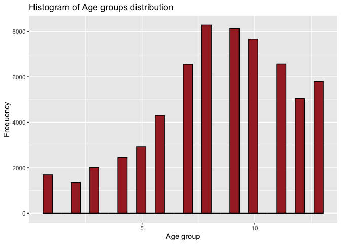<!-- -->

Let’s look at number of cases with Diabetes and without Diabetes for
each age group for the selected education level.

``` r
table(factor(subset$Diabetes_binary, labels = c("No diabet", "Diabet")), 
      factor(subset$Age, labels = c("Age 18 - 24", "Age 25 to 29", "Age 30 to 34", 
                                    "Age 35 to 39", "Age 40 to 44",
                                    "Age 45 to 49", "Age 50 to 54",
                                    "Age 55 to 59", "Age 60 to 64", 
                                    "Age 65 to 69", "Age 70 to 74",
                                    "Age 75 to 79", "Age 80 or older")) )
```

    ##            
    ##             Age 18 - 24 Age 25 to 29 Age 30 to 34 Age 35 to 39 Age 40 to 44 Age 45 to 49 Age 50 to 54 Age 55 to 59 Age 60 to 64 Age 65 to 69 Age 70 to 74 Age 75 to 79 Age 80 or older
    ##   No diabet        1656         1308         1932         2283         2639         3738         5575         6864         6414         5774         4958         3876            4667
    ##   Diabet             33           36           86          175          278          562          985         1407         1702         1886         1613         1175            1128

Let’s check if number of cases with Diabetes and without Diabetes are
equal for males and females for the selected subset of data.

``` r
table(factor (subset$Diabetes_binary, labels = c("No diabet", "Diabet")), 
      factor(subset$Sex, labels = c("Female", "Male")))
```

    ##            
    ##             Female  Male
    ##   No diabet  29014 22670
    ##   Diabet      6106  4960

Linear correlation between numeric variables allows to check which
variables are correlated with target variable `Diabetes_binary` and
could be used as predictors in the models.

``` r
corrplot(cor(as.matrix(subset %>% dplyr::select(-Education))), 
         type="upper", 
         tl.pos = "lt")
```

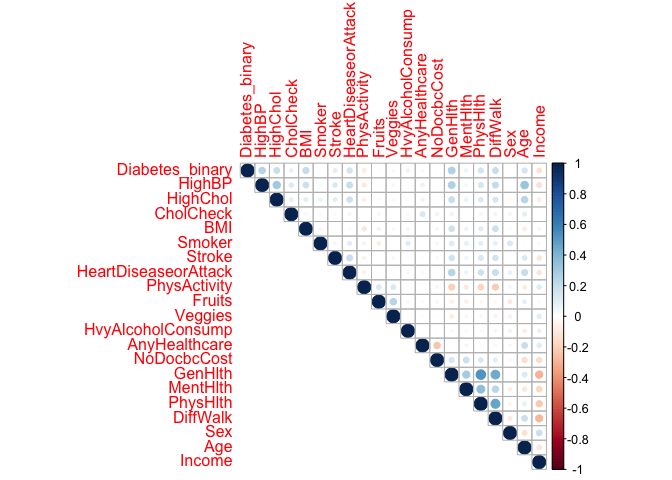<!-- -->

Number of cases with Diabetes and without Diabetes for each general
health level.

``` r
table(factor(subset$Diabetes_binary, labels = c("No diabet", "Diabet")), 
      factor(subset$GenHlth, labels = c("Excellent", "Very good", 
                                        "Good", "Fair", "Poor")) )
```

    ##            
    ##             Excellent Very good  Good  Fair  Poor
    ##   No diabet      6959     16840 17715  7514  2656
    ##   Diabet          265      1630  4133  3477  1561

Number of cases with Diabetes and without Diabetes for high blood
pressure and normal blood pressure patients.

``` r
table(factor(subset$Diabetes_binary, labels = c("No diabet", "Diabet")), 
      factor(subset$HighBP, labels = c("No high BP", "High BP")) )
```

    ##            
    ##             No high BP High BP
    ##   No diabet      28453   23231
    ##   Diabet          2577    8489

Number of cases with Diabetes and without Diabetes for high cholesterol
and normal cholesterol patients.

``` r
table(factor(subset$Diabetes_binary, labels = c("No diabet", "Diabet")), 
      factor (subset$HighChol, labels = c("No high chol", "High chol")))
```

    ##            
    ##             No high chol High chol
    ##   No diabet        30169     21515
    ##   Diabet            3620      7446

BMI distribution for patients with Diabetes and without Diabetes for the
selected education level.

``` r
ggplot(subset, aes(x = as_factor(Diabetes_binary), 
                   y = BMI, 
                   fill = as_factor(Diabetes_binary))) +
  geom_boxplot() +
  labs(title = "BMI distribution for patients with and without diabetes", 
       x = "Diabetes", 
       y = "BMI") +
  scale_fill_manual(values = c("0" = "grey", "1" = "red"),
                    labels = c("0" = "Without Diabetes", "1" = "With Diabetes")) +
  labs(fill = "Diabetes Status")
```

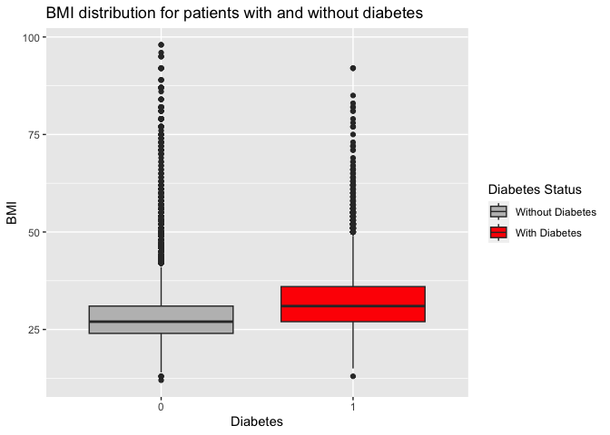<!-- -->

Let’s plot number of cases with Diabetes and Without Diabetes for each
General Health level for the selected sunset of data.

``` r
ggplot(subset, aes(x = as.factor(GenHlth), fill = as.factor(Diabetes_binary), group = Diabetes_binary)) +
  geom_bar(position = "dodge") +
  labs(
    title = "Number of Cases with Diabetes and Without Diabetes by GenHlth Level",
    x = "GenHlth Level",
    y = "Number of Cases"
  ) +
  scale_fill_manual(
    values = c("0" = "grey", "1" = "red"),
    labels = c("0" = "Without Diabetes", "1" = "With Diabetes")
  ) + 
  labs(fill = "Diabetes Status")
```

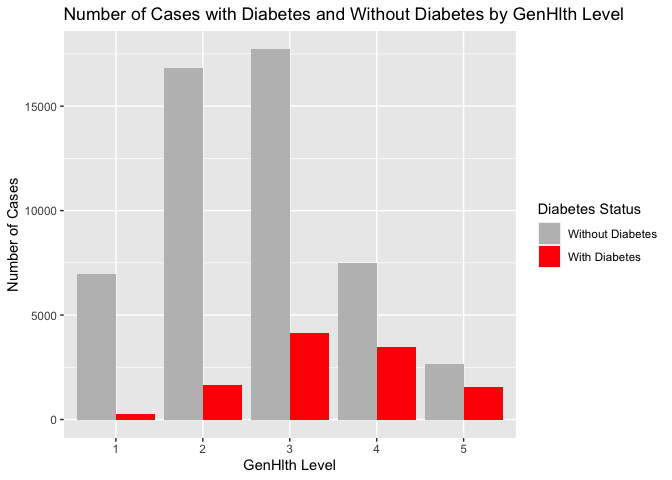<!-- -->

Visualization of the proportion with and without diabetes grouped by Age
for the given education level. It appears the proportion of with
diabetes increases with age, which is not surprising.

``` r
ggplot(subset, aes(x = as.factor(Age), y = 1, fill = as.factor(Diabetes_binary), group = Diabetes_binary)) +
  geom_bar(position = "fill", stat = "identity") +
  labs(
    title = "Number of Cases with Diabetes and Without Diabetes by Age",
    x = "Age",
    y = "Number of Cases"
  ) +
  scale_fill_manual(
    values = c("0" = "grey", "1" = "red"),
    labels = c("0" = "Without Diabetes", "1" = "With Diabetes")
  ) +
  labs(fill = "Diabetes Status")
```

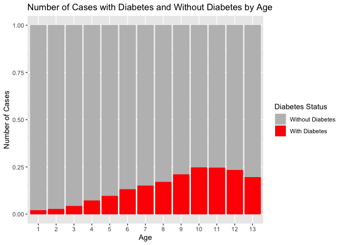<!-- -->

Visualization showing the distribution of `Diabetes_binary` by `BMI`.

``` r
#TODO: fix this graph. Temporary commented it becasue it causes compilation error. BMI is numeric
#ggplot(subset, aes(x = as.factor(Diabetes_binary), y = BMI, group = Diabetes_binary,fill = Diabetes_binary)) + 
#  labs(
#    title = "Violin Plot of Diabetes Status by BMI",
#    x = "Diabetes Status",
#    y = "BMI Scale"
#  ) +
#  geom_violin(trim = FALSE) + 
#  scale_fill_manual(
#    values = c("0" = "grey", "1" = "red"),
#    labels = c("0" = "Without Diabetes", "1" = "With Diabetes")
#    ) + 
#  labs(fill = "Diabetes Status")
```

Visualization showing the counts of `Diabetes_binary` by `Income` for
the given education level.

``` r
ggplot(subset, aes(x = as.factor(Income), fill = as.factor(Diabetes_binary), group = Diabetes_binary)) +
  geom_bar(position = "stack") +
  labs(
    title = "Number of Cases with Diabetes and Without Diabetes by Income",
    x = "Income",
    y = "Number of Cases"
  ) +
  scale_fill_manual(
    values = c("0" = "grey", "1" = "red"),
    labels = c("0" = "Without Diabetes", "1" = "With Diabetes")
  ) +
  labs(fill = "Diabetes Status")
```

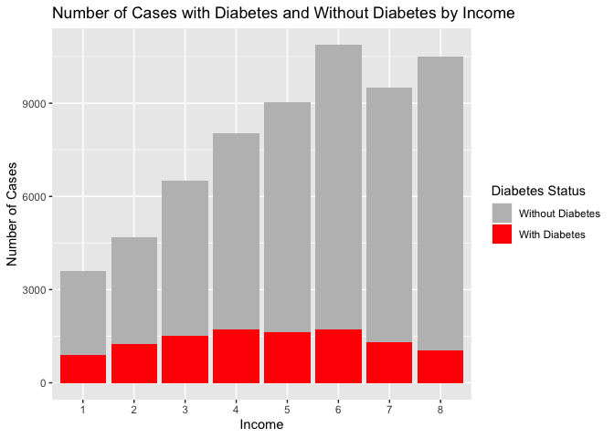<!-- -->

# 5 Modeling

Converting some of the variables to factors and checking dataset
structure.

``` r
names = c('HighBP' ,'HighChol', 
          'CholCheck', 'Smoker', 
          'Diabetes_binary', 'Stroke',
          'HeartDiseaseorAttack', 'PhysActivity',
          'Fruits', 'Veggies', 
          'HvyAlcoholConsump', 'Sex',
          'Age','Income', 'GenHlth', 
          'MentHlth', 'PhysHlth', 'DiffWalk',
          'AnyHealthcare', 'NoDocbcCost')
subset[,names] = lapply(subset[,names] , factor)
str(subset)
```

    ## tibble [62,750 × 22] (S3: tbl_df/tbl/data.frame)
    ##  $ Diabetes_binary     : Factor w/ 2 levels "0","1": 1 1 1 1 2 1 1 1 2 1 ...
    ##  $ HighBP              : Factor w/ 2 levels "0","1": 2 2 2 1 2 2 2 2 2 1 ...
    ##  $ HighChol            : Factor w/ 2 levels "0","1": 2 2 2 1 2 2 2 2 2 1 ...
    ##  $ CholCheck           : Factor w/ 2 levels "0","1": 2 2 2 2 2 2 2 2 2 2 ...
    ##  $ BMI                 : num [1:62750] 40 28 25 24 28 21 22 28 27 23 ...
    ##  $ Smoker              : Factor w/ 2 levels "0","1": 2 1 2 1 1 1 1 2 2 1 ...
    ##  $ Stroke              : Factor w/ 2 levels "0","1": 1 1 1 1 1 1 2 1 1 1 ...
    ##  $ HeartDiseaseorAttack: Factor w/ 2 levels "0","1": 1 1 1 1 1 1 2 1 1 1 ...
    ##  $ PhysActivity        : Factor w/ 2 levels "0","1": 1 1 2 1 1 2 1 1 1 2 ...
    ##  $ Fruits              : Factor w/ 2 levels "0","1": 1 2 1 1 1 2 2 2 2 2 ...
    ##  $ Veggies             : Factor w/ 2 levels "0","1": 2 1 2 2 2 2 1 2 2 2 ...
    ##  $ HvyAlcoholConsump   : Factor w/ 2 levels "0","1": 1 1 1 1 1 1 1 1 1 1 ...
    ##  $ AnyHealthcare       : Factor w/ 2 levels "0","1": 2 2 2 2 2 2 2 2 2 2 ...
    ##  $ NoDocbcCost         : Factor w/ 2 levels "0","1": 1 2 1 1 1 1 1 1 1 1 ...
    ##  $ GenHlth             : Factor w/ 5 levels "1","2","3","4",..: 5 5 3 2 4 3 3 3 4 1 ...
    ##  $ MentHlth            : Factor w/ 31 levels "0","1","2","3",..: 19 31 1 1 1 1 31 7 21 3 ...
    ##  $ PhysHlth            : Factor w/ 31 levels "0","1","2","3",..: 16 31 1 1 1 1 1 1 21 1 ...
    ##  $ DiffWalk            : Factor w/ 2 levels "0","1": 2 2 2 1 2 1 2 2 2 1 ...
    ##  $ Sex                 : Factor w/ 2 levels "0","1": 1 1 1 2 1 1 1 1 1 1 ...
    ##  $ Age                 : Factor w/ 13 levels "1","2","3","4",..: 9 9 11 8 11 10 12 9 8 6 ...
    ##  $ Education           : num [1:62750] 4 4 4 4 4 4 4 4 4 4 ...
    ##  $ Income              : Factor w/ 8 levels "1","2","3","4",..: 3 8 4 3 6 3 4 6 7 8 ...

Splitting up data into training and validation datasets.

``` r
set.seed(5)
trainIndex <- createDataPartition(subset$Diabetes_binary, p = .7, 
                                  list = FALSE, 
                                  times = 1)
train_data = subset[trainIndex, ]
val_data = subset[-trainIndex, ]


#Taking sample TEMPORARY. 
#Will be removed
#Having performance issues and not able to render for original sizes. 
#TODO: remove the following lines
train_data <- train_data[sample(nrow(train_data), size = 500), ]
val_data <- val_data[sample(nrow(val_data), size = 200), ]
```

## 5.1 Log loss

**Log loss**, also known as **logarithmic loss** or **cross-entropy
loss**, is a common evaluation metric for binary classification models.
It measures the performance of a model by quantifying the difference
between predicted probabilities and actual values. Log-loss is
indicative of how close the prediction probability is to the
corresponding actual/true value, penalizing inaccurate predictions with
higher values. **Lower log-loss** indicates **better** model
performance.

Mathematical interpretation: Log Loss is the negative average of the log
of corrected predicted probabilities for each instance.

$$log \ loss = -\frac{1}{N} \sum_{i=1}^N y_i log(p(y_i)) + (1-y_i)log(1-p(y_i))$$

$p(y_i)$ is the probability of $1$

$1-p(y_i)$ is the probability of 0

$y_i$ is the true binary outcome

We may prefer `log loss` to things like `accuracy` for several reasons:

- **Probabilistic Evaluation** - Log loss considers probabilities, while
  accuracy only looks at final decisions
- **Handles Imbalanced Data** - Log loss shows poor performance in
  imbalanced datasets
- **Fair Model Comparison** - Log loss enables fair model comparisons
  and makes it easier to evaluate which model is performing better

## 5.2 Logistic regression

**Logistic regression** is a statistical and machine learning model used
for binary classification tasks. It’s a type of regression analysis
that’s well-suited for predicting the probability of an observation
belonging to one of two classes or categories.

- Logistic regression is used when the response variable is binary,
  meaning it has two possible outcomes or classes.
- Logistic regression uses the `sigmoid` function to model the
  relationship between the features and the probability of the binary
  outcome. The logistic function has an S-shaped curve and maps any
  real-valued number to a value between 0 and 1.
  $p(x)=\frac{1}{1+e^{-(\beta_0+\beta_1x)}}$. ($p(x)$ is the probability
  of the dependent variable being 1)
- The goal of logistic regression is to find the best-fitting model by
  estimating the coefficients $\beta_0$, $\beta_1$. This is typically
  done using a process called maximum likelihood estimation. The
  coefficients are adjusted to maximize the likelihood of the observed
  data given the model.

Creating lists to store model performances on train and validations data
sets.

``` r
models_performace_train = list()
models_performace_val = list()
logistic_regression_train = list()
```

### 5.2.1 Fit Logistic regression model 1

Before we can fit logistic regression models, we need to transform
response variable to the format `train` function expects using function
`make.names`.

``` r
train_data$Diabetes_binary_transformed = train_data$Diabetes_binary
val_data$Diabetes_binary_transformed = val_data$Diabetes_binary

levels(train_data$Diabetes_binary_transformed) = make.names(levels(train_data$Diabetes_binary_transformed))
levels(val_data$Diabetes_binary_transformed) = make.names(levels(val_data$Diabetes_binary_transformed))
```

Fit logistic regression model with `HighChol`, `BMI` and `GenHlth` as
predictors.

``` r
train.control = trainControl(method = "cv", 
                              number = 5, 
                              summaryFunction=mnLogLoss,
                              classProbs = TRUE)

set.seed(83)
lr_model_1 = train(Diabetes_binary_transformed ~ 
                                   HighChol+
                                   BMI + 
                                   GenHlth, 
                                 data = train_data,
                                 method = "glm", 
                                 family="binomial",
                                 metric="logLoss",
                                 trControl = train.control
                                )
summary(lr_model_1)
```

    ## 
    ## Call:
    ## NULL
    ## 
    ## Coefficients:
    ##             Estimate Std. Error z value Pr(>|z|)    
    ## (Intercept) -5.35481    1.11977  -4.782 1.73e-06 ***
    ## HighChol1    1.17977    0.26842   4.395 1.11e-05 ***
    ## BMI          0.02971    0.01537   1.933  0.05319 .  
    ## GenHlth2     2.02100    1.04903   1.927  0.05404 .  
    ## GenHlth3     2.20824    1.03242   2.139  0.03244 *  
    ## GenHlth4     2.87366    1.03970   2.764  0.00571 ** 
    ## GenHlth5     2.63160    1.09379   2.406  0.01613 *  
    ## ---
    ## Signif. codes:  0 '***' 0.001 '**' 0.01 '*' 0.05 '.' 0.1 ' ' 1
    ## 
    ## (Dispersion parameter for binomial family taken to be 1)
    ## 
    ##     Null deviance: 462.17  on 499  degrees of freedom
    ## Residual deviance: 408.24  on 493  degrees of freedom
    ## AIC: 422.24
    ## 
    ## Number of Fisher Scoring iterations: 6

Obtain `log loss` for train data set for logistic regression model \#1.

``` r
logistic_regression_train[['logistic_regression_model_1']] = lr_model_1$results$logLoss
print(paste("Obtained Log loss for for logistic regression model #1 on train dataset", 
            logistic_regression_train[['logistic_regression_model_1']]))
```

    ## [1] "Obtained Log loss for for logistic regression model #1 on train dataset 0.449723787006158"

### 5.2.2 Fit Logistic regression model 2

Fit logistic regression with second order `BMI`, `HighChol`,
`HeartDiseaseorAttack` and interaction between `HighChol`and
`HeartDiseaseorAttack` as predictors.

``` r
train.control = trainControl(method = "cv", 
                              number = 5, 
                              summaryFunction=mnLogLoss,
                              classProbs = TRUE)

set.seed(8)
lr_model_2 = train(Diabetes_binary_transformed ~ 
                                   poly(BMI, 2) + 
                                   HighChol + HeartDiseaseorAttack+
                                   HighChol:HeartDiseaseorAttack,
                                 data = train_data,
                                 method = "glm", 
                                 family="binomial",
                                 metric="logLoss",
                                 trControl = train.control
                                )
summary(lr_model_2)
```

    ## 
    ## Call:
    ## NULL
    ## 
    ## Coefficients:
    ##                                   Estimate Std. Error z value Pr(>|z|)    
    ## (Intercept)                        -2.5635     0.2436 -10.523  < 2e-16 ***
    ## `poly(BMI, 2)1`                     3.8585     4.6180   0.836 0.403419    
    ## `poly(BMI, 2)2`                   -10.5606     6.6736  -1.582 0.113550    
    ## HighChol1                           1.3716     0.2951   4.647 3.36e-06 ***
    ## HeartDiseaseorAttack1               2.2173     0.6417   3.456 0.000549 ***
    ## `HighChol1:HeartDiseaseorAttack1`  -1.7170     0.7365  -2.331 0.019732 *  
    ## ---
    ## Signif. codes:  0 '***' 0.001 '**' 0.01 '*' 0.05 '.' 0.1 ' ' 1
    ## 
    ## (Dispersion parameter for binomial family taken to be 1)
    ## 
    ##     Null deviance: 462.17  on 499  degrees of freedom
    ## Residual deviance: 410.22  on 494  degrees of freedom
    ## AIC: 422.22
    ## 
    ## Number of Fisher Scoring iterations: 6

Obtain `log loss` for train data set for logistic regression model \#2.

``` r
logistic_regression_train[['logistic_regression_model_2']] = lr_model_2$results$logLoss
print(paste("Obtained Log loss for for logistic regression model #2 on train dataset", 
            logistic_regression_train[['logistic_regression_model_2']]))
```

    ## [1] "Obtained Log loss for for logistic regression model #2 on train dataset 0.41878581810596"

### 5.2.3 Fit Logistic regression model 3

Fit logistic regression with `Age`, `GenHlth`, `HighBP`,
`HeartDiseaseorAttack` and second order `BMI` as predictors.

``` r
train.control = trainControl(method = "cv", 
                              number = 5, 
                              summaryFunction=mnLogLoss,
                              classProbs = TRUE)

set.seed(10)
lr_model_3 = train(Diabetes_binary_transformed ~ Income+
                     Age+GenHlth+
                     HighBP+
                     HeartDiseaseorAttack+
                     poly(BMI, 2),
                   data = train_data,
                   method = "glm", 
                   family="binomial",
                   metric="logLoss",
                   trControl = train.control
                   )
summary(lr_model_3)
```

    ## 
    ## Call:
    ## NULL
    ## 
    ## Coefficients:
    ##                         Estimate Std. Error z value Pr(>|z|)   
    ## (Intercept)            -20.15039 1253.15066  -0.016  0.98717   
    ## Income2                  0.08153    0.66837   0.122  0.90292   
    ## Income3                  0.88018    0.66290   1.328  0.18425   
    ## Income4                 -1.10194    0.72618  -1.517  0.12915   
    ## Income5                 -1.05352    0.71231  -1.479  0.13914   
    ## Income6                  0.01841    0.66571   0.028  0.97794   
    ## Income7                  0.29582    0.63726   0.464  0.64251   
    ## Income8                 -0.02629    0.70423  -0.037  0.97022   
    ## Age2                    -0.22319 2024.42996   0.000  0.99991   
    ## Age3                     0.08598 1962.79579   0.000  0.99997   
    ## Age4                    14.79762 1253.15062   0.012  0.99058   
    ## Age5                    16.08289 1253.15031   0.013  0.98976   
    ## Age6                    15.29521 1253.15031   0.012  0.99026   
    ## Age7                    15.81126 1253.15026   0.013  0.98993   
    ## Age8                    16.05270 1253.15022   0.013  0.98978   
    ## Age9                    14.99817 1253.15025   0.012  0.99045   
    ## Age10                   16.31287 1253.15022   0.013  0.98961   
    ## Age11                   16.28889 1253.15024   0.013  0.98963   
    ## Age12                   16.26335 1253.15024   0.013  0.98965   
    ## Age13                   16.67274 1253.15024   0.013  0.98938   
    ## GenHlth2                 1.87162    1.08838   1.720  0.08550 . 
    ## GenHlth3                 1.85475    1.07308   1.728  0.08391 . 
    ## GenHlth4                 2.84875    1.09401   2.604  0.00922 **
    ## GenHlth5                 2.57088    1.15307   2.230  0.02577 * 
    ## HighBP1                  0.78968    0.31563   2.502  0.01235 * 
    ## HeartDiseaseorAttack1    0.59922    0.37052   1.617  0.10583   
    ## `poly(BMI, 2)1`          4.67224    5.48453   0.852  0.39427   
    ## `poly(BMI, 2)2`        -13.36237    8.00505  -1.669  0.09507 . 
    ## ---
    ## Signif. codes:  0 '***' 0.001 '**' 0.01 '*' 0.05 '.' 0.1 ' ' 1
    ## 
    ## (Dispersion parameter for binomial family taken to be 1)
    ## 
    ##     Null deviance: 462.17  on 499  degrees of freedom
    ## Residual deviance: 355.96  on 472  degrees of freedom
    ## AIC: 411.96
    ## 
    ## Number of Fisher Scoring iterations: 17

Obtain `log loss` for train data set for logistic regression model \#3.

``` r
logistic_regression_train[['logistic_regression_model_3']] = lr_model_3$results$logLoss
print(paste("Obtained Log loss for for logistic regression model #3 on train dataset", 
            logistic_regression_train[['logistic_regression_model_3']]))
```

    ## [1] "Obtained Log loss for for logistic regression model #3 on train dataset 0.457116957539331"

### 5.2.4 The best performed logistic regression model

Now we can choose the best performed model based on train dataset
performance among logistic regression models.

``` r
best_lr_model = names(logistic_regression_train)[which.min(unlist(logistic_regression_train))]
```

The best performed logistic regression model is model
**logistic_regression_model_2**.

Save the logistic regression model performance on training dataset.

``` r
if (best_lr_model == "logistic_regression_model_1") {
  lr_model = lr_model_1
} else if (best_lr_model == "logistic_regression_model_2") {
  lr_model = lr_model_2
} else {
  lr_model = lr_model_3
}

models_performace_train[['logistic_regression_model']] = lr_model$results$logLoss

print(paste("Log Loss for logistic regression model for training dataset:", 
            models_performace_train[['logistic_regression_model']]))
```

    ## [1] "Log Loss for logistic regression model for training dataset: 0.41878581810596"

In order to obtain `log loss` metric for validation dataset, let’s
create custom function for log loss calculation.

``` r
calculateLogLoss <- function(predicted_probabilities, true_labels) {
  predicted_probabilities = pmax(pmin(predicted_probabilities, 1 - 1e-15), 
                                 1e-15)

  log_loss <- -mean(true_labels * log(predicted_probabilities) + 
                      (1 - true_labels) * log(1 - predicted_probabilities))
  return(log_loss)
}
```

Calculate and save logistic regression model performance on validation
dataset.

``` r
val_predictions = predict(lr_model, 
                             newdata = val_data %>% dplyr::select(-Diabetes_binary), 
                             type = "prob")

predicted_prob_class1 = val_predictions[, 1]
true_labels = as.integer(as.character(val_data$Diabetes_binary))

log_loss_val_lr_model = calculateLogLoss(predicted_prob_class1, true_labels)
print(paste("Log Loss for logistic regression model for validation dataset:", 
            log_loss_val_lr_model))
```

    ## [1] "Log Loss for logistic regression model for validation dataset: 1.85571979372687"

``` r
models_performace_val[["logistic_regression_model"]] = log_loss_val_lr_model
```

## 5.3 LASSO logistic regression

`LASSO (Least Absolute Shrinkage and Selection Operator) logistic regression`
is a statistical method that combines logistic regression with LASSO
regularization. It is used for binary classification problems where you
want to predict the probability of an event occurring based on various
predictor variables.

$$\sum_{i=1}^n(y_i-\sum_{j}x_{ij}\beta_j)^2 + \lambda \sum_{j=1}^p |\beta_j|$$

- `LASSO logistic regression` models the probability of an event using
  the logistic function. It models the log-odds of the event as a linear
  combination of predictor variables. The logistic function is used to
  transform the linear combination into probabilities.
- `LASSO` adds a regularization term to the logistic regression model.
  The regularization term is a penalty based on the absolute values of
  the model coefficients (L1 regularization). This penalty encourages
  some of the coefficient values to become **exactly zero**, effectively
  performing feature selection.
- `LASSO` regularization promotes sparsity in the model. It can
  automatically select a subset of the most relevant predictor variables
  by setting the coefficients of irrelevant variables to zero. This
  helps to reduce overfitting and build more interpretable models.
- The degree of regularization is controlled by a hyper parameter
  denoted as $\lambda$.

Using Lasso models in logistic regression offers benefits such as
automatic feature selection, better generalization to new data, model
stability, improved interpretability, handling multicollinearity, and
variable importance assessment.

### 5.3.1 Fit and validate LASSO logistic regression

``` r
train.control = trainControl(method = "cv",
                              number = 5, 
                              summaryFunction=mnLogLoss,
                              classProbs = TRUE)


set.seed(2)

# Limiting number of features due to performance issues
lasso_log_reg<-train(#Diabetes_binary ~., 
                   Diabetes_binary ~ HighBP + HighChol + BMI + Smoker + AnyHealthcare + GenHlth + Age + Sex,
                   data = dplyr::select(train_data, -Diabetes_binary_transformed),
                   method = 'glmnet',
                   metric="logLoss",
                   tuneGrid = expand.grid(alpha = 1, 
                                          lambda=seq(0, 1, by = 0.25))
)
lasso_log_reg$results
```

    ##   alpha lambda  Accuracy      Kappa AccuracySD    KappaSD
    ## 1     1   0.00 0.8006017 0.09174814 0.02159021 0.07191475
    ## 2     1   0.25 0.8291949 0.00000000 0.01917599 0.00000000
    ## 3     1   0.50 0.8291949 0.00000000 0.01917599 0.00000000
    ## 4     1   0.75 0.8291949 0.00000000 0.01917599 0.00000000
    ## 5     1   1.00 0.8291949 0.00000000 0.01917599 0.00000000

Obtained the best tuning parameter $\lambda$ value is

``` r
lasso_log_reg$bestTune$lambda
```

    ## [1] 1

Plot obtained accuracy for different $\lambda$ values.

``` r
plot(lasso_log_reg)
```

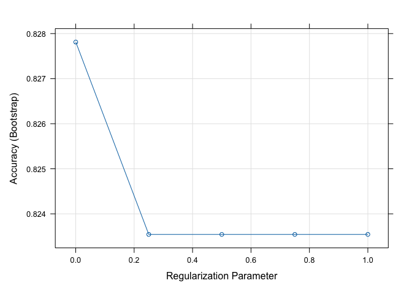<!-- -->

Calculate log loss for train data set

``` r
train_predictions = predict(lasso_log_reg, 
                             newdata = train_data %>% dplyr::select(-Diabetes_binary), 
                             type = "prob")

predicted_prob_class1 = train_predictions[, 1]
true_labels = as.integer(as.character(train_data$Diabetes_binary))

log_loss_train_lasso = calculateLogLoss(predicted_prob_class1, true_labels)
print(paste("Log Loss for lasso regression model for train dataset", 
            log_loss_train_lasso))
```

    ## [1] "Log Loss for lasso regression model for train dataset 1.47768811123829"

``` r
models_performace_train[["lasso"]] = log_loss_train_lasso
```

Calculate log loss for validation data set

``` r
val_predictions = predict(lasso_log_reg, 
                             newdata = val_data %>% dplyr::select(-Diabetes_binary), 
                             type = "prob")

predicted_prob_class1 = val_predictions[, 1]
true_labels = as.integer(as.character(val_data$Diabetes_binary))

log_loss_val_lasso = calculateLogLoss(predicted_prob_class1, true_labels)
print(paste("Log Loss for lasso regression model for validation dataset", 
            log_loss_val_lasso))
```

    ## [1] "Log Loss for lasso regression model for validation dataset 1.53843215073624"

``` r
models_performace_val[["lasso"]] = log_loss_val_lasso
```

## 5.4 Classification tree model

A Classification tree model is a supervised machine learning model used
to predict group membership. It has a hierarchical tree structure
consisting a root node, branches, internal nodes, and leaf nodes.
Classification trees are used when the target variable is categorical.
One benefit to classification trees is they are intuitive and usually
easy to explain.

Here is a break down of the tree structure:

- **Root Node** - The beginning node on the graph.
- **Branches** - The arrows connecting the nodes.
- **Internal Nodes** - A non-leaf node denoting a test on an attribute.
- **Leaf Nodes** - The terminal node displaying the classification.

### 5.4.1 Fit and validate classification tree model

``` r
train_control <- trainControl(method = "cv",
                              summaryFunction=mnLogLoss,
                              classProbs = TRUE,
                              number = 5)
set.seed(1122)
tree_model <- train(Diabetes_binary_transformed ~ ., 
                data = dplyr::select(train_data, -Diabetes_binary), 
                method = "rpart",
                trControl = train_control,
                metric="logLoss",
                tuneGrid = data.frame(cp=seq(0,.022, by = .001))
                )

tree_model$results
```

    ##       cp   logLoss  logLossSD
    ## 1  0.000 0.5953821 0.30271837
    ## 2  0.001 0.5953821 0.30271837
    ## 3  0.002 0.5953821 0.30271837
    ## 4  0.003 0.5953821 0.30271837
    ## 5  0.004 0.4605470 0.03705370
    ## 6  0.005 0.4605470 0.03705370
    ## 7  0.006 0.4605470 0.03705370
    ## 8  0.007 0.4605470 0.03705370
    ## 9  0.008 0.4605470 0.03705370
    ## 10 0.009 0.4605470 0.03705370
    ## 11 0.010 0.4546231 0.04093261
    ## 12 0.011 0.4546231 0.04093261
    ## 13 0.012 0.4546231 0.04093261
    ## 14 0.013 0.4546231 0.04093261
    ## 15 0.014 0.4546231 0.04093261
    ## 16 0.015 0.4353390 0.02132169
    ## 17 0.016 0.4353390 0.02132169
    ## 18 0.017 0.4353390 0.02132169
    ## 19 0.018 0.4353390 0.02132169
    ## 20 0.019 0.4353390 0.02132169
    ## 21 0.020 0.4353390 0.02132169
    ## 22 0.021 0.4353390 0.02132169
    ## 23 0.022 0.4353390 0.02132169

``` r
plot(tree_model)
```

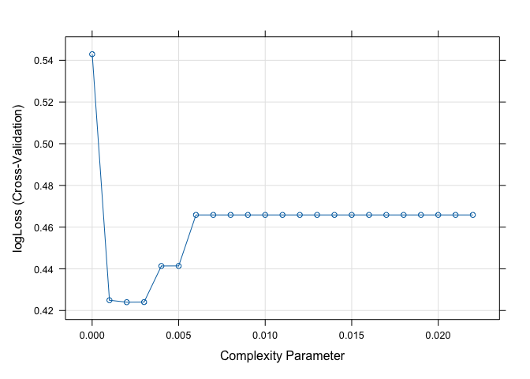<!-- -->

Obtain log loss for train data set

``` r
models_performace_train[["classification_tree"]] = min(tree_model$results$logLoss)
print(paste("Log Loss for classification tree model for training dataset:", 
            models_performace_train[["classification_tree"]]))
```

    ## [1] "Log Loss for classification tree model for training dataset: 0.435338994660815"

Calculate log loss for validation data set

``` r
val_predictions = predict(tree_model, 
                             newdata = val_data %>% dplyr::select(-Diabetes_binary_transformed), 
                             type = "prob")

predicted_prob_class1 = val_predictions[, 1]
true_labels = as.integer(as.character(val_data$Diabetes_binary))

log_loss_val_tree = calculateLogLoss(predicted_prob_class1, true_labels)
print(paste("Log Loss for classification tree for validation dataset", 
            log_loss_val_tree))
```

    ## [1] "Log Loss for classification tree for validation dataset 1.80267859250244"

``` r
models_performace_val[["classification_tree"]] = log_loss_val_tree
```

## 5.5 Random forest model

A Random Forest classification model is a supervised machine learning
model used for classification tasks. It is an ensemble of multiple
decision trees, where each tree predicts the class label of an input
based on a set of features. The final prediction in a Random Forest is
determined through a combination of predictions from individual decision
trees, often using **majority voting** for classification tasks.

Random Forest might be chosen over a basic Classification Tree for
several reasons:

- **Generalization** - Random Forest typically offers better
  generalization to new, unseen data. It reduces the risk of
  overfitting, which is a common issue with basic Classification Trees.
- **Higher Accuracy** - Random Forest often provides higher accuracy
  because it combines multiple decision trees. The majority voting from
  these trees leads to a more reliable and accurate classification.
- **Robustness to Noise** - Basic Classification Trees are sensitive to
  noise in the data, which can lead to overfitting. Random Forest,
  through ensemble learning, is more robust to noise and outliers.
- **Reduced Variance** - A basic Classification Tree can vary
  significantly with small changes in the training data. Random Forest
  reduces this variance because the ensemble of trees accounts for
  different sources of variance.
- **Feature Selection** - Random Forest provides a measure of feature
  importance. It can help identify which features are most relevant for
  making predictions. This feature selection is especially valuable when
  dealing with high-dimensional data.

There are several hyperparameters which could be fine-tuned during
random forest model training. Some which have the biggest affect to
model performance:

- **mtry** - Number of predictor variable randomly selected to be
  sampled at each split of the tree. It controls the level of feature
  randomness in each tree. A smaller mtry may reduce overfitting, while
  a larger mtry can lead to better diversity among trees.
- **ntree** - The number of decision trees (or “trees”) to be grown in
  the forest. Increasing the number of trees can improve the model’s
  accuracy, but it also increases computational cost.

### 5.5.1 Fit and validate random forest model

``` r
train_control <- trainControl(
  method = "cv",   
  number = 5,
  summaryFunction=mnLogLoss,
  classProbs = TRUE
)

# limiting number of the features due 
# to performance issues with random forest algorithm
set.seed(11)
rf_model = train(
  #Diabetes_binary_transformed ~ ., 
  Diabetes_binary_transformed ~ HighChol+
                                BMI + 
                                GenHlth+
                                HeartDiseaseorAttack+
                                Age+
                                Income,
  data = dplyr::select(train_data, -Diabetes_binary),
  method = "rf",
  metric="logLoss",
  tuneGrid = data.frame(mtry = c(1:4)), 
  trControl = train_control
)

rf_model$results
```

    ##   mtry   logLoss  logLossSD
    ## 1    1 0.9725341 0.37742775
    ## 2    2 0.5578986 0.16232838
    ## 3    3 0.4631675 0.05186905
    ## 4    4 0.5654993 0.30517247

``` r
plot(rf_model)
```

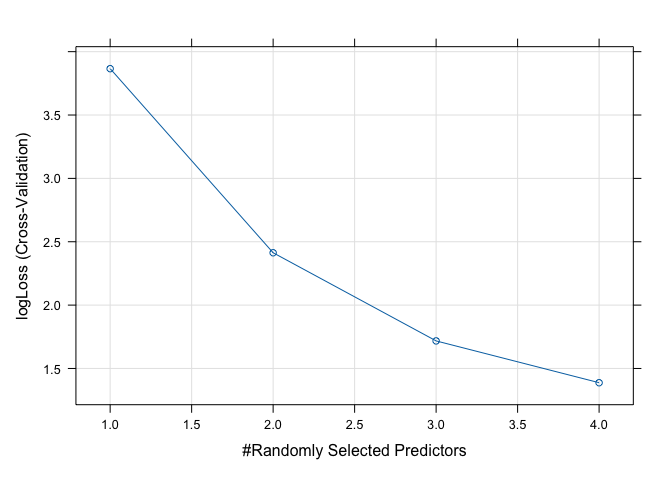<!-- -->

Obtain log loss for train data set

``` r
models_performace_train[["random_forest"]] = min(rf_model$results$logLoss)
print(paste("Log Loss for random forest model for training dataset:", models_performace_train[["random_forest"]]))
```

    ## [1] "Log Loss for random forest model for training dataset: 0.463167535947609"

Calculate log loss for validation data set

``` r
val_predictions = predict(rf_model, 
                             newdata = val_data %>% dplyr::select(-Diabetes_binary), 
                             type = "prob")

predicted_prob_class1 = val_predictions[, 1]
true_labels = as.integer(as.character(val_data$Diabetes_binary))

log_loss_val_rf = calculateLogLoss(predicted_prob_class1, true_labels)
print(paste("Log Loss:", log_loss_val_rf))
```

    ## [1] "Log Loss: 3.40651496935857"

``` r
models_performace_val[["random_forest"]] = log_loss_val_rf
log_loss_val_rf
```

    ## [1] 3.406515

## 5.6 New model - Support Vector Machine

Support Vector Machine(SVM) is a supervised machine learning algorithm
that is used for both classification and regression tasks. It is a
powerful and versatile algorithm known for its ability to handle complex
decision boundaries and high-dimensional data. SVM works by finding the
*optimal hyperplane* that best separates data points into different
classes or predicts a continuous target variable.

Main components of SVM:

- **Hyperplane** - SVM’s core concept is to find the optimal hyperplane
  that maximizes the margin between two classes in a data set. The
  hyperplane is the decision boundary that separates data points into
  different classes. In two dimensions, it’s a line; in higher
  dimensions, it’s a hyperplane.
- **Support Vectors** - Support Vectors are the data points that are
  closest to the decision boundary, or hyperplane. These support vectors
  play a crucial role in determining the position and orientation of the
  hyperplane.
- **Margin** - The margin is the distance between the decision boundary
  (hyperplane) and the closest support vectors. SVM aims to maximize
  this margin, as it represents the separation between classes. The
  larger the margin, the better the model’s generalization.
- **Kernel Trick** - SVM can handle both linearly separable and
  non-linearly separable data. The kernel trick allows SVM to transform
  data into higher-dimensional space, making it possible to find linear
  separation in this transformed space. Common kernel functions include
  linear, polynomial, radial basis function (RBF), and sigmoid.
- **C Parameter** - SVM has a hyper parameter called C, which controls
  the trade-off between maximizing the margin and minimizing the
  classification error. Smaller C values lead to a larger margin but may
  allow some mis-classification, while larger C values lead to a smaller
  margin with fewer mis-classifications.

### 5.6.1 Fit and validate support vector machine model

``` r
train_control = trainControl(
  method = "cv",
  number = 5,
  classProbs =  TRUE,
  summaryFunction=mnLogLoss
)

svm_grid = expand.grid(
  sigma = c(0.01, 0.1, 1),   # Range of sigma values for the RBF kernel
  C = c(0.1, 1, 10)          # Range of C values for regularization
)

# limiting number of features due to performance 
# issues of the algorithm 
svm_model = train(
  #Diabetes_binary_transformed ~ ., 
  Diabetes_binary_transformed ~ HighChol+
                                BMI + 
                                GenHlth,
  data = dplyr::select(train_data, -Diabetes_binary),
  method = "svmRadial",
  trControl = train_control,
  metric="logLoss",
  tuneGrid = svm_grid
)
```

    ## maximum number of iterations reached 0.001380852 0.001361526maximum number of iterations reached 0.0003606113 0.0003583553maximum number of iterations reached -1.813607e-05 -1.814389e-05maximum number of iterations reached -3.430225e-05 -3.430444e-05maximum number of iterations reached 0.0006259579 0.000625008maximum number of iterations reached 0.0003915902 0.0003884138

``` r
svm_model$results
```

    ##   sigma    C   logLoss   logLossSD
    ## 1  0.01  0.1 0.4629374 0.006879692
    ## 2  0.01  1.0 0.4648582 0.009574799
    ## 3  0.01 10.0 0.4632184 0.006917369
    ## 4  0.10  0.1 0.4631303 0.011232267
    ## 5  0.10  1.0 0.4659475 0.011274430
    ## 6  0.10 10.0 0.4607089 0.007966202
    ## 7  1.00  0.1 0.4625528 0.008059652
    ## 8  1.00  1.0 0.4633671 0.007274066
    ## 9  1.00 10.0 0.4656799 0.013200475

``` r
plot(svm_model)
```

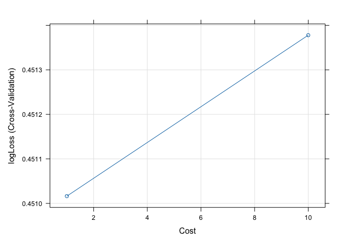<!-- -->

``` r
svm_model$bestTune
```

    ##   sigma  C
    ## 6   0.1 10

Obtain log loss for train dataset.

``` r
models_performace_train[["svm"]] = min(svm_model$results$logLoss)
print(paste("Log Loss for support vector machine model for training dataset", 
            models_performace_train[["svm"]]))
```

    ## [1] "Log Loss for support vector machine model for training dataset 0.460708864209502"

Calculate log loss for validation dataset.

``` r
val_predictions = predict(svm_model, 
                             newdata = val_data %>% dplyr::select(-Diabetes_binary_transformed), 
                             type = "prob")

predicted_prob_class1 = val_predictions[, 1]
true_labels = as.integer(as.character(val_data$Diabetes_binary))

log_loss_val_svm = calculateLogLoss(predicted_prob_class1, true_labels)
print(paste("Log Loss for support vector machine model for validation dataset", log_loss_val_svm))
```

    ## [1] "Log Loss for support vector machine model for validation dataset 1.57502686745109"

``` r
models_performace_val[["svm"]] = log_loss_val_svm
```

## 5.7 New model - Naive Bayes

The naive Bayes model is a popular supervised machine learning algorithm
used for classification. An advantage of a naive bayes model is it can
require a smaller portion of training data to predict classification.
But naive bayes may be out performed by other models such as boosted
trees and random forests. A break down of Bayes theorem below:

$$ P(c|x) = \frac{P(x|c)*P(c)}{P(x)}$$ Where:

- $P(c|x)$ is the posterior probability of C (class membership) given x
  (predictor).
- $P(c)$ prior probability of class membership.
- $P(x|c)$ is the probability of the predictor given class membership.
- $P(x)$ is the prior probability of the predictor.

### 5.7.1 Fit and validate Naive Bayes model

``` r
train_control = trainControl(
  method = "cv",
  number = 5,
  summaryFunction=mnLogLoss,
  classProbs =  TRUE
)

nb_grid <- expand.grid(
  usekernel = TRUE,
  fL = seq(0,1, by = 0.5),
  adjust = seq(0.5, 1.5, by = 0.5)
)

nb_model = train(
  Diabetes_binary_transformed ~ ., 
  data = dplyr::select(train_data, -MentHlth, -PhysHlth, -Diabetes_binary),
  method = "nb",
  trControl = train_control,
  tuneGrid = nb_grid,
  metric="logLoss"
)

nb_model$results
```

    ##   usekernel  fL adjust  logLoss logLossSD
    ## 1      TRUE 0.0    0.5 3.449753 0.1760866
    ## 2      TRUE 0.0    1.0 3.414670 0.1796922
    ## 3      TRUE 0.0    1.5 3.408101 0.1767417
    ## 4      TRUE 0.5    0.5 3.449753 0.1760866
    ## 5      TRUE 0.5    1.0 3.414670 0.1796922
    ## 6      TRUE 0.5    1.5 3.408101 0.1767417
    ## 7      TRUE 1.0    0.5 3.449753 0.1760866
    ## 8      TRUE 1.0    1.0 3.414670 0.1796922
    ## 9      TRUE 1.0    1.5 3.408101 0.1767417

``` r
plot(nb_model)
```

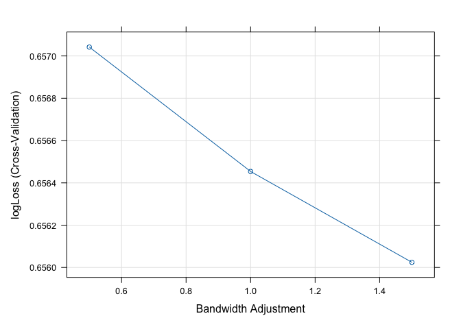<!-- -->

Obtain log loss for train dataset.

``` r
models_performace_train[["Naive Bayes"]] = min(nb_model$results$logLoss)
print(paste("Log Loss for naive bayes model for training dataset", 
            models_performace_train[["Naive Bayes"]]))
```

    ## [1] "Log Loss for naive bayes model for training dataset 3.40810062851827"

Calculate log loss for validation dataset.

``` r
val_predictions = predict(nb_model, 
                             newdata = val_data %>% dplyr::select(-Diabetes_binary_transformed), 
                             type = "prob")

predicted_prob_class1 = val_predictions[, 1]
true_labels = as.integer(as.character(val_data$Diabetes_binary))

log_loss_val_nb = calculateLogLoss(predicted_prob_class1, true_labels)
print(paste("Log Loss for naive bayes model for validation dataset", 
            log_loss_val_nb))
```

    ## [1] "Log Loss for naive bayes model for validation dataset 18.0034824665467"

``` r
models_performace_val[["Naive Bayes"]] = log_loss_val_nb
```

All models performance on training dataset based on `log loss` metric:

``` r
models_performace_train
```

    ## $logistic_regression_model
    ## [1] 0.4187858
    ## 
    ## $lasso
    ## [1] 1.477688
    ## 
    ## $classification_tree
    ## [1] 0.435339
    ## 
    ## $random_forest
    ## [1] 0.4631675
    ## 
    ## $svm
    ## [1] 0.4607089
    ## 
    ## $`Naive Bayes`
    ## [1] 3.408101

All models performance on validation dataset based on `log loss` metric:

``` r
models_performace_val
```

    ## $logistic_regression_model
    ## [1] 1.85572
    ## 
    ## $lasso
    ## [1] 1.538432
    ## 
    ## $classification_tree
    ## [1] 1.802679
    ## 
    ## $random_forest
    ## [1] 3.406515
    ## 
    ## $svm
    ## [1] 1.575027
    ## 
    ## $`Naive Bayes`
    ## [1] 18.00348

The best performed model based on train data set is
**logistic_regression_model**.

The best performed model based on validation data set is **lasso**.

# 6 Summary

In this report we analyze subset of dataset [Diabetes health indicator
dataset](https://www.kaggle.com/datasets/alexteboul/diabetes-health-indicators-dataset/)
for educational level - **Grade 12 or GED (High school graduate)**. We
fit and validate six different machine learning models. Based on
performance on validation dataset the best model is **lasso**.
